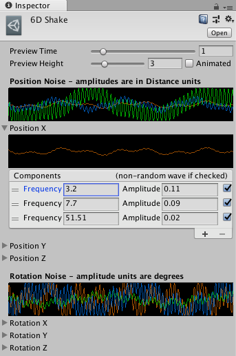

# Working with noise profiles

A __noise profile__ is an asset that defines a procedural curve for camera noise. The __Basic Multi Channel Perlin__ component applies a noise profile to the movement of the camera. Cinemachine applies noise movement after computing the position of the camera. This way, camera noise does not affect the computation of camera movement in future updates.

Cinemachine includes some predefined profile assets. Choose a predefined noise profile in the Noise component. Create your own noise profile asset by choosing __Create > Cinemachine > NoiseSettings__ in the [Project window](https://docs.unity3d.com/Manual/ProjectView.html).

The properties in the Inspector show graphs that give a visual representation of the noise profile. There are properties for the x, y, and z axes for position and rotation. Each axis may have more than one layer.

For realistic procedural noise, choose frequencies and amplitudes with care to ensure an interesting noise quality that is not obviously repetitive. The most convincing camera shakes use __Rotation__ noise because that’s where the camera is aiming. Handheld camera operators tend to shake more rotationally than they do positionally. After specifying __Rotation__ noise, add __Position__ noise.

Convincing noise profiles typically mix low, medium, and high frequencies together. When creating a new noise profile, start with these three layers of noise for each axis.

For amplitude, use larger values for wider lenses to shake the camera noticeably. For telephoto lenses, use smaller amplitude values because the narrower FOV amplifies the effect.

For frequency, a typical low range is 0.1-0.5 Hz, the mid range 0.8-1.5, and the high 3-4. The highest useful frequency depends on the frame rate of your game. A game typically runs at 30 or 60Hz. Noise frequencies higher than the frame rate of your game fall between the cracks of the Nyquist rate. In other words, they will not be directly tracked.

For example, if your game runs at 60 frames/second and you set a frequency to 100, you will get choppy camera noise. This is because your game can’t render something that moves faster than the frame rate.

## Properties:

| **Property:** || **Function:** |
|:---|:---|:---|
| __Preview Time__ || The number of seconds to display in the graphs in the Inspector. This property is for editing in the Inspector; it does not affect the content of the noise profile asset that you are editing. |
| __Preview Height__ || The vertical height of the graphs of the noise profile in the Inspector. This property is for editing noise profiles; it does not affect the noise profile asset. |
| __Animated__ || Check to show a moving representation of an example of the noise profile in the graph. This property is for editing noise profiles; it does not affect the noise profile asset. |
| __Position Noise__ || A graphical representation of all noise layers for all axes for camera movement.  |
| __Position X__, __Position Y__, __Position Z__ || The layers of noise for each axis to apply to camera movement. Each axis has a graphical representation of its layers. Each layer has properties for Frequency, Amplitude, and optional Perlin noise. Click + or - to add and remove layers, respectively.  |
| | _Frequency_ | The frequency of the wave in the noise layer, in Hz. |
| | _Amplitude_ | The amplitude (height) of the wave in the noise layer, in distance units. |
| | _Non-random wave if checked_ | Check to remove the Perlin noise from the noise layer. Without Perlin noise, Cinemachine uses a regular sine wave. Uncheck to apply Perlin noise to the layer, randomizing both the frequency and the amplitude while remaining in the neighbourhood of the selected values. |
| __Rotation Noise__ || A graphical representation of all noise layers for all axes for camera rotation. |
| __Rotation X__, __Rotation Y__, __Rotation Z__ || The layers of noise for each axis to apply to camera rotation. Each layer has properties for Frequency, Amplitude, and optional Perlin Noise. Click + or - to add and remove layers, respectively.  |
| | _Frequency_ | The frequency of the wave in the noise layer, in Hz. |
| | _Amplitude_ | The amplitude (height) of the wave in the noise layer, in degrees. |
| | _Non-random wave if checked_ | Check to remove the Perlin noise from the noise layer. Without Perlin noise, Cinemachine uses a regular sine wave. Uncheck to include random Perlin noise variation, randomizing both the frequency and the amplitude while remaining in the neighbourhood of the selected values. |

