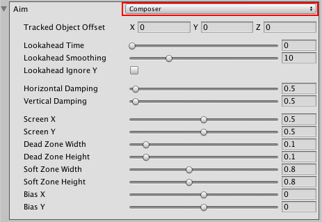

# Aim properties

Use the Aim properties to specify how to rotate the Virtual Camera. To change the camera’s position, use the [Body properties](CinemachineVirtualCameraBody.html).

* [__Composer__](CinemachineAimComposer.html): Keep the __Look At__ target in the camera frame.

* [__Group Composer__](CinemachineAimGroupComposer.html): Keep multiple __Look At__ targets in the camera frame.

* [__Do Nothing__](CinemachineAimDoNothing.html): Do not procedurally rotate the Virtual Camera.

* [__POV__](CinemachineAimPOV.html): Rotate the Virtual Camera based on the user’s input.

* [__Same As Follow Target__](CinemachineAimSameAsFollow.html): Set the camera’s rotation to the rotation of the __Look At__ target.

* [__Hard Look At__](CinemachineAimHardLook.html): Keep the __Look At__ target in the center of the camera frame.

