# About Cinemachine

Cinemachine is a modular suite of camera tools for Unity which give AAA game quality controls for every camera in your project.  It’s an easy to install plugin which lets you add functionality to cameras you’ve already got, or make new ones with amazing behaviors. 

Cinemachine has been designed to be the entire unified camera system in your project but can be used alongside your existing cameras as well. If you have a bunch of camera stuff working already and just want to use Cinemachine for cutscenes or something specific,  no problem at all. However when you use it across your project it allows you to blend any camera to any other camera in a gameplay-to-cutscene-and-back-seamlessly kind of way.

## Requirements

Cinemachine has no external dependencies.  Just install it and start using it.  If you are also using the Post Processing Stack (versions 1 or 2), then adapter modules are provided - protected by ifdefs which auto-define if the presence of the Post Processing Stack is detected.

This Cinemachine version 2.1.9 is compatible with the following versions of the Unity Editor:

* 2017.1 and later (recommended)

# Using Cinemachine

## Create your first Virtual Camera

Go to the Unity Main menu, and select Cinemachine/Create Virtual Camera. This is also the way to create additional Cinemachine shots.  

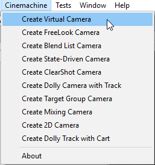

You will notice two changes to your scene: 

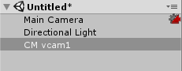

1. The main camera has a little icon next to it in the scene hierarchy.  This indicates that your camera has been Cinemachine-enabled using a new component: the CinemachineBrain.
2. A new GameObject CM vcam1 with a CinemachineVirtualCamera component, which is a single camera or shot.

Those two things are the heart of Cinemachine; everything else builds on them.

### Cinemachine Virtual Camera
The Virtual Camera is a shot, a single camera. It has child components which you can turn on to make it do things like procedurally track and compose objects, follow things and shake with procedural noise.   Together they are a very powerful combination and can yield an unlimited number of results.  

These modules have been designed, re-designed and re-designed again to offer the widest range of possibilities with the least number of controls.  The math driving these camera behaviours is complex and sophisticated, having gone through many different scenarios across all sorts of games.

#### Why Virtual Camera?
The reason for the ‘virtual’ camera scenario is because Unity renders from the main camera. Out-of-the-box Unity is limited to only one camera being active camera at a time – which makes the blending of two shots effectively impossible. Cinemachine is engineered to solve this and provide a wealth of simple, powerful functionality at the same time, allowing unsurpassed camera behaviors which are fast and easy to setup.

### Cinemachine Brain

This is the central Cinemachine component that does all the magic.  It’s a component attached to the Unity camera and it monitors all the Virtual Cameras in the scene and drives the Unity camera using the shot it likes best. 

What happens is that there is only one Unity Camera.  The brain that gets installed on it is responsioble for positioning and configuring that one camera to be in the right place at the right time, according to the instructions provided by the virtual cameras that the brain is observing.

There’s more info below on how to use these new things.  Don’t forget to check out the example scenes included in Cinemachine/Examples/Scenes, and please visit our user forum at https://forum.unity3d.com/forums/cinemachine.136/

## Frequently Asked Questions
**Do we have to replace our camera system with Cinemachine?** 
No, Cinemachine can work alongside your existing camera system and you can seamlessly blend back and forth between both systems.   If you wrote some camera tech you love but want Cinemachine for something else, no problem, mix the two together. 

**Isn’t having all these cameras around kind of heavy?**
No, in fact it’s incredibly light.  Each virtual camera has a super low overhead - make as many as you want.   If you are hypersensitive to performance you can disable all the cameras and just enable the ones you wish to have running at any given moment for extreme performance

**How does it all work?**
Cinemachine works a bit like a marionette system for your existing Main Camera.   It doesn’t create any new cameras, only new virtual ones.  The Cinemachine ‘Brain’ component is automatically added to the Main Camera in your scene and Cinemachine works with all its camera blending, priority, mixing magic to deliver a set of transforms to your Main Camera. Because it’s a completely unified system, you can blend from any camera type to any other.  Seamlessly go from an in-game freelook system to a keyframed cutscene camera and back.  Any combination is possible and the options are limitless. 

**Can I really save all my tunings in Play mode?**
Yes!  Almost everything in Cinemachine saves in play mode so jump in and tune some cameras while the game is running.  When you think about it, it’s really the only way to do it.  We want you to get right into the zone and massage cameras at any point in your game - while you’re in there playing it. 

**Our engineer spent a long time on our camera system and doesn’t want to change it.**
We hear this a lot. It’s never fun to throw code away but you need to think about the big picture of your project. If you can get up and running really quickly creating and tuning cameras without further bothering your engineer, isn’t that an advantage? It’s doubtful your existing system behaves exactly as desired in every scenario so there’s yet more coding to be done anyway.

Cameras are such a huge part of your project and good cameras can make the difference between an OK game and an amazing one.   Try running Cinemachine next to your existing cameras and see what it’s like.   If that engineer is still reluctant share this idea with them - Rockets eject perfectly great booster sections to get into space.   That camera code helped push you into orbit!  Great scenes are often left on the editing room floor.  Make the decision that’s best for your project.

**Can I mix between gameplay and cutscene cameras?**
You can mix between any cameras.   Seamless transitions from gameplay to cutscene and back are as easy as turning on a camera or playing a Timeline with CM clips on it. 

**How do you typically configure the cameras for a project?**
Instead of one big ball-of-code camera trying to do everything, you make lots of custom vcams for every given moment and turn them on when needed.  Blending or cutting to a new camera is as easy as turning one on.  If the priority is the same or higher, CM will use the new camera and blend to it based on how you’ve defined the default blend or any other blends in the Custom Blends section of the CM ‘Brain’ on the Main Camera.

**I don’t want to drastically change the camera in X scenario, I just want a little tweak**
Camera changes can be really subtle.  You can duplicate your main camera, only change the FOV or Composition and then blend to that camera just when a player enters a trigger volume. You can turn on vcams with only the subtlest of differences to get exactly the behavior you want in whatever situation.   Projects can have many vcams all with only minor changes, ready and waiting for whatever game scenario demands them. 

**When would I use the State Driven Camera?  Why have so many camera rigs?**
The SDC makes it super easy to link animations and states to different cameras.  Picture your character’s local-motion system and orbit camera.  It makes your game feel so much more alive when the camera shakes a bit more when your character is running, when the camera pulls back to a larger orbit when they go outside, when the camera gets all close when the character is sneaking around. The SDC allows you to craft the cameras to best suit what your player is doing.  

For example, one project in dev had 20+ different camera rigs all listening to animations and game events.  Stand, walk, sprint, jump, attack, >3 enemies arrive, inside, outside, trigger volumes in particular areas of the map, health <20%, etc. So much control is easily possible.

# User Manual

This guide is organized in logical sections that cover the ground from simple basic setups all the way through to advanced cinematic features of  Cinemachine.  Each of the classes and behaviours that make up Cinemachine are described in detail.

Cinemachine is by no means limited to the classes and behaviours described here.  It has an open pipeline architecture, and we look forward to seeing the exciting new behaviours and intelligence that our users will build into the system.

## Basic Virtual Cameras

Each virtual camera is a ‘shot’, or a single camera. You can animate them directly or blend two together to create camera moves. The reason they are ‘virtual’ cameras is to allow for blending, camera selection based on priorities and the ability to have Cinemachine hold multiple cameras in memory with the final product being presented to the current active Unity camera(s) which are rendering. 

Cinemachine allows you to create an unlimited number of virtual cameras, blend them together with the result being presented to the single Unity camera.   It does all this automatically.

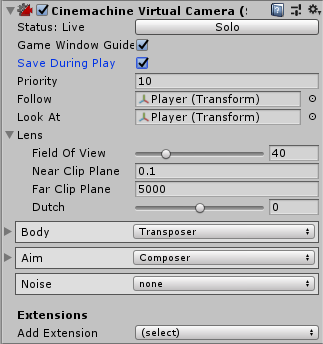

Key components of the Virtual Camera are:

* **Priority**:  The priority of this shot.  Equal or Higher value camera priorities compared to the current camera priority will be activated.  This allows for camera state machine setups where cameras are called based on trigger volumes, animations, health states, etc.  Important cameras will trigger over lower priority ones.
* **Lens**:  What kind of lens to use for this shot: FOV, clipping planes, and dutch (camera roll).  Post-processing effects can also be included here.
* **Body**: Where the camera is placed in your scene, and procedural ways to ‘mount’ your camera to any object and move the camera with it.
* **Aim**:  What the camera looks at, and procedural ways to track and compose any subject.
* Noise:  Procedural Perlin multi-layered noise system for handheld behaviors, shakes, and vibrations.
* **Extensions**:  These are add-ons to the basic Cinemachine pipeline.  Post-Processing and Collision Avoidance are examples of standard extensions shipped with Cinemachine.  The API is open, so that you can author your own extensions as well.

The **Solo Button** in the Virtual Camera inspector panel will make the virtual camera temporarily Live so that you can have immediate visual feedback in the game view when tweaking the behavioural parameters of the camera.

The **Game Window Guides** checkbox toggles the visibility of any screen compositional guides that the virtual camera might want to display in the game window.  This toggle is a static global, and applies to all virtual cameras.

The **Save During Play** checkbox enables the Cinemachine feature of taking camera settings tweaks made while in Play mode, and propagating them back to the scene.  This allows in-game fine tuning of cameras without having to do a whole lot of copy/pasting.  After you exit play mode, the scene will be updated to reflect the changes made during play.  Pressing Undo will revert those changes.

The following sections describe the behaviours and classes that make up the Cinemachine Virtual Camera, and some of its standard procedural components.

### CinemachineVirtualCamera
This component is intended to be attached to an empty Transform GameObject, and it represents a Virtual Camera within the Unity scene.

The Virtual Camera will animate its Transform according to the rules contained in its CinemachineComponent pipeline (Aim, Body, and Noise).  When the virtual camera is Live, the Unity camera will assume the position and orientation of the virtual camera.

A virtual camera is not a camera.  Instead, it can be thought of as a camera controller, not unlike a cameraman.  It can drive the Unity Camera and control its position, orientation, lens settings, and PostProcessing effects.  Each Virtual Camera owns its own Cinemachine Component Pipeline, through which you provide the instructions for dynamically tracking specific game objects.

A virtual camera is very lightweight, and does no rendering of its own.  It merely tracks interesting GameObjects, and positions itself accordingly.  A typical game can have dozens of virtual cameras, each set up to follow a particular character or capture a particular event.

A Virtual Camera can be in any of three states:

* **Live**: The virtual camera is actively controlling the Unity Camera.  The virtual camera is tracking its targets and being updated every frame. 
* **Standby**: The virtual camera is tracking its targets and being updated every frame, but no Unity Camera is actively being controlled by it.  This is the state of a virtual camera that is enabled in the scene but perhaps at a lower priority than the Live virtual camera. 
* **Disabled**: The virtual camera is present but disabled in the scene.  It is not actively tracking its targets and so consumes no processing power.  However, the virtual camera can be made live from the Timeline.

The Unity Camera can be driven by any virtual camera in the scene.  The game logic can choose the virtual camera to make live by manipulating the virtual cameras' enabled flags and their priorities, based on game logic.

In order to be driven by a virtual camera, the Unity Camera must have a CinemachineBrain behaviour, which will select the most eligible virtual camera based on its priority or on other criteria, and will manage blending.

| _Setting_ | _Type_ | _Description_ |
| --- | --- | --- |
| **Look At** | Transform | The object that the camera wants to look at (the Aim target).  If this is null, then the vcam's Transform orientation will define the camera's orientation. |
| **Follow** | Transform | The object that the camera wants to move with (the Body target).  If this is null, then the vcam's Transform position will define the camera's position. |
| **Position Blending** | PositionBlendMethod | Hint for blending positions to and from this virtual camera. _Possible Values:_ - **Linear**: Standard linear position blend. - **Spherical**: Spherical blend about LookAt target position, if there is a LookAt target. - **Cylindrical**: Cylindrical blend about LookAt target position, if there is a LookAt target.  Vertical co-ordinate is linearly interpolated.  |
| **Lens** | LensSettings | Specifies the lens properties of this Virtual Camera.  This generally mirrors the Unity Camera's lens settings, and will be used to drive the Unity camera when the vcam is active. |
| **Priority** | Int32 | The priority will determine which camera becomes active based on the state of other cameras and this camera.  Higher numbers have greater priority. |

### LensSettings
Describes the FOV and clip planes for a camera.  This generally mirrors the Unity Camera's lens settings, and will be used to drive the Unity camera when the vcam is active.

| _Setting_ | _Type_ | _Description_ |
| --- | --- | --- |
| **Field Of View** | Single | This is the camera view in vertical degrees.  For cinematic people, a 50mm lens on a super-35mm sensor would equal a 19.6 degree FOV. |
| **Orthographic Size** | Single | When using an orthographic camera, this defines the half-height, in world coordinates, of the camera view. |
| **Near Clip Plane** | Single | This defines the near region in the renderable range of the camera frustum.  Raising this value will stop the game from drawing things near the camera, which can sometimes come in handy.  Larger values will also increase your shadow resolution. |
| **Far Clip Plane** | Single | This defines the far region of the renderable range of the camera frustum.  Typically you want to set this value as low as possible without cutting off desired distant objects. |
| **Dutch** | Single | Camera Z roll, or tilt, in degrees. |

### CinemachineComposer
This is a CinemachineComponent in the Aim section of the component pipeline.  Its job is to aim the camera at the vcam's LookAt target object, with configurable offsets, damping, and composition rules.

The composer does not change the camera's position.  It will only pan and tilt the camera where it is, in order to get the desired framing.  To move the camera, you have to use the virtual camera's Body section.

The vcam’s LookAt target is the Composer’s target.  Common Composer targets: include bones on a character like the upper spine or head bone, vehicles, or dummy objects which are controlled or animated programmatically. 

Once you’ve set the vcam’s LookAt target and are tracking something, you need to define where you’d like it to be on the screen and how aggressively you’d like to camera to track it. The degree of lag, or how tightly the camera follows the subject is defined by the two controls: 

**Horizontal/Vertical Soft Damping:** Setting these values to zero means the camera will hard track the subject and the blue regions above will act as rigid barriers locking the camera movement to keep the target inside those values. Setting the larger will allow the target to ‘squish’ into the blue regions, giving you some really nice camera weight and lag. This is what real camera operators do! The vertical and horizontal values are separated so you can let the camera squish more left to right or follow tighter up and down, etc. 

**SoftZone/DeadZone**: Tune these to define where you want the subject to be onscreen. These controls are incredibly versatile. The blue areas are the ‘squishy’ areas based on how much horizontal/vertical damping you have, and the red areas define the ‘no pass’ limits where the camera will always track the subject. Opening up the soft areas to create a ‘dead zone’ in the middle allows you to make areas of the screen immune to target motion, handy for things like animation cycles where you don’t want the camera to track the target if it moves just a little.

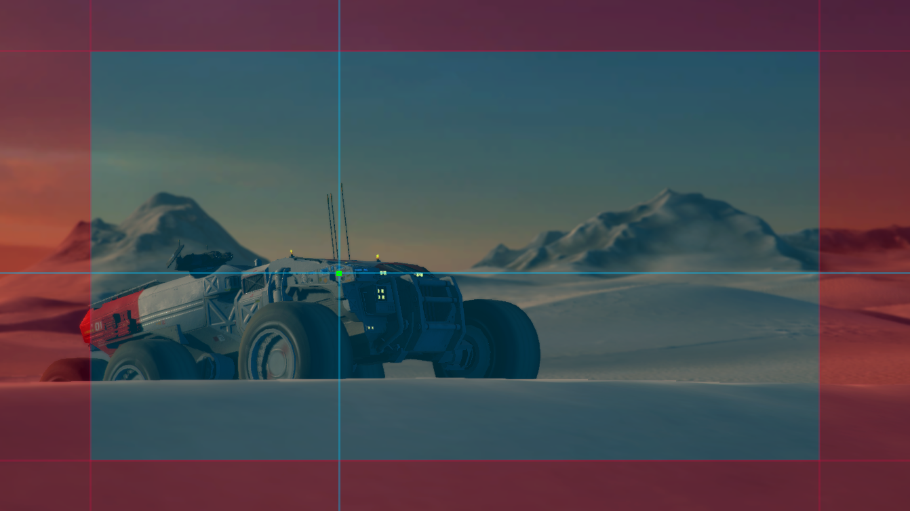

| _Setting_ | _Type_ | _Description_ |
| --- | --- | --- |
| **Tracked Object Offset** | Vector3 | Target offset from the target object's center in target-local space.  Use this to fine-tune the tracking target position when the desired area is not the tracked object's center. |
| **Lookahead Time** | Single | This setting will instruct the composer to adjust its target offset based on the motion of the target.  The composer will look at a point where it estimates the target will be this many seconds into the future.  Note that this setting is sensitive to noisy animation, and can amplify the noise, resulting in undesirable camera jitter.  If the camera jitters unacceptably when the target is in motion, turn down this setting, or animate the target more smoothly. |
| **Lookahead Smoothing** | Single | Controls the smoothness of the lookahead algorithm.  Larger values smooth out jittery predictions and also increase prediction lag. |
| **Lookahead Ignore Y** | Boolean | If checked, movement along the Y axis will be ignored for lookahead calculations. |
| **Horizontal Damping** | Single | How aggressively the camera tries to follow the target in the screen-horizontal direction.  Small numbers are more responsive, rapidly orienting the camera to keep the target in the dead zone.  Larger numbers give a more heavy slowly responding camera.  Using different vertical and horizontal settings can yield a wide range of camera behaviors. |
| **Vertical Damping** | Single | How aggressively the camera tries to follow the target in the screen-vertical direction.  Small numbers are more responsive, rapidly orienting the camera to keep the target in the dead zone.  Larger numbers give a more heavy slowly responding camera.  Using different vertical and horizontal settings can yield a wide range of camera behaviors. |
| **Screen X** | Single | Horizontal screen position for target.  The camera will rotate to position the tracked object here. |
| **Screen Y** | Single | Vertical screen position for target, The camera will rotate to position the tracked object here. |
| **Dead Zone Width** | Single | Camera will not rotate horizontally if the target is within this range of the position. |
| **Dead Zone Height** | Single | Camera will not rotate vertically if the target is within this range of the position. |
| **Soft Zone Width** | Single | When target is within this region, camera will gradually rotate horizontally to re-align towards the desired position, depending on the damping speed. |
| **Soft Zone Height** | Single | When target is within this region, camera will gradually rotate vertically to re-align towards the desired position, depending on the damping speed. |
| **Bias X** | Single | A non-zero bias will move the target position horizontally away from the center of the soft zone. |
| **Bias Y** | Single | A non-zero bias will move the target position vertically away from the center of the soft zone. |

### CinemachineTransposer
This is a CinemachineComponent in the Body section of the component pipeline.  Its job is to position the camera in a fixed relationship to the vcam's Follow target object, with offsets and damping.

The Tansposer will only change the camera's position in space.  It will not re-orient or otherwise aim the camera.  To to that, you need to instruct the vcam in the Aim section of its pipeline.

Transposer is a component which mounts a camera to any object. It has a number of advantages over just putting the camera under the object you want to have the camera follow. Hood Cam, Door Cam, POV Cam, Missile Cam - if you want to mount the camera to something, use Transposer. 

Using Transposer for your camera body motion has advantages: 

* The position tuning is kept, even if the game is running. Tune a regular camera in game mode and the position is lost once you quit, not with Transposer. Tune it up while the game is running and you’re done. 
* Add damping to the camera - if your camera follows something, the damping values can give you some ‘weight’ to the camera so they feel smoother. 
* Organization: Put all your cameras in one place, instead of having them hidden under all sorts of assets in your project - you pick their targets vs. put the camera under them in the hierarchy. 

**Follow Offset**: The camera will go to the centre of the object you’re targeting in the Transposer Camera Target, so if you want the camera to be further behind, put in some offsets. We default at -10 so the camera is behind whatever you’re targeting. 

**Damping**: Per channel damping which will cause the camera to lag behind the target.  You can control both the position damping, and the orientation damping.

**Binding Mode**: There’s options in the relationship between the camera and the target object. 

* *Lock To Target* interprets the camera offset in target-local coords.  As the target rotates, the camera rotates around it to maintain the offset.
* *Lock to Target With World Up* is the same as the above but it keeps the camera pointing up. Handy if your target flips over. 
* *Lock to Target On Target Assign* mounts the camera relative to the target’s local coordinate system at the time the camera is initialized. This offset remains constant in world space, and the camera will not rotate along with the target
* *World Space* offsets positions the camera relative to the target in world coords no matter what direction the target object is facing. 
* *Simple Follow with World Up:* this will follow the target at the desired distance and height while moving the camera position as little as possible.  This is quite similar to what a human camera operator would do when instructed to follow a target.

These different modes do incredibly different things, so try them out and one should work well for whatever your requirements are. 

| _Setting_ | _Type_ | _Description_ |
| --- | --- | --- |
| **Binding Mode** | BindingMode | The coordinate space to use when interpreting the offset from the target.  This is also used to set the camera's Up vector, which will be maintained when aiming the camera. _Possible Values:_ - **Lock To Target On Assign**: Camera will be bound to the Follow target using a frame of reference consisting of the target's local frame at the moment when the virtual camera was enabled, or when the target was assigned. - **Lock To Target With World Up**: Camera will be bound to the Follow target using a frame of reference consisting of the target's local frame, with the tilt and roll zeroed out. - **Lock To Target No Roll**: Camera will be bound to the Follow target using a frame of reference consisting of the target's local frame, with the roll zeroed out. - **Lock To Target**: Camera will be bound to the Follow target using the target's local frame. - **World Space**: Camera will be bound to the Follow target using a world space offset. - **Simple Follow With World Up**: Offsets will be calculated relative to the target, using Camera-local axes.  |
| **Follow Offset** | Vector3 | The distance vector that the transposer will attempt to maintain from the Follow target. |
| **X Damping** | Single | How aggressively the camera tries to maintain the offset in the X-axis.  Small numbers are more responsive, rapidly translating the camera to keep the target's x-axis offset.  Larger numbers give a more heavy slowly responding camera.  Using different settings per axis can yield a wide range of camera behaviors. |
| **Y Damping** | Single | How aggressively the camera tries to maintain the offset in the Y-axis.  Small numbers are more responsive, rapidly translating the camera to keep the target's y-axis offset.  Larger numbers give a more heavy slowly responding camera.  Using different settings per axis can yield a wide range of camera behaviors. |
| **Z Damping** | Single | How aggressively the camera tries to maintain the offset in the Z-axis.  Small numbers are more responsive, rapidly translating the camera to keep the target's z-axis offset.  Larger numbers give a more heavy slowly responding camera.  Using different settings per axis can yield a wide range of camera behaviors. |
| **Pitch Damping** | Single | How aggressively the camera tries to track the target rotation's X angle.  Small numbers are more responsive.  Larger numbers give a more heavy slowly responding camera. |
| **Yaw Damping** | Single | How aggressively the camera tries to track the target rotation's Y angle.  Small numbers are more responsive.  Larger numbers give a more heavy slowly responding camera. |
| **Roll Damping** | Single | How aggressively the camera tries to track the target rotation's Z angle.  Small numbers are more responsive.  Larger numbers give a more heavy slowly responding camera. |

### CinemachineBasicMultiChannelPerlin
As a part of the Cinemachine Pipeline implementing the Noise stage, this component adds Perlin Noise to the Camera state, in the Correction channel of the CameraState.

The noise is created by using a predefined noise profile asset.  This defines the shape of the noise over time.  You can scale this in amplitude or in time, to produce a large family of different noises using the same profile.

The Noise is a multi-layered Perlin noise function which is applied after the Composer and adds additional transforms. It has controls for Position and Orientation. You can add as many layers as you want by increasing the profile’s Size value. 

Procedural noise is a complex thing to make look real. Convincing hand-held motion is a mixture of low, medium and high frequency wobbles which together combine to create something believable. 

**Position / Orientation Size**: This is how many noise functions you’d like to blend together for the Position or Orientation or both. Mix at least 3 Orientation channels together for some realistic hand-held motion. 

**Amplitude** defines the amount of noise in degrees. Wider lenses will need larger degree values in order to ‘see’ the shake. Telephoto lenses use smaller values as that small setting appears amplified through narrower FOV lenses. 

**Frequency** defines the speed of the noise in Hz. Typically a ‘low’ frequency value might be around 0.1. Consider that your game is running at 30 or 60hz, so settings higher than that will be ‘on the other side’ of the Nyquest frequency meaning that they will not be directly tracked. A setting of 100 will be higher than what the camera can ‘follow’ as your game is only running at say 60hz. It can look kind of choppy since the camera can’t track something which is sampling faster than what the game is running at. It can also look kind of cool, but rarely. Experiment.  Typically, for most hand-held setups, the low is around 0.1-0.5, the mid maybe .8-1.5 and the high around 3-4. That’s 3-4 shakes back and forth per second. 

The most convincing camera shakes are typically done with Orientation noise as that’s where the camera is aiming. Handheld camera operators tend shake more rotationally than they do positionally, but of course feel free to mix in some Position noise, just remember it’s probably best to start with the Orientation. 

We’ve included a number of presets to get you going, under Cinemachine/Examples/Presets/Noise and of course you can add as many of your own as you wish, just right click in the Asset window Create->Cinemachine->Noise, and drag that asset into the Noise Settings window under that Virtual Camera. You can also animate the Noise through the Amplitude Gain and Frequency Gain settings to ramp the effect up and down.

| _Setting_ | _Type_ | _Description_ |
| --- | --- | --- |
| **Noise Profile** | NoiseSettings | The asset containing the Noise Profile.  Define the frequencies and amplitudes there to make a characteristic noise profile.  Make your own or just use one of the many presets. |
| **Amplitude Gain** | Single | Gain to apply to the amplitudes defined in the NoiseSettings asset.  1 is normal.  Setting this to 0 completely mutes the noise. |
| **Frequency Gain** | Single | Scale factor to apply to the frequencies defined in the NoiseSettings asset.  1 is normal.  Larger magnitudes will make the noise shake more rapidly. |

### NoiseSettings
This is an asset that defines a noise profile.  A noise profile is the shape of the noise as a function of time.  You can build arbitrarily complex shapes by combining different base perlin noise frequencies at different amplitudes.

The frequencies and amplitudes should be chosen with care, to ensure an interesting noise quality that is not obviously repetitive.

As a mathematical side-note, any arbitrary periodic curve can be broken down into a series of fixed-amplitude sine-waves added together.  This is called fourier decomposition, and is the basis of much signal processing.  It doesn't really have much to do with this asset, but it's super interesting!

| _Setting_ | _Type_ | _Description_ |
| --- | --- | --- |
| **Position** | TransformNoiseParams[] | These are the noise channels for the virtual camera's position.  Convincing noise setups typically mix low, medium and high frequencies together, so start with a size of 3. |
| **Orientation** | TransformNoiseParams[] | These are the noise channels for the virtual camera's orientation.  Convincing noise setups typically mix low, medium and high frequencies together, so start with a size of 3. |

### NoiseSettings.NoiseParams
Describes the behaviour for a channel of noise.

| _Setting_ | _Type_ | _Description_ |
| --- | --- | --- |
| **Amplitude** | Single | The amplitude of the noise for this channel.  Larger numbers vibrate higher. |
| **Frequency** | Single | The frequency of noise for this channel.  Higher magnitudes vibrate faster. |

### NoiseSettings.TransformNoiseParams
Contains the behaviour of noise for the noise module for all 3 cardinal axes of the camera.

| _Setting_ | _Type_ | _Description_ |
| --- | --- | --- |
| **X** | NoiseParams | Noise definition for X-axis. |
| **Y** | NoiseParams | Noise definition for Y-axis. |
| **Z** | NoiseParams | Noise definition for Z-axis. |

## Brains and Blending
The CinemachineBrain is the central Cinemachine component that does all the magic.  It’s a component attached to the Unity camera and it monitors all the Virtual Cameras in the scene and drives the Unity camera using the shot it likes best. 

When it’s time to transition from one shot to another, you can choose how this transition is accomplished.  It can be a camera cut, or a Cinemachine blend.  Cinemachine Blends are special: they are not fades, or wipes, or dissolves.  Rather, they are an interpolation of one camera’s settings to another.  Think of a blend more as if one cameraman smoothly passed the camera to another cameraman in a different position, to elegantly transition the shot without a cut.

### CinemachineBrain
CinemachineBrain is the link between the Unity Camera and the Cinemachine Virtual Cameras in the scene.  It monitors the priority stack to choose the current Virtual Camera, and blend with another if necessary.  Finally and most importantly, it applies the Virtual Camera state to the attached Unity Camera.

The CinemachineBrain is also the place where rules for blending between virtual cameras are defined.  Camera blending is an interpolation over time of one virtual camera position and state to another.  If you think of virtual cameras as cameramen, then blending is a little like one cameraman smoothly passing the camera to another cameraman.  You can specify the time over which to blend, as well as the blend curve shape.  Note that a camera cut is just a zero-time blend.

The Brain holds the following key settings:

* **Blend Settings**:  This is the array which defines how any shot blends to any other shot.  You can have a 4 second blend from CameraA to CameraB, but a 1 second blend from CameraB back to CameraA.  This is very powerful when used in a state machine type setup.  If a specific blend between two cameras isn’t defined, it uses the Default Blend which by default is a smooth 2-second blend (but you can change this).

* **Layer Filter**:  The Brain will only notice those virtual cameras that pass its Unity Camera’s culling mask.  You can set up split-screen environments by assigning different Virtual Cameras to different layers, and using the culling mask to filter them.

* **Event Dispatching**:  The brain will fire events when the shot changes, in case you need to monitor this.  There in an event for whenever a Virtual Camera goes live, and another event for when the camera cuts (so that temporal post effects can be reset).

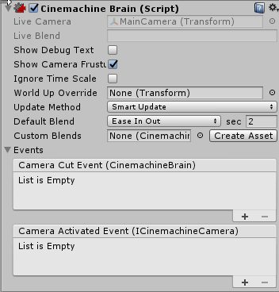

| _Setting_ | _Type_ | _Description_ |
| --- | --- | --- |
| **Show Debug Text** | Boolean | When enabled, the current camera and blend will be indicated in the game window, for debugging. |
| **Show Camera Frustum** | Boolean | When enabled, the camera's frustum will be shown at all times in the scene view. |
| **Ignore Time Scale** | Boolean | When enabled, the cameras will always respond in real-time to user input and damping, even if the game is running in slow motion. |
| **World Up Override** | Transform | If set, this object's Y axis will define the worldspace Up vector for all the virtual cameras.  This is useful for instance in top-down game environments.  If not set, Up is worldspace Y.  Setting this appropriately is important, because Virtual Cameras don't like looking straight up or straight down. |
| **Update Method** | UpdateMethod | Use FixedUpdate if all your targets are animated during FixedUpdate (e.g.  RigidBodies), LateUpdate if all your targets are animated during the normal Update loop, and SmartUpdate if you want Cinemachine to do the appropriate thing on a per-target basis.  SmartUpdate is the recommended setting. _Possible Values:_ - **Fixed Update**: Virtual cameras are updated in sync with the Physics module, in FixedUpdate. - **Late Update**: Virtual cameras are updated in MonoBehaviour LateUpdate. - **Smart Update**: Virtual cameras are updated according to how the target is updated.  |
| **Default Blend** | CinemachineBlendDefinition | The blend that is used in cases where you haven't explicitly defined a blend between two Virtual Cameras. |
| **Custom Blends** | CinemachineBlenderSettings | This is the asset that contains custom settings for blends between specific virtual cameras in your scene. |
| **Camera Cut Event** | BrainEvent | This event will fire whenever a virtual camera goes live and there is no blend. |
| **Camera Activated Event** | VcamEvent | This event will fire whenever a virtual camera goes live.  If a blend is involved, then the event will fire on the first frame of the blend. |

### CinemachineBlendDefinition
Definition of a Camera blend.  This struct holds the information necessary to generate a suitable AnimationCurve for a Cinemachine Blend.

| _Setting_ | _Type_ | _Description_ |
| --- | --- | --- |
| **Style** | Style | Shape of the blend curve. _Possible Values:_ - **Cut**: Zero-length blend. - **Ease In Out**: S-shaped curve, giving a gentle and smooth transition. - **Ease In**: Linear out of the outgoing shot, and easy into the incoming. - **Ease Out**: Easy out of the outgoing shot, and linear into the incoming. - **Hard In**: Easy out of the outgoing, and hard into the incoming. - **Hard Out**: Hard out of the outgoing, and easy into the incoming. - **Linear**: Linear blend.  Mechanical-looking. - **Custom**: Custom blend curve.  |
| **Time** | Single | Duration of the blend, in seconds. |

### CinemachineBlenderSettings
Asset that defines the rules for blending between Virtual Cameras.

The From and To settings are name-based, which means that cameras are found by matching their names to the settings.  They are not linked to specific game objects.

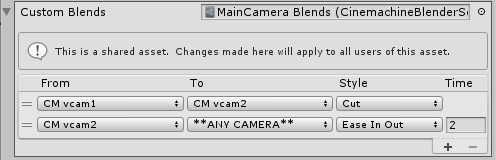

**Blender supports wildcards** called * * ANY CAMERA * *, which you can use on the input or output of blends so that no matter what camera you’re in, you only have to specify one blend to a particular shot if you always want to blend into or out of that shot the same way. 

| _Setting_ | _Type_ | _Description_ |
| --- | --- | --- |
| **Custom Blends** | CustomBlend[] | The array containing explicitly defined blends between two Virtual Cameras. |

### CinemachineBlenderSettings.CustomBlend
Container specifying how two specific Cinemachine Virtual Cameras blend together.

| _Setting_ | _Type_ | _Description_ |
| --- | --- | --- |
| **From** | String | When blending from this camera. |
| **To** | String | When blending to this camera. |
| **Blend** | CinemachineBlendDefinition | Blend curve definition. |

## Follow Cams and Player Input
In the previous sections of the manual we discussed basic virtual cameras.  They are great for cinematics and composition, but it’s hard to set up a camera that follows in the path of a moving target, and up to now there has been no consideration of cameras that position themselves in response to player input.

Because Cinemachine is a modular system, it’s easy to replace the Transposer in the Body section with a different component - one that considers the velocity of the Follow target, and player input coming from various HIDs.  One such component is the **OrbitalTransposer**.

Building on the OrbitalTransposer, the **CinemachineFreeLook** camera is a complex rig that allows the player to position the camera in 2 dimensions: horizontally using the OrbitalTransposer, and vertically using a super-powerful custom blending of 3 interrelated child rigs.

Player input is accomplished either by setting up axes in the Unity Input Manager, or you can drive the values directly using any custom or proprietary input system.

### CinemachineOrbitalTransposer
This is a CinemachineComponent in the the Body section of the component pipeline.  Its job is to position the camera in a variable relationship to a the vcam's Follow target object, with offsets and damping.

This component is typically used to implement a camera that follows its target.  It can accept player input from an input device, which allows the player to dynamically control the relationship between the camera and the target, for example with a joystick.

The OrbitalTransposer introduces the concept of __Heading__, which is the direction in which the target is moving, and the OrbitalTransposer will attempt to position the camera in relationship to the heading, which is by default directly behind the target.  You can control the default relationship by adjusting the Heading Bias setting.

If you attach an input controller to the OrbitalTransposer, then the player can also control the way the camera positions itself in relation to the target heading. This allows the camera to move to any spot on an orbit around the target.  You can configure the OrbitalTransposer to take its input from any axis previously set up in the Input Manager, or you can control the value directly using any custom input system.

Another feature of the OrbitalTransposer is automatic recentering.  When enabled, it will automatically move the camera back to the default target heading after is has detected no user input for a specified time.

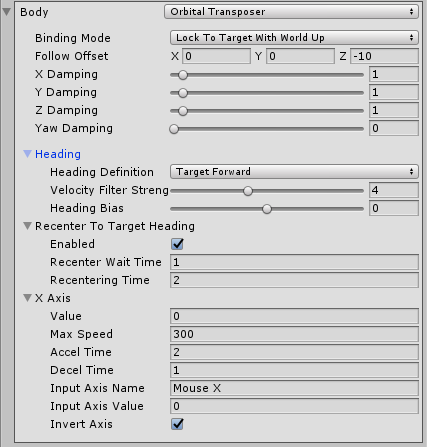

| _Setting_ | _Type_ | _Description_ |
| --- | --- | --- |
| **Heading** | Heading | The definition of Forward.  Camera will follow behind. |
| **Recenter To Target Heading** | Recentering | Automatic heading recentering.  The settings here defines how the camera will reposition itself in the absence of player input. |
| **X Axis** | AxisState | Heading Control.  The settings here control the behaviour of the camera in response to the player's input. |
| **Binding Mode** | BindingMode | The coordinate space to use when interpreting the offset from the target.  This is also used to set the camera's Up vector, which will be maintained when aiming the camera. _Possible Values:_ - **Lock To Target On Assign**: Camera will be bound to the Follow target using a frame of reference consisting of the target's local frame at the moment when the virtual camera was enabled, or when the target was assigned. - **Lock To Target With World Up**: Camera will be bound to the Follow target using a frame of reference consisting of the target's local frame, with the tilt and roll zeroed out. - **Lock To Target No Roll**: Camera will be bound to the Follow target using a frame of reference consisting of the target's local frame, with the roll zeroed out. - **Lock To Target**: Camera will be bound to the Follow target using the target's local frame. - **World Space**: Camera will be bound to the Follow target using a world space offset. - **Simple Follow With World Up**: Offsets will be calculated relative to the target, using Camera-local axes.  |
| **Follow Offset** | Vector3 | The distance vector that the transposer will attempt to maintain from the Follow target. |
| **X Damping** | Single | How aggressively the camera tries to maintain the offset in the X-axis.  Small numbers are more responsive, rapidly translating the camera to keep the target's x-axis offset.  Larger numbers give a more heavy slowly responding camera.  Using different settings per axis can yield a wide range of camera behaviors. |
| **Y Damping** | Single | How aggressively the camera tries to maintain the offset in the Y-axis.  Small numbers are more responsive, rapidly translating the camera to keep the target's y-axis offset.  Larger numbers give a more heavy slowly responding camera.  Using different settings per axis can yield a wide range of camera behaviors. |
| **Z Damping** | Single | How aggressively the camera tries to maintain the offset in the Z-axis.  Small numbers are more responsive, rapidly translating the camera to keep the target's z-axis offset.  Larger numbers give a more heavy slowly responding camera.  Using different settings per axis can yield a wide range of camera behaviors. |
| **Pitch Damping** | Single | How aggressively the camera tries to track the target rotation's X angle.  Small numbers are more responsive.  Larger numbers give a more heavy slowly responding camera. |
| **Yaw Damping** | Single | How aggressively the camera tries to track the target rotation's Y angle.  Small numbers are more responsive.  Larger numbers give a more heavy slowly responding camera. |
| **Roll Damping** | Single | How aggressively the camera tries to track the target rotation's Z angle.  Small numbers are more responsive.  Larger numbers give a more heavy slowly responding camera. |

### CinemachineOrbitalTransposer.Heading
How the "forward" direction is defined.  Orbital offset is in relation to the forward direction.

| _Setting_ | _Type_ | _Description_ |
| --- | --- | --- |
| **Heading Definition** | HeadingDefinition | How 'forward' is defined.  The camera will be placed by default behind the target.  PositionDelta will consider 'forward' to be the direction in which the target is moving. _Possible Values:_ - **Position Delta**: Target heading calculated from the difference between its position on the last update and current frame. - **Velocity**: Target heading calculated from its Rigidbody's velocity.  If no Rigidbody exists, it will fall back to HeadingDerivationMode.PositionDelta. - **Target Forward**: Target heading calculated from the Target Transform's euler Y angle. - **World Forward**: Default heading is a constant world space heading.  |
| **Velocity Filter Strength** | Int32 | Size of the velocity sampling window for target heading filter.  This filters out irregularities in the target's movement.  Used only if deriving heading from target's movement (PositionDelta or Velocity). |
| **Heading Bias** | Single | Where the camera is placed when the X-axis value is zero.  This is a rotation in degrees around the Y axis.  When this value is 0, the camera will be placed behind the target.  Nonzero offsets will rotate the zero position around the target. |

### AxisState
Axis state for defining how to react to player input.  The settings here control the responsiveness of the axis to player input.

| _Setting_ | _Type_ | _Description_ |
| --- | --- | --- |
| **Value** | Single | The current value of the axis. |
| **Max Speed** | Single | The maximum speed of this axis in units/second. |
| **Accel Time** | Single | The amount of time in seconds it takes to accelerate to MaxSpeed with the supplied Axis at its maximum value. |
| **Decel Time** | Single | The amount of time in seconds it takes to decelerate the axis to zero if the supplied axis is in a neutral position. |
| **Input Axis Name** | String | The name of this axis as specified in Unity Input manager.  Setting to an empty string will disable the automatic updating of this axis. |
| **Input Axis Value** | Single | The value of the input axis.  A value of 0 means no input.  You can drive this directly from a custom input system, or you can set the Axis Name and have the value driven by the internal Input Manager. |
| **Invert Input** | Boolean | If checked, then the raw value of the input axis will be inverted before it is used. |
| **Min Value** | Single | The minimum value for the axis. |
| **Max Value** | Single | The maximum value for the axis. |
| **Wrap** | Boolean | If checked, then the axis will wrap around at the min/max values, forming a loop. |

### AxisState.Recentering
Helper for automatic axis recentering.

| _Setting_ | _Type_ | _Description_ |
| --- | --- | --- |
| **Enabled** | Boolean | If checked, will enable automatic recentering of the axis.  If unchecked, recenting is disabled. |
| **Wait Time** | Single | If no user input has been detected on the axis, the axis will wait this long in seconds before recentering. |
| **Recentering Time** | Single | Maximum angular speed of recentering.  Will accelerate into and decelerate out of this. |

### CinemachineFreeLook
A Cinemachine Camera geared towards a 3rd person camera experience.  The camera orbits around its subject with three separate camera rigs defining rings around the target.  Each rig has its own radius, height offset, composer, and lens settings.  Depending on the camera's position along the spline connecting these three rigs, these settings are interpolated to give the final camera position and state.

Player input is supplied along 2 axes: the X axis which controls the orbital position (see CinemachineOrbitalTransposer), and the Y axis which controls the vertical position on the spline connecting the 3 child rigs.

Each child rig can have its own Lens settings, or common shared values can be used.  Additionally, each child rig can have its own Composer and Noise settings.

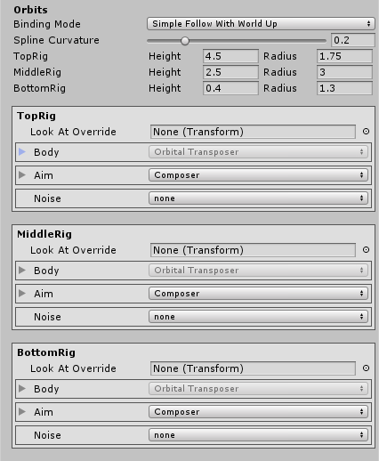

| _Setting_ | _Type_ | _Description_ |
| --- | --- | --- |
| **Look At** | Transform | Object for the camera children to look at (the aim target). |
| **Follow** | Transform | Object for the camera children wants to move with (the body target). |
| **Common Lens** | Boolean | If enabled, this lens setting will apply to all three child rigs, otherwise the child rig lens settings will be used. |
| **Lens** | LensSettings | Specifies the lens properties of this Virtual Camera.  This generally mirrors the Unity Camera's lens settings, and will be used to drive the Unity camera when the vcam is active. |
| **Y Axis** | AxisState | The Vertical axis.  Value is 0..1.  Chooses how to blend the child rigs. |
| **X Axis** | AxisState | The Horizontal axis.  Value is 0..359.  This is passed on to the rigs' OrbitalTransposer component. |
| **Heading** | Heading | The definition of Forward.  Camera will follow behind. |
| **Recenter To Target Heading** | Recentering | Controls how automatic recentering of the X axis is accomplished. |
| **Binding Mode** | BindingMode | The coordinate space to use when interpreting the offset from the target.  This is also used to set the camera's Up vector, which will be maintained when aiming the camera. _Possible Values:_ - **Lock To Target On Assign**: Camera will be bound to the Follow target using a frame of reference consisting of the target's local frame at the moment when the virtual camera was enabled, or when the target was assigned. - **Lock To Target With World Up**: Camera will be bound to the Follow target using a frame of reference consisting of the target's local frame, with the tilt and roll zeroed out. - **Lock To Target No Roll**: Camera will be bound to the Follow target using a frame of reference consisting of the target's local frame, with the roll zeroed out. - **Lock To Target**: Camera will be bound to the Follow target using the target's local frame. - **World Space**: Camera will be bound to the Follow target using a world space offset. - **Simple Follow With World Up**: Offsets will be calculated relative to the target, using Camera-local axes.  |
| **Spline Curvature** | Single | Controls how taut is the line that connects the rigs' orbits, which determines final placement on the Y axis. |
| **Orbits** | Orbit[] | The radius and height of the three orbiting rigs. |
| **Priority** | Int32 | The priority will determine which camera becomes active based on the state of other cameras and this camera.  Higher numbers have greater priority. |

## Tracked Dolly
If you need your camera’s position to be confined to a dolly track, this can be done with a combination of a CinemachinePath for the track, and a TrackedDolly for the Body component of the virtual camera.  There is a shortcut for creating this pair in the Cinemachine menu:

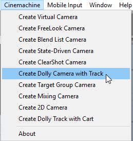

The path itself is defined by positioning waypoints.  The CinemachinePath inspector provides a simple interface for doing this.  The waypoints are connected using a bezier, and you can control how the interpolation occurs by manipulating the curve tangents at the waypoints.  The result of this is a camera track, drawn in the scene view in a manner resembling a railroad track.  It will not be drawn in the game view.

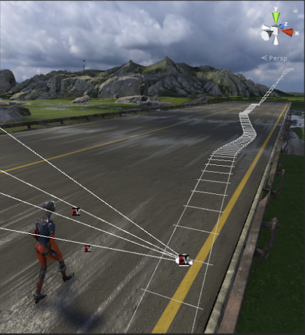

### CinemachineTrackedDolly
A Cinemachine Virtual Camera Body component that constrains camera motion to a CinemachinePath or a CinemachineSmoothPath.  The camera can move along the path.

This component can operate in two modes: manual positioning, and Auto-Dolly positioning.  In Manual mode, the camera's position is specified by animating the Path Position field.  In Auto-Dolly mode, the Path Position field is animated automatically every frame by finding the position on the path that's closest to the virtual camera's Follow target.

| _Setting_ | _Type_ | _Description_ |
| --- | --- | --- |
| **Path** | CinemachinePathBase | The path to which the camera will be constrained.  This must be non-null. |
| **Path Position** | Single | The position along the path at which the camera will be placed.  This can be animated directly, or set automatically by the Auto-Dolly feature to get as close as possible to the Follow target.  The value is interpreted according to the Position Units setting. |
| **Position Units** | PositionUnits | How to interpret Path Position.  If set to Path Units, values are as follows: 0 represents the first waypoint on the path, 1 is the second, and so on.  Values in-between are points on the path in between the waypoints.  If set to Distance, then Path Position represents distance along the path. _Possible Values:_ - **Path Units**: Use PathPosition units, where 0 is first waypoint, 1 is second waypoint, etc. - **Distance**: Use Distance Along Path.  Path will be sampled according to its Resolution setting, and a distance lookup table will be cached internally. - **Normalized**: Normalized units, where 0 is the start of the path, and 1 is the end.  Path will be sampled according to its Resolution setting, and a distance lookup table will be cached internally.  |
| **Path Offset** | Vector3 | Where to put the camera relative to the path position.  X is perpendicular to the path, Y is up, and Z is parallel to the path.  This allows the camera to be offset from the path itself (as if on a tripod, for example). |
| **X Damping** | Single | How aggressively the camera tries to maintain its position in a direction perpendicular to the path.  Small numbers are more responsive, rapidly translating the camera to keep the target's x-axis offset.  Larger numbers give a more heavy slowly responding camera.  Using different settings per axis can yield a wide range of camera behaviors. |
| **Y Damping** | Single | How aggressively the camera tries to maintain its position in the path-local up direction.  Small numbers are more responsive, rapidly translating the camera to keep the target's y-axis offset.  Larger numbers give a more heavy slowly responding camera.  Using different settings per axis can yield a wide range of camera behaviors. |
| **Z Damping** | Single | How aggressively the camera tries to maintain its position in a direction parallel to the path.  Small numbers are more responsive, rapidly translating the camera to keep the target's z-axis offset.  Larger numbers give a more heavy slowly responding camera.  Using different settings per axis can yield a wide range of camera behaviors. |
| **Camera Up** | CameraUpMode | How to set the virtual camera's Up vector.  This will affect the screen composition, because the camera Aim behaviours will always try to respect the Up direction. _Possible Values:_ - **Default**: Leave the camera's up vector alone.  It will be set according to the Brain's WorldUp. - **Path**: Take the up vector from the path's up vector at the current point. - **Path No Roll**: Take the up vector from the path's up vector at the current point, but with the roll zeroed out. - **Follow Target**: Take the up vector from the Follow target's up vector. - **Follow Target No Roll**: Take the up vector from the Follow target's up vector, but with the roll zeroed out.  |
| **Pitch Damping** | Single | How aggressively the camera tries to track the target rotation's X angle.  Small numbers are more responsive.  Larger numbers give a more heavy slowly responding camera. |
| **Yaw Damping** | Single | How aggressively the camera tries to track the target rotation's Y angle.  Small numbers are more responsive.  Larger numbers give a more heavy slowly responding camera. |
| **Roll Damping** | Single | How aggressively the camera tries to track the target rotation's Z angle.  Small numbers are more responsive.  Larger numbers give a more heavy slowly responding camera. |
| **Auto Dolly** | AutoDolly | Controls how automatic dollying occurs.  A Follow target is necessary to use this feature. |

### CinemachineTrackedDolly.AutoDolly
Controls how automatic dollying occurs.

| _Setting_ | _Type_ | _Description_ |
| --- | --- | --- |
| **Enabled** | Boolean | If checked, will enable automatic dolly, which chooses a path position that is as close as possible to the Follow target.  Note: this can have significant performance impact. |
| **Position Offset** | Single | Offset, in current position units, from the closest point on the path to the follow target. |
| **Search Radius** | Int32 | Search up to how many waypoints on either side of the current position.  Use 0 for Entire path. |
| **Search Resolution** | Int32 | We search between waypoints by dividing the segment into this many straight pieces.  The higher the number, the more accurate the result, but performance is proportionally slower for higher numbers. |

### CinemachinePath
Defines a world-space path, consisting of an array of waypoints, each of which has position, tangent, and roll settings.  Bezier interpolation is performed between the waypoints, to get a smooth and continuous path.

| _Setting_ | _Type_ | _Description_ |
| --- | --- | --- |
| **Looped** | Boolean | If checked, then the path ends are joined to form a continuous loop. |
| **Waypoints** | Waypoint[] | The waypoints that define the path.  They will be interpolated using a bezier curve. |
| **Resolution** | Int32 | Path samples per waypoint.  This is used for calculating path distances. |
| **Appearance** | Appearance | The settings that control how the path will appear in the editor scene view. |

### CinemachinePath.Waypoint
A waypoint along the path.

| _Setting_ | _Type_ | _Description_ |
| --- | --- | --- |
| **Position** | Vector3 | Position in path-local space. |
| **Tangent** | Vector3 | Offset from the position, which defines the tangent of the curve at the waypoint.  The length of the tangent encodes the strength of the bezier handle.  The same handle is used symmetrically on both sides of the waypoint, to ensure smoothness. |
| **Roll** | Single | Defines the roll of the path at this waypoint.  The other orientation axes are inferred from the tangent and world up. |

### CinemachineSmoothPath
Defines a world-space path, consisting of an array of waypoints, each of which has position and roll settings.  Bezier interpolation is performed between the waypoints, to get a smooth and continuous path.  The path will pass through all waypoints, and (unlike CinemachinePath) first and second order continuity is guaranteed.

| _Setting_ | _Type_ | _Description_ |
| --- | --- | --- |
| **Looped** | Boolean | If checked, then the path ends are joined to form a continuous loop. |
| **Waypoints** | Waypoint[] | The waypoints that define the path.  They will be interpolated using a bezier curve. |
| **Resolution** | Int32 | Path samples per waypoint.  This is used for calculating path distances. |
| **Appearance** | Appearance | The settings that control how the path will appear in the editor scene view. |

### CinemachineSmoothPath.Waypoint
A waypoint along the path.

| _Setting_ | _Type_ | _Description_ |
| --- | --- | --- |
| **Position** | Vector3 | Position in path-local space. |
| **Roll** | Single | Defines the roll of the path at this waypoint.  The other orientation axes are inferred from the tangent and world up. |

### CinemachinePathBase.Appearance
This class holds the settings that control how the path will appear in the editor scene view.  The path is not visible in the game view.

| _Setting_ | _Type_ | _Description_ |
| --- | --- | --- |
| **Path Color** | Color | The color of the path itself when it is active in the editor. |
| **Inactive Path Color** | Color | The color of the path itself when it is inactive in the editor. |
| **Width** | Single | The width of the railroad-tracks that are drawn to represent the path. |

## State-Driven Camera
The State-Driven Camera is an implementation of a simple yet powerful concept: activate specific shots when the subject enters specific animations states.

Even better, the blending between shots within the state-driven rig can be customized and tuned to maximize the emotional punch of the transitions.

Using Cinemachine it’s possible to set up world-class 3rd person action adventure camera systems. For example, you can create a unique Free-Look camera for events like this: Stand / Walk, Run, Sprint, etc. Link the appropriate Cinemachine Free-Look camera up to that animation state, so when the animation state is triggered it turns on that Cinemachine camera.  

The idea is to simply blend into the right Free-Look camera for each animation state. Your ‘Sprint’ Free-Look gets in closer, the lens is wider and there is a ton of handheld noise. Boom, you now have a ‘Roadie Run’ camera. This concept has been used to set up a complex camera rig that had over 40 Free-Look cameras for a character’s local-motion and combat system, all set up so quickly and all tuneable in real-time. 

You first start with an animated target, i.e. something that has an Animator component controlled by a FSM:

You then create a CinemachineStateDrivenCamera and connect the FSM to its Animated Target:
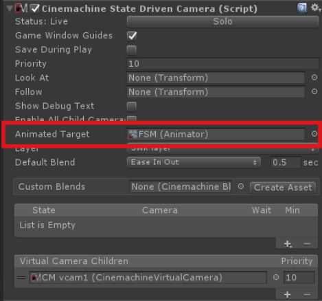

Once you have set the Animated Target setting to point to a target object that has animation states, the inspector editor will scan the target object for animation states and populate its menus so that you can quickly and easily map available animation states to child vcams.

Next, create some state-to-camera mappings. You do that by clicking on the little + icon in the state list:
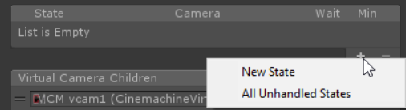

This will add an entry in the state list, and you can then choose the state you want to handle, and the virtual camera child to map it to.
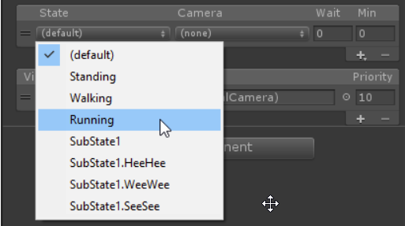

The available cameras are the virtual camera children of the StateDrivenCamera. Create as many as you like, of whatever variety you need. You can use the hierarchy view to reparent externally-created vcams to the StateDrivenCamera, if you like, or just press the little + on the camera list to create a standard one. When you do, those cameras will become available for mapping.    These virtual cameras will only be visible to the State-Driven Camera parent, and will consume no processing resources until they are activated by the parent.

You will end up with something like this:
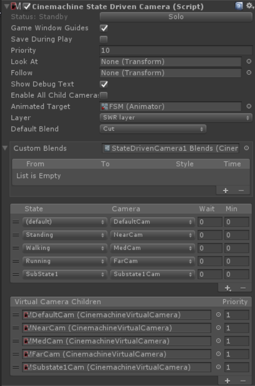

So now, when the states in the list become active, the associated child cameras will also become active. They will blend in using the default blend setting defined in the StateDrivenCamera. You can also create custom blends for specific pairs by creating a custom blend asset on the StateDrivenCamera.

### CinemachineStateDrivenCamera
This is a virtual camera "manager" that owns and manages a collection of child Virtual Cameras.  These child vcams are mapped to individual states in an animation state machine, allowing you to associate specific vcams to specific animation states.  When that state is active in the state machine, then the associated camera will be activated.

You can define custom blends and transitions between child cameras.

In order to use this behaviour, you must have an animated target (i.e.  an object animated with a state machine) to drive the behaviour.

| _Setting_ | _Type_ | _Description_ |
| --- | --- | --- |
| **Look At** | Transform | Default object for the camera children to look at (the aim target), if not specified in a child camera.  May be empty if all of the children define targets of their own. |
| **Follow** | Transform | Default object for the camera children wants to move with (the body target), if not specified in a child camera.  May be empty if all of the children define targets of their own. |
| **Animated Target** | Animator | The state machine whose state changes will drive this camera's choice of active child. |
| **Layer Index** | Int32 | Which layer in the target state machine to observe. |
| **Show Debug Text** | Boolean | When enabled, the current child camera and blend will be indicated in the game window, for debugging. |
| **Enable All Child Cameras** | Boolean | Force all child cameras to be enabled.  This is useful if animating them in Timeline, but consumes extra resources. |
| **Instructions** | Instruction[] | The set of instructions associating virtual cameras with states.  These instructions are used to choose the live child at any given moment. |
| **Default Blend** | CinemachineBlendDefinition | The blend which is used if you don't explicitly define a blend between two Virtual Camera children. |
| **Custom Blends** | CinemachineBlenderSettings | This is the asset which contains custom settings for specific child blends. |
| **Priority** | Int32 | The priority will determine which camera becomes active based on the state of other cameras and this camera.  Higher numbers have greater priority. |

## Collision Avoidance and Shot Evaluation
When characters move around in complex environments, sometimes obstacles in the scene can come between a camera and its subject.  Similarly, it can also happen that scene obstacles will inconveniently find themselves to be exactly where a camera wants to be.  Cinemachine provides a mechanism to handle these situations.

The Collider module can be added to any Cinemachine Virtual Camera (including complex camera types such as FreeLook, State-Driven-Camera, and ClearShot).  It does some or all of several things:

* Pushes the camera out of intersecting obstacles in the scene.
* Puts the camera in front of obstacles that come between the camera and its LookAt target.
* Evaluates **shot quality** (has the camera been moved away from where it wants to be?  does the camera have a clear view of its target?  is the camera at a desirable distance from its target?).  This shot evaluation becomes part of the state information of the vcam, and is available for use by modules that perform actions based on shot quality (see ClearShot, for example).
* Gaussian smoothing of camera position.

The collider uses Physics Raycasts to do these things, hence obstacles in the scene must have collider volumes in order to be visible to the CinemachineCollider.  Furthermore, there is an associated performance cost related to this.  If your game is such that the cost of using physics is prohibitive, then you might prefer to implement this functionality in a different way.

### CinemachineCollider
An add-on module for Cinemachine Virtual Camera that post-processes the final position of the virtual camera.  Based on the supplied settings, the Collider will attempt to preserve the line of sight with the LookAt target of the virtual camera by moving away from objects that will obstruct the view.

Additionally, the Collider can be used to assess the shot quality and report this as a field in the camera State.

| _Setting_ | _Type_ | _Description_ |
| --- | --- | --- |
| **Collide Against** | LayerMask | The Unity layer mask against which the collider will raycast. |
| **Minimum Distance From Target** | Single | Obstacles closer to the target than this will not be seen. |
| **Avoid Obstacles** | Boolean | When enabled, will attempt to resolve situations where the line of sight to the target is blocked by an obstacle. |
| **Distance Limit** | Single | The maximum raycast distance when checking if the line of sight to this camera's target is clear.  If the setting is 0 or less, the current actual distance to target will be used. |
| **Camera Radius** | Single | Camera will try to maintain this distance from any obstacle.  Try to keep this value small.  Increase it if you are seeing inside obstacles due to a large FOV on the camera. |
| **Strategy** | ResolutionStrategy | The way in which the Collider will attempt to preserve sight of the target. _Possible Values:_ - **Pull Camera Forward**: Camera will be pulled forward along its Z axis until it is in front of the nearest obstacle. - **Preserve Camera Height**: In addition to pulling the camera forward, an effort will be made to return the camera to its original height. - **Preserve Camera Distance**: In addition to pulling the camera forward, an effort will be made to return the camera to its original distance from the target.  |
| **Maximum Effort** | Int32 | Upper limit on how many obstacle hits to process.  Higher numbers may impact performance.  In most environments, 4 is enough. |
| **Damping** | Single | The gradualness of collision resolution.  Higher numbers will move the camera more gradually away from obstructions. |
| **Optimal Target Distance** | Single | If greater than zero, a higher score will be given to shots when the target is closer to this distance.  Set this to zero to disable this feature. |

### CinemachineConfiner
An add-on module for Cinemachine Virtual Camera that post-processes the final position of the virtual camera.  It will confine the virtual camera's position to the volume specified in the Bounding Volume field.

This is less resource-intensive than CinemachineCollider, but it does not perform shot evaluation.

The confiner can operate in 2D or 3D mode.  The mode will influence the kind of bounding shape it will accept.  In 3D mode, the camera’s position in 3D will be confined to the volume.  This will work for 2D games, but you will have to take the depth into account.  In 2D mode, you don’t have to worry about depth.

If your camera is orthographic, there will be an additional option to confine the screen edges, not just the camera point.  This ensures that the entire screen area stays within the bounding shape.

| _Setting_ | _Type_ | _Description_ |
| --- | --- | --- |
| **Confine Mode** | Mode | The confiner can operate using a 2D bounding shape or a 3D bounding volume. _Possible Values:_ - **Confine 2D**:  requires a Collider2D bounding shape - **Confine 3D**: requires a 3D Collider bounding volume  |
| **Bounding Volume** | Collider | The volume within which the camera is to be contained. |
| **Bounding Shape 2D** | Collider2D | The 2D shape within which the camera is to be contained. |
| **Confine Screen Edges** | Boolean | If camera is orthographic, screen edges will be confined to the volume.  If not checked, then only the camera center will be confined. |
| **Damping** | Single | How gradually to return the camera to the bounding volume if it goes beyond the borders.  Higher numbers are more gradual. |

### CinemachineClearShot
Cinemachine ClearShot is a "manager camera" that owns and manages a set of Virtual Camera gameObject children.  When Live, the ClearShot will check the children, and choose the one with the best quality shot and make it Live.

This can be a very powerful tool.  If the child cameras have CinemachineCollider extensions, they will analyze the scene for target obstructions, optimal target distance, and other items, and report their assessment of shot quality back to the ClearShot parent, who will then choose the best one.  You can use this to set up complex multi-camera coverage of a scene, and be assured that a clear shot of the target will always be available.

If multiple child cameras have the same shot quality, the one with the highest priority will be chosen.

You can also define custom blends between the ClearShot children.

| _Setting_ | _Type_ | _Description_ |
| --- | --- | --- |
| **Look At** | Transform | Default object for the camera children to look at (the aim target), if not specified in a child camera.  May be empty if all children specify targets of their own. |
| **Follow** | Transform | Default object for the camera children wants to move with (the body target), if not specified in a child camera.  May be empty if all children specify targets of their own. |
| **Show Debug Text** | Boolean | When enabled, the current child camera and blend will be indicated in the game window, for debugging. |
| **Activate After** | Single | Wait this many seconds before activating a new child camera. |
| **Min Duration** | Single | An active camera must be active for at least this many seconds, unless a higher-priority camera wants to activate. |
| **Randomize Choice** | Boolean | If checked, camera choice will be randomized if multiple cameras are equally desirable.  Otherwise, child list order and child camera priority will be used. |
| **Default Blend** | CinemachineBlendDefinition | The blend which is used if you don't explicitly define a blend between two Virtual Cameras. |
| **Priority** | Int32 | The priority will determine which camera becomes active based on the state of other cameras and this camera.  Higher numbers have greater priority. |

## Multiple Target Objects
If you have multiple LookAt targets and you want to keep them all in the frame, Cinemachine can do this too.  It’s a 2-step process:

1. Define a target group.  This is a list of target objects, each with a weight and radius.  The weight says how important the group member is, and the radius is a rough indication of its physical size.
2. Create a vcam with a GroupComposer, and assign the LookAt target to the target group.  The GroupComposer will make sure that all group members remain in the frame.

There is a shortcut in the Cinemachine menu to set this up and get you going.

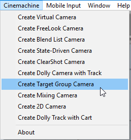

### CinemachineTargetGroup
Defines a group of target objects, each with a radius and a weight.  The weight is used when calculating the average position of the target group.  Higher-weighted members of the group will count more.  The bounding box is calculated by taking the member positions, weight, and radii into account.

| _Setting_ | _Type_ | _Description_ |
| --- | --- | --- |
| **Position Mode** | PositionMode | How the group's position is calculated.  Select GroupCenter for the center of the bounding box, and GroupAverage for a weighted average of the positions of the members. _Possible Values:_ - **Group Center**: Group position will be the center of the group's axis-aligned bounding box. - **Group Average**: Group position will be the weighted average of the positions of the members.  |
| **Rotation Mode** | RotationMode | How the group's rotation is calculated.  Select Manual to use the value in the group's transform, and GroupAverage for a weighted average of the orientations of the members. _Possible Values:_ - **Manual**: Manually set in the group's transform. - **Group Average**: Weighted average of the orientation of its members.  |
| **Update Method** | UpdateMethod | When to update the group's transform based on the position of the group members. _Possible Values:_ - **Update**: Updated in normal MonoBehaviour Update. - **Fixed Update**: Updated in sync with the Physics module, in FixedUpdate. - **Late Update**: Updated in MonoBehaviour LateUpdate.  |
| **Targets** | Target[] | The target objects, together with their weights and radii, that will contribute to the group's average position, orientation, and size. |

### CinemachineTargetGroup.Target
Holds the information that represents a member of the group.

| _Setting_ | _Type_ | _Description_ |
| --- | --- | --- |
| **Target** | Transform | The target objects.  This object's position and orientation will contribute to the group's average position and orientation, in accordance with its weight. |
| **Weight** | Single | How much weight to give the target when averaging.  Cannot be negative. |
| **Radius** | Single | The radius of the target, used for calculating the bounding box.  Cannot be negative. |

### CinemachineGroupComposer
This is a CinemachineComponent in the Aim section of the component pipeline.  Its job is to aim the camera at a target object, with configurable offsets, damping, and composition rules.

In addition, if the target is a CinemachineTargetGroup, the behaviour will adjust the FOV and the camera distance to ensure that the entire group of targets is framed properly.

| _Setting_ | _Type_ | _Description_ |
| --- | --- | --- |
| **Group Framing Size** | Single | The bounding box of the targets should occupy this amount of the screen space.  1 means fill the whole screen.  0.5 means fill half the screen, etc. |
| **Framing Mode** | FramingMode | What screen dimensions to consider when framing.  Can be Horizontal, Vertical, or both. _Possible Values:_ - **Horizontal**: Consider only the horizontal dimension.  Vertical framing is ignored. - **Vertical**: Consider only the vertical dimension.  Horizontal framing is ignored. - **Horizontal And Vertical**: The larger of the horizontal and vertical dimensions will dominate, to get the best fit.  |
| **Frame Damping** | Single | How aggressively the camera tries to frame the group.  Small numbers are more responsive, rapidly adjusting the camera to keep the group in the frame.  Larger numbers give a more heavy slowly responding camera. |
| **Adjustment Mode** | AdjustmentMode | How to adjust the camera to get the desired framing.  You can zoom, dolly in/out, or do both. _Possible Values:_ - **Zoom Only**: Do not move the camera, only adjust the FOV. - **Dolly Only**: Just move the camera, don't change the FOV. - **Dolly Then Zoom**: Move the camera as much as permitted by the ranges, then adjust the FOV if necessary to make the shot.  |
| **Max Dolly In** | Single | The maximum distance toward the target that this behaviour is allowed to move the camera. |
| **Max Dolly Out** | Single | The maximum distance away the target that this behaviour is allowed to move the camera. |
| **Minimum Distance** | Single | Set this to limit how close to the target the camera can get. |
| **Maximum Distance** | Single | Set this to limit how far from the target the camera can get. |
| **Minimum FOV** | Single | If adjusting FOV, will not set the FOV lower than this. |
| **Maximum FOV** | Single | If adjusting FOV, will not set the FOV higher than this. |
| **Minimum Ortho Size** | Single | If adjusting Orthographic Size, will not set it lower than this. |
| **Maximum Ortho Size** | Single | If adjusting Orthographic Size, will not set it higher than this. |
| **Tracked Object Offset** | Vector3 | Target offset from the target object's center in target-local space.  Use this to fine-tune the tracking target position when the desired area is not the tracked object's center. |
| **Lookahead Time** | Single | This setting will instruct the composer to adjust its target offset based on the motion of the target.  The composer will look at a point where it estimates the target will be this many seconds into the future.  Note that this setting is sensitive to noisy animation, and can amplify the noise, resulting in undesirable camera jitter.  If the camera jitters unacceptably when the target is in motion, turn down this setting, or animate the target more smoothly. |
| **Lookahead Smoothing** | Single | Controls the smoothness of the lookahead algorithm.  Larger values smooth out jittery predictions and also increase prediction lag. |
| **Lookahead Ignore Y** | Boolean | If checked, movement along the Y axis will be ignored for lookahead calculations. |
| **Horizontal Damping** | Single | How aggressively the camera tries to follow the target in the screen-horizontal direction.  Small numbers are more responsive, rapidly orienting the camera to keep the target in the dead zone.  Larger numbers give a more heavy slowly responding camera.  Using different vertical and horizontal settings can yield a wide range of camera behaviors. |
| **Vertical Damping** | Single | How aggressively the camera tries to follow the target in the screen-vertical direction.  Small numbers are more responsive, rapidly orienting the camera to keep the target in the dead zone.  Larger numbers give a more heavy slowly responding camera.  Using different vertical and horizontal settings can yield a wide range of camera behaviors. |
| **Screen X** | Single | Horizontal screen position for target.  The camera will rotate to position the tracked object here. |
| **Screen Y** | Single | Vertical screen position for target, The camera will rotate to position the tracked object here. |
| **Dead Zone Width** | Single | Camera will not rotate horizontally if the target is within this range of the position. |
| **Dead Zone Height** | Single | Camera will not rotate vertically if the target is within this range of the position. |
| **Soft Zone Width** | Single | When target is within this region, camera will gradually rotate horizontally to re-align towards the desired position, depending on the damping speed. |
| **Soft Zone Height** | Single | When target is within this region, camera will gradually rotate vertically to re-align towards the desired position, depending on the damping speed. |
| **Bias X** | Single | A non-zero bias will move the target position horizontally away from the center of the soft zone. |
| **Bias Y** | Single | A non-zero bias will move the target position vertically away from the center of the soft zone. |

## 2D Environments
Cinemachine supports Orthographic cameras.  When you set the Unity Camera’s style to Orthographic, Cinemachine will adjust to accommodate it.  FOV will be replaced by Orthographic Size in the Lens settings.  Note that settings related to FOV and certain FOV-oriented behaviours such as FollowZoom will not have any effect if the camera is orthographic.

In orthographic environments, it doesn’t usually make sense to rotate the camera.  Accordingly, Cinemachine has a special transposer that handles framing and composition without rotating the camera.

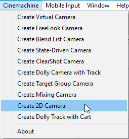

### CinemachineFramingTransposer
This is a Cinemachine Component in the Body section of the component pipeline.  Its job is to position the camera in a fixed screen-space relationship to the vcam's Follow target object, with offsets and damping.

The camera will be first moved along the camera Z axis until the Follow target is at the desired distance from the camera's X-Y plane.  The camera will then be moved in its XY plane until the Follow target is at the desired point on the camera's screen.

The FramingTansposer will only change the camera's position in space.  It will not re-orient or otherwise aim the camera.

For this component to work properly, the vcam's LookAt target must be null.  The Follow target will define what the camera is looking at.

If the Follow target is a CinemachineTargetGroup, then additional controls will be available to dynamically adjust the camera's view in order to frame the entire group.

Although this component was designed for orthographic cameras, it works equally well with persective cameras and can be used in 3D environments.

| _Setting_ | _Type_ | _Description_ |
| --- | --- | --- |
| **Lookahead Time** | Single | This setting will instruct the composer to adjust its target offset based on the motion of the target.  The composer will look at a point where it estimates the target will be this many seconds into the future.  Note that this setting is sensitive to noisy animation, and can amplify the noise, resulting in undesirable camera jitter.  If the camera jitters unacceptably when the target is in motion, turn down this setting, or animate the target more smoothly. |
| **Lookahead Smoothing** | Single | Controls the smoothness of the lookahead algorithm.  Larger values smooth out jittery predictions and also increase prediction lag. |
| **Lookahead Ignore Y** | Boolean | If checked, movement along the Y axis will be ignored for lookahead calculations. |
| **X Damping** | Single | How aggressively the camera tries to maintain the offset in the X-axis.  Small numbers are more responsive, rapidly translating the camera to keep the target's x-axis offset.  Larger numbers give a more heavy slowly responding camera.  Using different settings per axis can yield a wide range of camera behaviors. |
| **Y Damping** | Single | How aggressively the camera tries to maintain the offset in the Y-axis.  Small numbers are more responsive, rapidly translating the camera to keep the target's y-axis offset.  Larger numbers give a more heavy slowly responding camera.  Using different settings per axis can yield a wide range of camera behaviors. |
| **Z Damping** | Single | How aggressively the camera tries to maintain the offset in the Z-axis.  Small numbers are more responsive, rapidly translating the camera to keep the target's z-axis offset.  Larger numbers give a more heavy slowly responding camera.  Using different settings per axis can yield a wide range of camera behaviors. |
| **Screen X** | Single | Horizontal screen position for target.  The camera will move to position the tracked object here. |
| **Screen Y** | Single | Vertical screen position for target, The camera will move to position the tracked object here. |
| **Camera Distance** | Single | The distance along the camera axis that will be maintained from the Follow target. |
| **Dead Zone Width** | Single | Camera will not move horizontally if the target is within this range of the position. |
| **Dead Zone Height** | Single | Camera will not move vertically if the target is within this range of the position. |
| **Dead Zone Depth** | Single | The camera will not move along its z-axis if the Follow target is within this distance of the specified camera distance. |
| **Unlimited Soft Zone** | Boolean | If checked, then then soft zone will be unlimited in size. |
| **Soft Zone Width** | Single | When target is within this region, camera will gradually move horizontally to re-align towards the desired position, depending on the damping speed. |
| **Soft Zone Height** | Single | When target is within this region, camera will gradually move vertically to re-align towards the desired position, depending on the damping speed. |
| **Bias X** | Single | A non-zero bias will move the target position horizontally away from the center of the soft zone. |
| **Bias Y** | Single | A non-zero bias will move the target position vertically away from the center of the soft zone. |
| **Group Framing Mode** | FramingMode | What screen dimensions to consider when framing.  Can be Horizontal, Vertical, or both. _Possible Values:_ - **Horizontal**: Consider only the horizontal dimension.  Vertical framing is ignored. - **Vertical**: Consider only the vertical dimension.  Horizontal framing is ignored. - **Horizontal And Vertical**: The larger of the horizontal and vertical dimensions will dominate, to get the best fit. - **None**: Don't do any framing adjustment.  |
| **Adjustment Mode** | AdjustmentMode | How to adjust the camera to get the desired framing.  You can zoom, dolly in/out, or do both. _Possible Values:_ - **Zoom Only**: Do not move the camera, only adjust the FOV. - **Dolly Only**: Just move the camera, don't change the FOV. - **Dolly Then Zoom**: Move the camera as much as permitted by the ranges, then adjust the FOV if necessary to make the shot.  |
| **Group Framing Size** | Single | The bounding box of the targets should occupy this amount of the screen space.  1 means fill the whole screen.  0.5 means fill half the screen, etc. |
| **Max Dolly In** | Single | The maximum distance toward the target that this behaviour is allowed to move the camera. |
| **Max Dolly Out** | Single | The maximum distance away the target that this behaviour is allowed to move the camera. |
| **Minimum Distance** | Single | Set this to limit how close to the target the camera can get. |
| **Maximum Distance** | Single | Set this to limit how far from the target the camera can get. |
| **Minimum FOV** | Single | If adjusting FOV, will not set the FOV lower than this. |
| **Maximum FOV** | Single | If adjusting FOV, will not set the FOV higher than this. |
| **Minimum Ortho Size** | Single | If adjusting Orthographic Size, will not set it lower than this. |
| **Maximum Ortho Size** | Single | If adjusting Orthographic Size, will not set it higher than this. |

## Post-Processing Stack V1
If you have Unity’s Post-Processing Stack as an asset in your project (and if you don’t, you should, because this is an amazing tool that gives world-class results), you can easily assign custom post-effects to any shot in your scene, even though it’s a virtual camera and not a real one.

This section describes the use of Post Processing stack V1.  If you have Post Processing V2, see the section below.

Just define a Post-Processing profile for your vcam, and connect it by attaching a CinemachinePostFX component to your vcam.  To complete the connection, you will also need a CinemachinePostFX component on the Unity camera, alongside the CinemachineBrain.  That’s all you have to do.  Now, whenever the vcam is activated, its custom Post-Processing profile will be applied to the Unity camera.

### CinemachinePostFX
This behaviour is a liaison between Cinemachine with the Post-Processing v1 module.  You must have the Post-Processing V1 stack asset store package installed in order to use this behaviour.

It's used in 2 ways:

* As a component on the Unity Camera: it serves as the liaison between the camera's CinemachineBrain and the camera's Post-Processing behaviour.  It listens for camera Cut events and resets the Post-Processing stack when they occur.  If you are using Post-Processing, then you should add this behaviour to your camera alongside the CinemachineBrain, always.

* As a component on the Virtual Camera: In this capacity, it holds a Post-Processing Profile asset that will be applied to the Unity camera whenever the Virtual camera is live.  It also has the (temporary) optional functionality of animating the Focus Distance and DepthOfField properties of the Camera State, and applying them to the current Post-Processing profile.

| _Setting_ | _Type_ | _Description_ |
| --- | --- | --- |
| **Profile** | PostProcessingProfile | When this behaviour is on a Unity Camera, this setting is the default Post-Processing profile for the camera, and will be applied whenever it is not overridden by a virtual camera.  When the behaviour is on a virtual camera, then this is the Post-Processing profile that will become active whenever this virtual camera is live. |
| **Focus Tracks Target** | Boolean | If checked, then the Focus Distance will be set to the distance between the camera and the LookAt target. |
| **Focus Offset** | Single | Offset from target distance, to be used with Focus Tracks Target. |

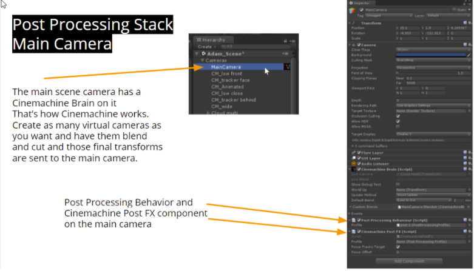
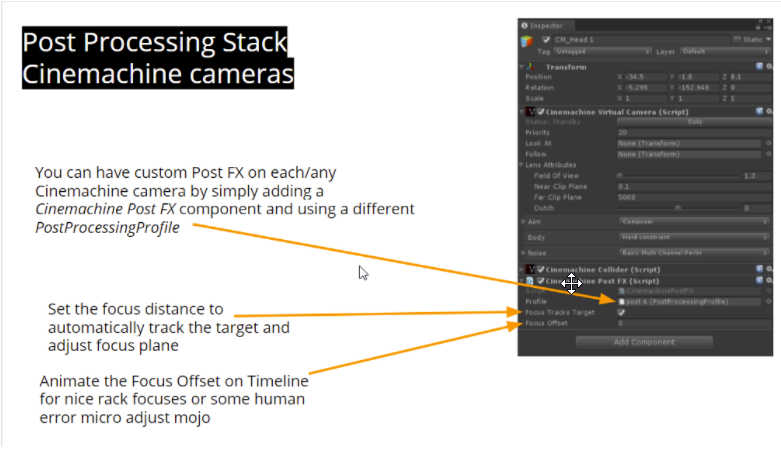

## Post Processing Stack V2
If you have Unity's Post Processing Stack V2 package installed, you can add post-processing profiles to you virtual cameras.  The profiles will blend along with the cameras.

Define a Post-Processing profile for your vcam, and connect it by attaching a **CinemachinePostProcessing** extension to your vcam.  To complete the connection, you will also need a PostProcessingLayer component on the Unity camera, alongside the CinemachineBrain.  

That’s all you have to do.  Now, whenever the vcam is activated, its custom Post-Processing profile will be applied to the Unity camera.  If the camera is blending with another vcam, then the blend weight will be applied to the Post Processing effects also.

### CinemachinePostProcessing
This behaviour is a liaison between Cinemachine with the Post-Processing V2 module. You must have the Post-Processing Stack V2 unity package installed in order to use this behaviour.

As a component on the Virtual Camera, it holds a Post-Processing Profile asset that will be applied to the camera whenever the Virtual camera is live. It also has the optional functionality of animating the Focus Distance and DepthOfField properties of the Camera State, and applying them to the current Post-Processing profile.

| _Setting_ | _Type_ | _Description_ |
| --- | --- | --- |
| **Profile** | PostProcessingProfile | When this behaviour is on a Unity Camera, this setting is the default Post-Processing profile for the camera, and will be applied whenever it is not overridden by a virtual camera.  When the behaviour is on a virtual camera, then this is the Post-Processing profile that will become active whenever this virtual camera is live. |
| **Focus Tracks Target** | Boolean | If checked, then the Focus Distance will be set to the distance between the camera and the LookAt target. |
| **Focus Offset** | Single | Offset from target distance, to be used with Focus Tracks Target. |

## And the Rest
Additional components included with Cinemachine are documented in this section.

### CinemachinePOV
This is a CinemachineComponent in the Aim section of the component pipeline.  Its job is to aim the camera in response to the user's mouse or joystick input.

The composer does not change the camera's position.  It will only pan and tilt the camera where it is, in order to get the desired framing.  To move the camera, you have to use the virtual camera's Body section.

| _Setting_ | _Type_ | _Description_ |
| --- | --- | --- |
| **Vertical Axis** | AxisState | The Vertical axis.  Value is -90..90.  Controls the vertical orientation. |
| **Vertical Recentering** | Recentering | Controls how automatic recentering of the Vertical axis is accomplished. |
| **Horizontal Axis** | AxisState | The Horizontal axis.  Value is -180..180.  Controls the horizontal orientation. |
| **Horizontal Recentering** | Recentering | Controls how automatic recentering of the Horizontal axis is accomplished. |

### CinemachineSameAsFollowTarget
This is a CinemachineComponent in the Aim section of the component pipeline.  Its job is to match the orientation of the Follow target.

### CinemachineSmoothPath
Defines a world-space path, consisting of an array of waypoints, each of which has position and roll settings.  Bezier interpolation is performed between the waypoints, to get a smooth and continuous path.  The path will pass through all waypoints, and (unlike CinemachinePath) first and second order continuity is guaranteed.

| _Setting_ | _Type_ | _Description_ |
| --- | --- | --- |
| **Looped** | Boolean | If checked, then the path ends are joined to form a continuous loop. |
| **Waypoints** | Waypoint[] | The waypoints that define the path.  They will be interpolated using a bezier curve. |
| **Resolution** | Int32 | Path samples per waypoint.  This is used for calculating path distances. |
| **Appearance** | Appearance | The settings that control how the path will appear in the editor scene view. |

### CinemachineFollowZoom
An add-on module for Cinemachine Virtual Camera that adjusts the FOV of the lens to keep the target object at a constant size on the screen, regardless of camera and target position.

| _Setting_ | _Type_ | _Description_ |
| --- | --- | --- |
| **Width** | Single | The shot width to maintain, in world units, at target distance. |
| **Damping** | Single | Increase this value to soften the aggressiveness of the follow-zoom.  Small numbers are more responsive, larger numbers give a more heavy slowly responding camera. |
| **Min FOV** | Single | Lower limit for the FOV that this behaviour will generate. |
| **Max FOV** | Single | Upper limit for the FOV that this behaviour will generate. |

### CinemachineDollyCart
This is a very simple behaviour that constrains its transform to a CinemachinePath.  It can be used to animate any objects along a path, or as a Follow target for Cinemachine Virtual Cameras.

| _Setting_ | _Type_ | _Description_ |
| --- | --- | --- |
| **Path** | CinemachinePathBase | The path to follow. |
| **Update Method** | UpdateMethod | When to move the cart, if Velocity is non-zero. _Possible Values:_ - **Update**: Updated in normal MonoBehaviour Update. - **Fixed Update**: Updated in sync with the Physics module, in FixedUpdate.  |
| **Position Units** | PositionUnits | How to interpret the Path Position.  If set to Path Units, values are as follows: 0 represents the first waypoint on the path, 1 is the second, and so on.  Values in-between are points on the path in between the waypoints.  If set to Distance, then Path Position represents distance along the path. _Possible Values:_ - **Path Units**: Use PathPosition units, where 0 is first waypoint, 1 is second waypoint, etc. - **Distance**: Use Distance Along Path.  Path will be sampled according to its Resolution setting, and a distance lookup table will be cached internally.  |
| **Speed** | Single | Move the cart with this speed along the path.  The value is interpreted according to the Position Units setting. |
| **Position** | Single | The position along the path at which the cart will be placed.  This can be animated directly or, if the velocity is non-zero, will be updated automatically.  The value is interpreted according to the Position Units setting. |

### CinemachineMixingCamera
CinemachineMixingCamera is a "manager camera" that takes on the state of the weighted average of the states of its child virtual cameras.

A fixed number of slots are made available for cameras, rather than a dynamic array.  We do it this way in order to support weight animation from the Timeline.  Timeline cannot animate array elements.

| _Setting_ | _Type_ | _Description_ |
| --- | --- | --- |
| **Weight 0** | Single | The weight of the first tracked camera. |
| **Weight 1** | Single | The weight of the second tracked camera. |
| **Weight 2** | Single | The weight of the third tracked camera. |
| **Weight 3** | Single | The weight of the fourth tracked camera. |
| **Weight 4** | Single | The weight of the fifth tracked camera. |
| **Weight 5** | Single | The weight of the sixth tracked camera. |
| **Weight 6** | Single | The weight of the seventh tracked camera. |
| **Weight 7** | Single | The weight of the eighth tracked camera. |
| **Priority** | Int32 | The priority will determine which camera becomes active based on the state of other cameras and this camera.  Higher numbers have greater priority. |

### CinemachineBlendListCamera
This is a virtual camera "manager" that owns and manages a collection of child Virtual Cameras.  When the camera goes live, these child vcams are enabled, one after another, holding each camera for a designated time.  Blends between cameras are specified.  The last camera is held indefinitely.

| _Setting_ | _Type_ | _Description_ |
| --- | --- | --- |
| **Look At** | Transform | Default object for the camera children to look at (the aim target), if not specified in a child camera.  May be empty if all of the children define targets of their own. |
| **Follow** | Transform | Default object for the camera children wants to move with (the body target), if not specified in a child camera.  May be empty if all of the children define targets of their own. |
| **Show Debug Text** | Boolean | When enabled, the current child camera and blend will be indicated in the game window, for debugging. |
| **Enable All Child Cameras** | Boolean | Force all child cameras to be enabled.  This is useful if animating them in Timeline, but consumes extra resources. |
| **Instructions** | Instruction[] | The set of instructions for enabling child cameras. |
| **Priority** | Int32 | The priority will determine which camera becomes active based on the state of other cameras and this camera.  Higher numbers have greater priority. |

### CinemachineExternalCamera
This component will expose a non-cinemachine camera to the cinemachine system, allowing it to participate in blends.  Just add it as a component alongside an existing Unity Camera component.

| _Setting_ | _Type_ | _Description_ |
| --- | --- | --- |
| **Look At** | Transform | The object that the camera is looking at.  Setting this will improve the quality of the blends to and from this camera. |
| **Priority** | Int32 | The priority will determine which camera becomes active based on the state of other cameras and this camera.  Higher numbers have greater priority. |

### CinemachineStoryboard
An add-on module for Cinemachine Virtual Camera that places an image in screen space over the camera's output.

| _Setting_ | _Type_ | _Description_ |
| --- | --- | --- |
| **Show Image** | Boolean | If checked, the specified image will be displayed as an overlay over the virtual camera's output. |
| **Image** | Texture | The image to display. |
| **Aspect** | FillStrategy | How to handle differences between image aspect and screen aspect. _Possible Values:_ - **Best Fit**: Image will be as large as possible on the screen, without being cropped. - **Crop Image To Fit**: Image will be cropped if necessary so that the screen is entirely filled. - **Stretch To Fit**: Image will be stretched to cover any aspect mismatch with the screen.  |
| **Alpha** | Single | The opacity of the image.  0 is transparent, 1 is opaque. |
| **Center** | Vector2 | The screen-space position at which to display the image.  Zero is center. |
| **Rotation** | Vector3 | The screen-space rotation to apply to the image. |
| **Scale** | Vector2 | The screen-space scaling to apply to the image. |
| **Sync Scale** | Boolean | If checked, X and Y scale are synchronized. |
| **Mute Camera** | Boolean | If checked, Camera transform will not be controlled by this virtual camera. |
| **Split View** | Single | Wipe the image on and off horizontally. |

### SaveDuringPlay
Cameras need to be tweaked in context - often that means while the game is playing.  Normally, Unity does not propagate those changes to the scene once play mode is exited.  Cinemachine has implemented a special feature to preserve parameter tweaks made during game play.  It won’t save structural changes (like adding or removing a behaviour), but it will keep the tweaks.  Cinemachine behaviours have a special attribute [SaveDuringPlay] to enable this functionality.  Feel free to use it on your own scripts too if you need it.

It works by scanning the scene after Play exits and applying any changed parameters back to the scene.  This kicks in a second or so after exit.  You can always hit Undo to revert the changes.

If there are specific settings within a behaviour that you want to exclude from Play-Mode save, you can add the [NoSaveDuringPlay] attribute to them, and they will be skipped.

This feature can be enabled by checking the Save During Play checkbox on any Virtual Camera inspector.  This is a static global setting, not per-camera, so you only need to check it once.

## Timeline Integration
1. Drag a Cinemachine-enabled Unity camera (i.e. one with a CinemachineBrain component) onto the timeline, select Create Cinemachine Track from the popup menu.  
2. The Cinemachine track is an enable/disable style track, which means that the clips will enable Cinemachine Virtual Cameras while they are active in the timeline.
3. Overlapping Cinemachine Shot Clips will produce blends.
4. Create a Cinemachine shot by right-clicking on the Cinemachine Track and selecting Create Cinemachine Shot Clip.
5. Drag a virtual camera from the scene onto the Cinemachine Shot Clip inspector.  That will associate the shot clip with the virtual camera.
6. The virtual camera does not need to be enabled in the scene.  While the clip is active in the timeline, that camera will become enabled.

The following slides will serve as a brief introduction to get you started.
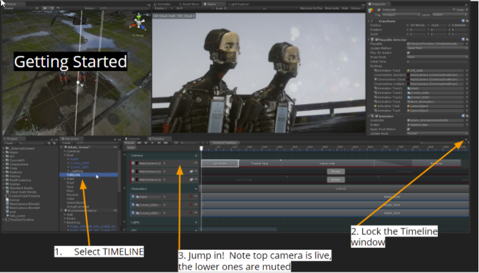

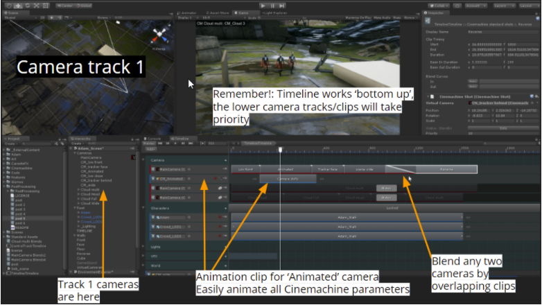

## Special Environments
### Top-Down Games
Cinemachine Virtual Cameras are modeled after human camera operators.  As such, they have a sensitivity to the up/down axis, and will always try to avoid introducing roll into the camera framing - unless you deliberately introduce it via such settings as dutch.  Because of this sensitivity, virtual cameras do not like to look straight up or down for extended periods.  They will do it in passing, but if the LookAt target is often straight up or down, they will not always give the desired results.

If you are building a top-down game, the best practice is to redefine the up direction, for the purposes of the camera.  You do this by setting the World Up Override in the CinemachineBrain to a game object whose local up points in the direction that you want the Camera’s up to normally be.   This will be applied to all virtual cameras connected to that brain.
### Split-screen
You can set up a multi-camera split-screen with Cinemachine 2.0:

1. Make 2 Unity Cameras, give each one its own CinemachineBrain, and set up their viewports.
2. Now make 2 virtual cameras to follow the players. Assign those virtual cameras to different layers. We’ll call them layer A and layer B. 
3. Go back to the two Unity cameras, and set their culling masks so that one camera sees layer A but not layer B, and the other camera does the opposite. 
4. That’s it!  Camera A will be driven by virtual cameras on layer A, and camera B will be driven by virtual cameras on layer B. They will do their blending etc independently.
5. Add as many layers and cameras as you like.


## Scripting
Cinemachine is a pure-csharp implementation and is completely accessible to scripting.  All of the settings visible in the inspector have corresponding fields in the csharp classes.  In addition there is a full scripting API which you can discover either by examining the well-commented sources in the implementation, or by looking at the scripting scene in the examples, or by consulting the API documentation shipped with Cinemachine and available online.

# Document Revision History

|Date|Reason|
|---|---|
|Feb 15, 2018|Updated for 2.1.11|
|Nov 21, 2017|Initial version.|

