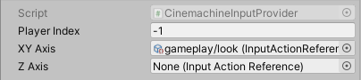

# Alternative Input Systems

Some Cinemachine components (e.g. FreeLook, POV, OrbitalTransposer) require user input to position or orient the camera.  By default, Cinemachine gets user input by querying the standard Unity `Input.GetAxis(name)`.  

When alternative input systems are used in a project, this default behaviour must be overridden so that input is obtained from the appropriate source.

Cinemachine has defined an interface: `Cinemachine.AxisState.IInputAxisProvider`.  If a `MonoBehaviour` implementing this interface is added to a Virtual Camera or FreeLook, then it will be queried for input instead of the standard input system.

Cinemachine ships with an example of such a behaviour that uses the new __UnityEngine.Input__ package: **CinemachineInputProvider**.  It has dual purpose:
1. Provide a simple out-of-the-box adapter for the new UnityEngine.Input package, to cover common usecases
2. To serve as a source code example of how to integrate Cinemachine with custom or 3rd-party input systems

# CinemachineInputProvider

This is a behaviour that is intended to be added to a virtual camera or FreeLook.  It is an input source override, which causes the virtual camera to obtain input using the new __UnityEngine.Input__ package instead of the standard Unity Input system.

This behaviour is available when the __UnityEngine.Input__ package is installed in the project.

## Properties:

| **Property:** | **Function:** |
|:---|:---|
| __Player Index__ | Which player's input controls to query.  Leave this at the default value of -1 for single-player games.  Otherwise this should be the index of the player in the `UnityEngine.Inout.InputUser.all` list |
| __XY Axis__ | A `Vector2` input action that will supply values for the X and Y axes.  Can be null if X and Y axes are not used |
| __Z Axis__ | A `float` input action that will supply values for the Z axis.  Can be null if Z axis is not used |
