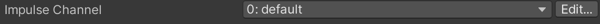
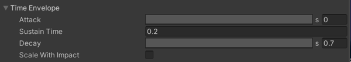
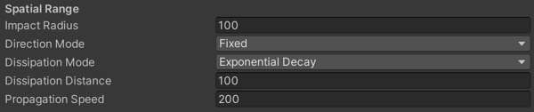

#Cinemachine Collision Impulse Source

For collision-based impulses, attach a **CinemachineCollisionImpulseSource** component to a GameObject that has a Collider or Collider2D component. **CinemachineCollisionImpulseSource** generates an impulse when something collides with the GameObject or enters a trigger zone. 

To add a Collision Impulse Source component:

1. Select the GameObject that you want to trigger impulses, navigate to its Inspector, and click the **Add Component** button.

2. Go to **Scripts > Cinemachine** and select **Cinemachine Collision Impulse Source**.

By default, an Impulse Source affects every [Impulse Listener](CinemachineImpulseListener.md) in range, but you can apply [channel filtering](CinemachineImpulseFiltering.md#ChannelFiltering) to make Impulse Sources affect some Impulse Listeners and not others. 

## Properties:

The properties in the Cinemachine Collision Impulse Source Inspector window are divided into the following sections.

- [Impulse Channel](#ImpulseChannel) (A)
- [Signal Shape](#SignalShape) (B)
- [Time Envelope](#TimeEnvelope) (C)
- [Spatial Range](#SpatialRange) (D)
- [Trigger Object Filter](#TriggerObject) (E)
- [How to Generate The Impulse](#GenerateImpulse) (F)

### Impulse Channel

Impulse Listeners filter impulses based on channels to control which Impulse Sources they react to. Channels work like Camera Layers, but are distinct from them. These properties control the channels that the Collision Impulse Source broadcasts impulse signals on. For details, see documentation on [Filtering](CinemachineImpulseFiltering.md).

| **Property:**       | **Function:**                                                |
| ------------------- | ------------------------------------------------------------ |
| **Impulse Channel** | Choose one or more channels from the drop-down.  Click **Edit** to modify existing channels or add new ones. |

### Signal Shape

These properties control the basic characteristics of the raw signal when it is emitted by the Collision Impulse Source.

| **Property:**  | **Function:**                                                |
| -------------- | ------------------------------------------------------------ |
| **Raw Signal** | The raw signal form.   Drag a signal Asset onto the signal name to connect the signal to the Collision Impulse Source.  Click the “gear” icon for additional signal options, including options for creating new signals.  See [Raw Vibration Signals](CinemachineImpulseRawSignal.md) for details.|
|**Amplitude Gain** | Set a value by which to multiply the amplitude of **Raw Signal**. This controls the strength of the vibrations. This is set to 1 by default.  Use values greater than 1 to amplify the signal, 1 for the original signal, values less than 1 and greater than 0 to attenuate the signal, and 0 to mute the signal. |
|**Frequency Gain**|Set a value by which to multiply the frequency of **Raw Signal**. This controls the speed of the vibrations. This is set to 1 by default.  Use values greater than one to increase the frequency, 1 for the original signal, values less than 1 and greater than 0 to reduce the frequency of the signal. A frequency of 0 holds a single noise value indefinitely, as though time were frozen.|
|**Randomize**|Enable this to randomize the **Raw Signal’s** start time.  This property is available when the **Raw Signal** is a noise profile Asset. See [Raw Vibration Signals](CinemachineImpulseRawSignal.md) for details.|
|**Repeat Mode**|Specify whether to loop the **Raw Signal** over the duration of the time envelope, or stretch it to fit the time envelope.  This property is available when the **Raw Signal** is a fixed signal. See [Raw Vibration Signals](CinemachineImpulseRawSignal.md) for details.|

### Time Envelope

These properties control the duration of the impulse and the intensity of the **Raw Signal** over that duration.

| Property:             | Function:                                                    |
| --------------------- | ------------------------------------------------------------ |
| **Attack**            | Define how the signal reaches full amplitude at the beginning of the waveform. Click the preview pane (grey bar) to set the shape of the curve, and use the numerical field to set the time (in seconds) to reach the full amplitude. Leave the preview pane blank to use a default curve that is suitable for most purposes. |
| **Sustain Time**      | Set the time to maintain the full amplitude of the waveform after the attack. |
| **Decay**             | Define how the signal goes from full amplitude to zero the end of the waveform. Click the preview pane (grey bar) to set the shape of the curve, and use the numerical field to set the time (in seconds) to mute the signal. Leave the preview pane blank to use a default curve that is suitable for most purposes. |
| **Scale With Impact** | Enable this to apply signal amplitude scaling to **Time Envelope**. If checked, the Cinemachine Collision Impulse Source component scales the time envelope according to the strength of the impact: stronger impacts last longer, and milder impacts have a shorter duration. |

### Spatial Range

These properties define a zone in the Scene. The impulses from this Impulse Source only affect Impulse Listeners in this zone.

| Property:|| Function:|
|--|--|--|
|**Impact Radius**||Set the radius of the space in the Scene around the impact point where the signal stays at full amplitude. Beyond that the signal strength fades out over the dissipation distance. After that, the strength is zero. In other words, the total effect radius of the signal is **Impact Radius** + **Dissipation Distance**.|
|**Direction Mode**||Define how the Cinemachine Collision Impulse Source component should apply the direction of the signal as the Impulse Listener moves away from the Impulse Source.|
||Fixed|Use **Fixed** to use a constant signal direction.|
||Rotate Toward Source|Use **Rotate Toward Source** to rotate the signal in the direction of the Impulse Source, giving a subtle visual clue about the source’s location. **Rotate Toward Source** has no effect on radially-symmetric signals.|
|**Dissipation Mode**||Define how the signal dissipates when the listener is outside the **Impact Radius**.|
||Linear Decay|The signal dissipates evenly over the **Dissipation Distance**.|
||Soft Decay|The signal dissipates slowly at the beginning of the **Dissipation Distance**, more quickly in the middle, and slowly again as it reaches the end.|
|| Exponential Decay|The signal dissipates very quickly at the beginning of the **Dissipation Distance**, then more and more slowly as it reaches the end.|
|**Dissipation Distance**||Set the distance beyond the impact radius over which the signal decays from full strength to nothing.|

### Trigger Object Filter

These properties filter the GameObjects that trigger an impulse when they collide or enter the trigger zone. GameObjects in layers specified by the **Layer Mask** trigger impulses unless you tag them with the **Ignore Tag** value. For details, see documentation on [Filtering](CinemachineImpulseFiltering.md).

| Property:      | Function:                                                    |
| -------------- | ------------------------------------------------------------ |
| **Layer Mask** | Rigidbody components in these layers that collide with an Impulse Source or enter the trigger zone cause the Source to broadcast its signal. |
| **Ignore Tag** | GameObjects with this tag do not generate an impulse, even if they are in a layer specified in **Layer Mask**. |

### How To Generate The Impulse

An impulse is triggered at a location by an impact mass moving at an impact velocity. Unity dynamically calculates the mass and velocity of the Rigidbody or Rigidbody 2D component that triggers the impulse. The **How To Generate The Impulse** properties control how the mass and velocity of the Rigidbody affect the strength and direction of the signal. 

| Property:                   | Function:                                                    |
| --------------------------- | ------------------------------------------------------------ |
| **Use Impact Direction**    | Enable this setting to rotate the impulse signal to correspond to the direction of the impact velocity. For example, if the raw signal vibrates vertically but the impact direction is horizontal, you could check this property to make the resulting impulse signal vibrate horizontally.    Disable to use the direction of the raw signal irrespective of the impact direction. |
| **Scale Impact With Mass**  | Enable this setting to increase or decrease the amplitude of the impulse signal based on the mass of the colliding GameObjects. The masses are specified in the Rigidbody or RigidBody2D component of the GameObject that contains the Cinemachine Impulse Source, and of the colliding GameObject.    Disable this setting to use a constant mass of 1. |
| **Scale Impact With Speed** | Enable this setting to scale the amplitude of the signal based on the speed of the impact. Faster moving GameObjects have a greater momentum, and therefore produce a stronger signal.   Disable this setting to ignore the speed of the colliding GameObject. |
