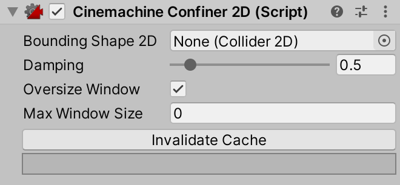

# Cinemachine Confiner 2D

Use the **Cinemachine Confiner 2D** [extension](https://docs.unity3d.com/Packages/com.unity.cinemachine@2.6/manual/CinemachineVirtualCameraExtensions.html) to confine the camera's position such that the screen edges stay within a shape defined by a 2D polygon. This will work for orthographic or perspective cameras, provided that the camera's forward vector remains parallel to the bounding shape's  normal, i.e. that the camera is looking straight at the polygon, and not obliquely at it.

When confining the camera, the camera's view size at the polygon plane is considered, and also its aspect ratio. Based on this information and the input polygon, a second (smaller) polygon is computed to which the camera's transform is constrained. Computation of this secondary polygon is nontrivial and expensive, so it should be done only when absolutely necessary.  

The cached secondary polygon needs to be recomputed in the following circumstances:

*   when the input polygon's points change, 
*   when the input polygon is non-uniformly scaled

**For efficiency reasons, Cinemachine will not automatically regenerate the inner polygon in these cases, and it is the responsibility of the client to call the InvalidateCache() method to trigger the recalculation**. An inspector button is also provided for this purpose.

If the input polygon scales uniformly or translates or rotates, the cache remains valid. 

## Oversize Windows
In the event that there are sections of the confining polygon that are too small to fully contain the camera window, then a _polygon skeleton_ will be calculated for those regions.  This is a zero-area shape that serves as a place to put the camera when it is confined to this region of the shape.  

Skeleton computation is the most expensive part of the cache calculation, so it is a good idea to tune this with some care:

- If it is known that the camera window will always be small enough to fit in every part of the bounding shape, then it is wise to disable skeleton calculation.  Do so by turning off the **Oversize Window** checkbox.
- Skeleton calculation can be optimized by setting the **Max Window Size** property to the largest size the camera window is expected to have.  Cinemachine will not spend time calculating the skeleton for window sizes larger than that.

# Properties:

|**Property:**|**Function:**|
|:---|:---|
|Bounding Shape 2D|The 2D shape within which the camera viewport is to be confined.|
|Damping|Damping applied around corners to avoid jumps.  Higher numbers are more gradual.|
|Oversize Window|If enabled, the confiner will compute a skeleton polygon to support cases where camera window size is bigger than some regions of the confining polygon.  Enable only if needed, because it's costly|
|Max Window Size|To optimize computation and memory costs, set this to the largest view size that the camera is expected to have.  The confiner will not compute a polygon cache for frustum sizes larger than this.  This refers to the size in world units of the frustum at the confiner plane (for orthographic cameras, this is just the orthographic size).  If set to 0, then this parameter is ignored and a polygon cache will be calculated for all potential window sizes.|
