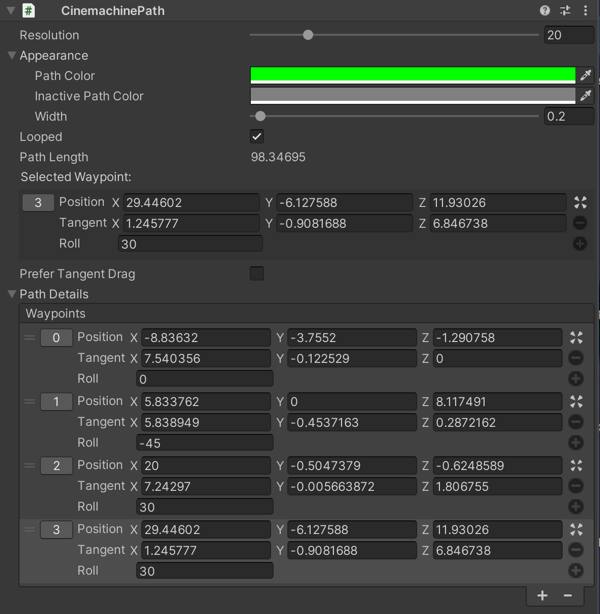

# Using dolly paths

A dolly path is an array of waypoints in a Scene. Use a dolly path to specify a fixed course to position or animate a Virtual Camera. Use the [Tracked Dolly](CinemachineBodyTrackedDolly.html) algorithm to use a dolly path with your Virtual Camera.

Cinemachine provides two types of dolly paths:

* [Smooth Path](CinemachineSmoothPath.html): Each waypoint has a position and roll. Cinemachine uses Bezier interpolation between the waypoints. Smooth Path gives you less control over the position of the path but animation along the path is always smooth and continuous.  This is the recommended path type.

* [Path](CinemachinePath.html): Each waypoint has a position, tangent, and roll. Use Path for finer control of the track’s position between waypoints. Animating a VIrtual Camera along a Path might cause jerky motion over waypoints when tangents don’t allow a smooth transition to and from the waypoint.

To create a Virtual Camera with a dolly path:

1. In the Unity menu, choose __GameObject > Cinemachine > Dolly Camera with Track__.
A new Virtual Camera and dolly track appears in the [Hierarchy]([https://docs.unity3d.com/Manual/Hierarchy.html](https://docs.unity3d.com/Manual/Hierarchy.html)). By default, the dolly track GameObject is a Smooth Path.

2. In the [Hierarchy]([https://docs.unity3d.com/Manual/Hierarchy.html](https://docs.unity3d.com/Manual/Hierarchy.html)) window, select the new dolly track GameObject.

3. In the [Inspector]([https://docs.unity3d.com/Manual/UsingTheInspector.html](https://docs.unity3d.com/Manual/UsingTheInspector.html)), add and adjust waypoints.

To create a path GameObject:

1. In the Unity menu, choose __GameObject > Create Empty.__

2. [Add the path component](https://docs.unity3d.com/Manual/UsingComponents.html), either __CinemachinePath__ or __CinemachineSmoothPath__

To edit a waypoint in a path:

1. In the [Hierarchy]([https://docs.unity3d.com/Manual/Hierarchy.html](https://docs.unity3d.com/Manual/Hierarchy.html)) window, select the path GameObject.

2. Select a waypoint by either clicking its index number in the [Scene](https://docs.unity3d.com/Manual/UsingTheSceneView.html) view or clicking its number in the __Path Details__ section in the [ Inspector](https://docs.unity3d.com/Manual/UsingTheInspector.html).

3. Edit the waypoint by [manipulating its Gizmo](https://docs.unity3d.com/Manual/PositioningGameObjects.html) in the Scene view or edit its properties in the Inspector. __Note__: When editing a waypoint for a regular path in the Scene view, the waypoint has two Gizmos: for the position and for the tangent.

