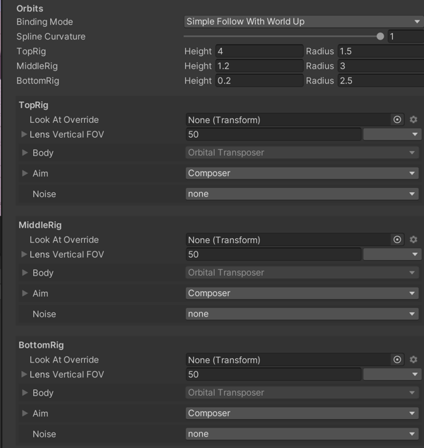

# Cinemachine Free Look Camera

The __Cinemachine Free Look Camera__ component provides a third-person camera experience. This Cinemachine Virtual Camera orbits around its subject along a position specified by three separate camera rigs: __Top__, __Middle__, and __Bottom__.

Each rig defines a ring around the target, with its own radius, height offset, composer, lens properties, and Noise settings. These are the same as the [properties for a regular Virtual Camera](CinemachineVirtualCamera.html).

Cinemachine Free Look Camera also defines a spline that connects the rigs. The spline defines the camera’s position when blending between the rigs.

Free Look uses player input along the x and y axes. The x axis controls the orbital position along the __Top__, __Middle__, or __Bottom__ horizontal orbits, like the [Orbital Transposer](CinemachineBodyOrbitalTransposer.html). The y-axis controls the vertical position, using the spline to determine the position between rigs.

## Properties:

| **Property:** || **Function:** |
|:---|:---|:---|
| __Solo__ || Toggles whether or not the Virtual Camera is temporarily live. Use this property to get immediate visual feedback in the [Game view](https://docs.unity3d.com/Manual/GameView.html) to adjust the Virtual Camera. |
| __Game Window Guides__ || Toggles the visibility of compositional guides in the Game view. These guides are available when Look At specifies a GameObject and the Aim section uses Composer or Group Composer, or when Follow specifies a target and the Body section uses Framing Composer. This property applies to all Virtual Cameras. |
| __Save During Play__ || Check to [apply the changes while in Play mode](CinemachineSavingDuringPlay.html).  Use this feature to fine-tune a Virtual Camera without having to remember which properties to copy and paste. This property applies to all Virtual Cameras. |
| __Priority__ || The importance of this Virtual Camera for choosing the next shot. A higher value indicates a higher priority. Cinemachine Brain chooses the next live Virtual Camera from all Virtual Cameras that are activated and have the same or higher priority as the current live Virtual Camera. This property has no effect when using a Virtual Camera with Timeline. |
| __Follow__ || The target GameObject to move with. The [Body properties](CinemachineVirtualCameraBody.html) use this target to update the position of the Unity camera. |
| __Look At__ || The target GameObject to aim at. The [Aim properties](CinemachineVirtualCameraAim.html) use this target to update the rotation of the Unity camera. This property is normally the same as the Follow target. |
| __Common Lens__ || Check to apply a common lens setting to all three child rigs. Uncheck to use separate lens settings for each child rig. |
| __Lens__ || If Common Lens is checked, these lens settings apply to all three rigs. These properties mirror their counterparts in the property settings for the [Unity camera](https://docs.unity3d.com/Manual/class-Camera.html). |
| | _Field Of View_ | This is the camera view in vertical degrees. For example, to specify the equivalent of a 50mm lens on a Super 35 sensor, enter a Field of View of 19.6 degrees. This property is available when the Unity camera with the Cinemachine Brain component uses a Projection of Perspective.   |
| | _Orthographic Size_ | When using an orthographic camera, this defines the half-height, in world coordinates, of the camera view. This property is available when the Unity camera with the Cinemachine Brain component uses a Projection of Orthographic. |
| | _Near Clip Plane_ | The closest point relative to the camera where drawing occurs. |
| | _Far Clip Plane_ | The furthest point relative to the camera where drawing occurs. |
| | _Dutch_ | Dutch angle. Tilts the Unity camera on the Z axis, in degrees. This property is unique to the Virtual Camera; there is no counterpart property in the Unity camera. |
| __Transitions__ ||  |
| | _Blend Hint_ | How to blend to and from the Free Look camera. Use None for default linear interpolation of position and aim. Use Spherical Position to blend spherically about the Look At position, linearly blending between Look At targets. Use Cylindrical Position to blend in a cylindrical path around the Look At target and interpolate linearly on the vertical axis. Use Screen Space Aim When Targets Differ for a standard linear position blend, with screen-space angular blend between differing Look At targets. |
| | _Inherit Position_ | When this virtual camera goes Live, attempt to force the position to be the same as the current position of the Unity Camera, allowing the virtual camera to apply its damping to accomplish the blend |
| | _Camera Activated_ | This event is invoked when the Virtual Camera becomes live.  Attach custom handlers here if you need them. |
| __Y Axis, X Axis__ || The vertical and horizontal axes for blending between rigs. For Y Axis the Value range is 0 to 1 and represents the blend position between the Top, Middle, and Bottom rigs. The value 0.5 represents the middle rig.  For X Axis, the Value is the angular deviation (in degrees) of the camera from directly behind the target. |
| | _Max Speed_ | The maximum speed of this axis in units/second. |
| | _Accel Time_ | The amount of time in seconds to accelerate to Max Speed. |
| | _Decel Time_ | The amount of time in seconds to decelerate to zero. |
| | _Input Axis Name_ | The name of this axis as specified in Unity Input manager. Setting to an empty string disables the automatic updating of the axis. |
| | _Input Axis Value_ | The value of the input axis. A value of 0 means no input. To drive this directly, use a custom input system. Or you set the Axis Name to control the value with the Unity Input Manager. |
| | _Invert_ | Check to invert the raw value of the input axis. |
| __Y Axis Recentering__ || Controls the automatic recentering on the y axis. |
| | _Enabled_ | Check to enable automatic recentering. |
| | _Wait Time_ | When no user input has been detected on the axis, the camera waits this long in seconds before recentering. |
| | _Recentering Time_ | Maximum angular speed of recentering. Accelerates into and decelerates out of the centered position. |
| __Orbits__ || Properties for defining the Top, Middle, and Bottom rigs.  |
| __Binding Mode__ || The coordinate space to use to interpret the offset from the target. Also sets the up vector. Cinemachine keeps the camera oriented in the up direction while aiming. These modes do incredibly different things, so try them out and one should work well for whatever your requirements are. |
| | _Lock To Target On Assign_ | The target’s local frame at the moment when the Virtual Camera was activated, or when the target was assigned. |
| | _Lock To Target With World Up_ | The target’s local frame, with the tilt and roll reset to zero. |
| | _Lock To Target No Roll_ | The target’s local frame, with the roll reset to zero. |
| | _Lock To Target_ | The target’s local frame. |
| | _World Space_ | World space offset. |
| | _Simple Follow With World Up_ | Relative to the target, using camera-local axes. |
| __Spline Curvature__ || The tautness of the line that connects the rigs’ orbits. This line determines the final placement on the y axis. |
| __Height, Radius__ || The radius and height of the Top, Middle, and Bottom rigs relative to the Follow target. |

