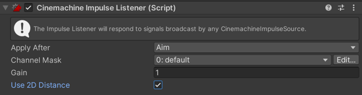

#Cinemachine Impulse Listener

Impulse [signals](CinemachineImpulseRawSignal.md) and [sources](CinemachineImpulseSourceOverview.md) don’t do anything on their own. An **Impulse Listener** is a Cinemachine extension that allows a virtual camera to “hear” impulse vibration signals and react to them.  

When you add an **Impulse Listener** extension to a virtual camera, it makes the camera shake in response to the signals emitted from Impulse Sources. In the simplest case, the Impulse Listener applies the signal verbatim to the camera’s Transform, causing it to shake.

In the image below, the figure’s feet are Impulse Sources. When they collide with the floor (A) they generate impulses. The camera is an Impulse Listener and reacts to the impulses by shaking (B), which shakes the resulting image in the Game view (C). 

To add an Impulse Listener to a Cinemachine virtual camera:

1. Select the virtual camera, navigate to the Inspector window and expand the **Cinemachine Virtual Camera** script.

2. Go to **Extensions > Add Extension**, and select **CinemachineImpulseListener**.

In the real world, some cameras are mounted less rigidly than others, and tend to shake more as a result. The Impulse Listener’s **Gain** property emulates this behavior by amplifying or attenuating impulse vibration signals. Higher values cause the camera to shake more.

>**TIP:** You can create your own Impulse Listener to interpret vibration signals any way you like.

By default, an Impulse Listener reacts to every Impulse Source in range, but you can apply [channel filtering](CinemachineImpulseFiltering.md#ChannelFiltering) to make a Listener react to some some Sources and ignore others.

##Properties:

| Property:           | Function:                                                    |
| ------------------- | ------------------------------------------------------------ |
| **Channel Mask**    | Specify the Impulse channels to react to. For details, see [Filtering with channels](CinemachineImpulseFiltering.md#ChannelFiltering).                   |
| **Gain**            | Amplify or attenuate the impulse signal. This property enables you to configure different Impulse Listeners to react differently to the same impulse signal. |
| **Use 2D Distance** | Enable this setting to ignore the z axis when calculating camera distance from the Impulse Source. Use this property for 2D games. |
