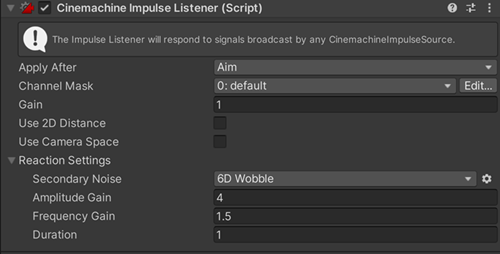

# Cinemachine Impulse Listener

Impulse signals and [sources](CinemachineImpulseSourceOverview.md) don’t do anything on their own. An **Impulse Listener** is a Cinemachine extension that allows a virtual camera to “hear” impulse vibration signals and react to them. 

Default implementations shipped with Cinemachine respond by applying the received signal directly to the listener’s transform position, causing it to shake along with the signal. Additionally, it’s possible to specify a secondary response - usually a randomized vibration along all positions and rotation axes - to give character to the listener’s movement. It’s as if the listener were supported on springs and then kicked by the impulse signal. In addition to the thrust given by the kick itself, there will be randomized shaking due to the springs.

When you add an **Impulse Listener** extension to a virtual camera, it makes the camera shake in response to the signals emitted from Impulse Sources. In the simplest case, the Impulse Listener applies the signal verbatim to the camera’s Transform, causing it to shake.

In the image below, the figure’s feet are Impulse Sources. When they collide with the floor (A) they generate impulses. The camera is an Impulse Listener and reacts to the impulses by shaking (B), which shakes the resulting image in the Game view (C). 

To add an Impulse Listener to a Cinemachine virtual camera:

1. Select the virtual camera, navigate to the Inspector window and expand the **Cinemachine Virtual Camera** script.

2. Go to **Extensions > Add Extension**, and select **CinemachineImpulseListener**.

In the real world, some cameras are mounted less rigidly than others, and tend to shake more as a result. The Impulse Listener’s **Gain** property emulates this behavior by amplifying or attenuating impulse vibration signals. Higher values cause the camera to shake more.

>**TIP:** You can create your own Impulse Listener to interpret vibration signals any way you like.

By default, an Impulse Listener reacts to every Impulse Source in range, but you can apply [channel filtering](CinemachineImpulseFiltering.md#ChannelFiltering) to make a Listener respond to some Sources and ignore others.

##Properties:

| Property:           | Function:                                                    |
| ------------------- | ------------------------------------------------------------ |
| **Apply After**     | Obstacles with this tag will be ignored. It is recommended to set this field to the target's tag. |
| **Channel Mask**    | Specifies the Impulse channels to react to. For details, see [Filtering with channels](CinemachineImpulseFiltering.md#ChannelFiltering). |
| **Gain**            | This is how much the received impulse signal will be magnified by for the purposes of reacting. It’s a simple multiplier applied to the incoming signal. The default value is 1.|
| **Use 2D Distance** | Enable this setting to ignore the z axis when calculating camera distance from the Impulse Source. Use this property for 2D games. |
| **Use Camera Space** | Interprets the impulse signal in camera space as opposed to world space.  So if the impulse Y axis is vibrating, then the listener will move up and down on its local Y axis. |
| **Reaction Settings** | Lets you set a secondary noise that gets triggered by the impulse signal. Choose the noise setting and tune it with the amplitude and frequency gain. Duration sets the fade-out time for the secondary noise. Time is approximate. This will scale automatically with stronger impulses.  The listener combines the original impulse signal and the reaction and applies it to the object it’s on. This could be a camera, a vcam, or any other object. Custom listeners can easily be authored to apply the signal in nonstandard ways (for example, convert Z motion to FOV). |