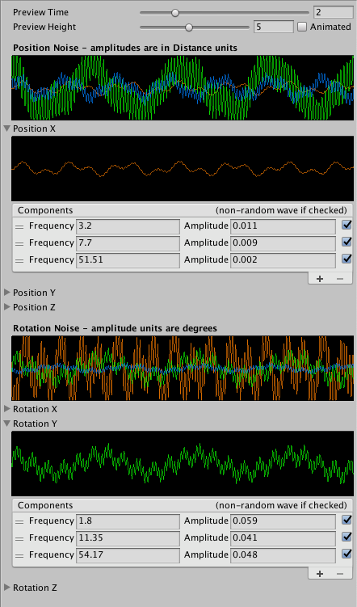

# Using Noise Profiles

Cinemachine uses a **[Noise Profile](CinemachineNoiseProfiles.md)** Asset to generate Basic Multi-Channel Perlin noise for Cinemachine Virtual Cameras. You can use the same Asset to create a procedural raw signal for Impulse.

The **Noise Profile** Asset allows you to add noise in up to six dimensions: three rotational axes and three positional axes. Typical camera noise profiles use only rotational noise, but for Impulse you often want positional noise as well.

Cinemachine ships with several **Noise Profile** presets, which you can use as they are, or clone and customize. **6D Shake** is a good all-around profile that you can use for a wide variety of situations. 

## Connecting a noise profile to an Impulse Source

To connect a noise profile Asset to an Impulse Source or a Collision Impulse Source, do one of the following:

- In the Impulse Source Inspector, click the gear icon next to the **Raw Signal** field and choose a preset from the **Presets** section of the menu.

- In the Project view, locate the noise profile you want to connect and drag it onto the **Raw Signal** field in the Impulse Source Inspector.

## Creating a new noise profile

You can create your own noise profiles from scratch in the Noise Profile Inspector; however, you might find it easier to clone an existing preset and edit it.

To create a new noise profile Asset:

1. In the Impulse Source Inspector, click the gear icon next to the **Raw Signal** field and choose **New Noise Settings**.

2. When prompted, give the new Asset a name and choose a location to save it to.

3. Locate the new Asset in the Project view and select it to open the Noise Profile Inspector.

   

   The Inspector displays a compound waveform for rotational noise and positional noise. You can expand any rotational or positional axis to view and edit its waveforms individually.
   
   For details about creating custom noise profiles, see [Working with noise profiles](CinemachineNoiseProfiles.md)
