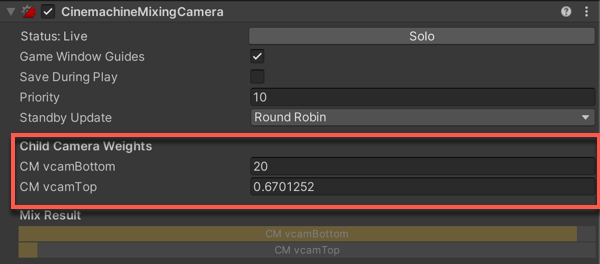

# Cinemachine Mixing Camera

The __Cinemachine Mixing Camera__ component uses the weighted average of its child Virtual Cameras to compute the position and other properties of the Unity camera.

Mixing Camera manages up to eight child Virtual Cameras. In the Mixing Camera component, these Virtual Cameras are fixed slots, not a dynamic array. Mixing Camera uses this implementation to support weight animation in Timeline. Timeline cannot animate array elements.

To create a Mixing Camera:

1. In the Unity menu, choose __GameObject > Cinemachine > Mixing Camera__.
A new Mixing Camera appears in the [Hierarchy](https://docs.unity3d.com/Manual/Hierarchy.html) window. By default, Unity also adds two Virtual Cameras as children of the Mixing Camera.

2. Adjust the children Virtual Cameras.

3. Add up to six more child cameras.

4. Select the Mixing Camera in the Hierarchy window then adjust the Child Camera Weights in the [Inspector](https://docs.unity3d.com/Manual/UsingTheInspector.html) window.

## Properties:

| **Property:** | **Function:** |
|:---|:---|
| __Solo__ | Toggles whether or not the Mixing Camera is temporarily live. Use this property to get immediate visual feedback in the [Game view](https://docs.unity3d.com/Manual/GameView.html) to adjust the Virtual Camera. |
| __Game Window Guides__ | Toggles the visibility of compositional guides in the Game view. This property applies to all Virtual Cameras. |
| __Save During Play__ | Check to [apply the changes while in Play mode](CinemachineSavingDuringPlay.html).  Use this feature to fine-tune a Virtual Camera without having to remember which properties to copy and paste. This property applies to all Virtual Cameras. |
| __Priority__ | The importance of this Mixing Camera for choosing the next shot. A higher value indicates a higher priority. Cinemachine Brain chooses the next live Virtual Camera from all Virtual Cameras that are activated and have the same or higher priority as the current live Virtual Camera. This property has no effect when using a Virtual Camera with Timeline. |
| __Standby Updates__ | Controls how often the virtual camera is updated when the virtual camera is not live. |
| __Child Camera Weights__ | The weight of the Virtual Camera. Each child Virtual Camera has a corresponding Weight property. Note that setting one camera's weight to 1 does not put the other weights to zero.  The contribution of any individual camera is its weight divided by the sum of all the child weights. |
| __Mix Result__ | A graphical representation of the weights of the child Virtual Cameras. The light part of the bar of each child camera represents the proportion of its contribution to the final position of the Mixing Camera. When the bar is completely dark, the camera makes no contribution to the position of the Mixing Camera. |

