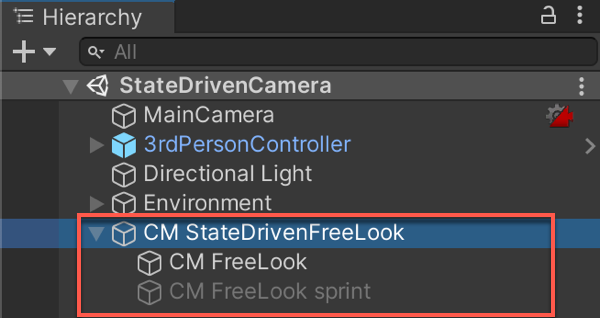
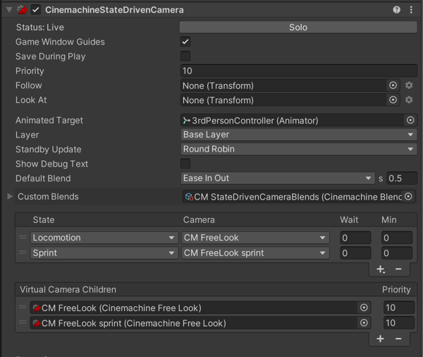

# Cinemachine State-Driven Camera

The __Cinemachine State-Driven Camera__ component activates a child Virtual Camera when an animation target changes states. For example, consider your avatar’s local-motion system and orbit camera. Your game feels more alive to the player when the camera shakes more as your avatar runs. When the avatar walks, blend for example to a Virtual Camera with more damping.

The animation target for a State-Driven Camera is a GameObject with an [Animator](https://docs.unity3d.com/Manual/class-Animator.html) component controlled by an [Animator Controller](https://docs.unity3d.com/Manual/class-AnimatorController.html).

Assign normal __Look At__ and __Follow__ targets to each child Virtual Camera. If a child Virtual Camera has no __Look At__ or __Follow__ target, State-Driven camera uses its own, respective targets.

State-Driven Camera has a list that assigns child Virtual Cameras to animation states. You can define default and custom blends between the State-Driven children.

In the Inspector, the State-Driven camera lists its Virtual Camera children. Use this list to add and delete child Virtual Cameras, and assign priorities.

To create a State-Driven camera:

1. Set up the animation target GameObject to [control it with an Animator Controller](https://docs.unity3d.com/Manual/AnimatorControllers.html).

2. In the Unity menu, choose __GameObject > Cinemachine > State-Driven Camera__. A new State-Driven camera appears in the hierarchy with a new child Virtual Camera.

3. In the [Inspector](https://docs.unity3d.com/Manual/UsingTheInspector.html), assign the animation target you created in step 1 to the Animated Target property.

4. If needed, add more child VIrtual Cameras either by clicking + in Virtual Camera Children or dragging and dropping existing Virtual Cameras in the [Hierarchy](https://docs.unity3d.com/Manual/Hierarchy.html) window.

5. Use the __State__ to assign child Virtual Cameras to the animation states.

## Properties:

| **Property:** | **Function:** |
|:---|:---|
| __Solo__ | Toggles whether or not the Virtual Camera is temporarily live. Use this property to get immediate visual feedback in the [Game view](https://docs.unity3d.com/Manual/GameView.html) to adjust the Virtual Camera. |
| __Standby Update__ | Controls how often the virtual camera is updated when the virtual camera is not live. |
| __Game Window Guides__ | Toggles the visibility of compositional guides in the Game view. These guides are available when Look At specifies a GameObject and the Aim section uses Composer or Group Composer, or when Follow specifies a target and the Body section uses Framing Composer. This property applies to all Virtual Cameras. |
| __Save During Play__ | Check to [apply the changes while in Play mode](CinemachineSavingDuringPlay.html).  Use this feature to fine-tune a Virtual Camera without having to remember which properties to copy and paste. This property applies to all Virtual Cameras. |
| __Priority__ | The importance of this State-Driven camera for choosing the next shot. A higher value indicates a higher priority. This property has no effect when using a State-Driven camera with Timeline. |
| __Look At__ | The default target GameObject that the children Virtual Camera move with. The State-Driven camera uses this target when the child does not specify this target. May be empty if all of the children define targets of their own. |
| __Follow__ | The default target GameObject to aim the Unity camera at. The State-Driven camera uses this target when the child does not specify this target. May be empty if all of the children define targets of their own. |
| __Animated Target__ | The GameObject that contains the Animator Controller. The State-Drive camera reacts to the animation state changes from this GameObject. |
| __Layer__ | The animation layer to observe in the Animated Target. |
| __Show Debug Text__ | Check to display a textual summary of the live Virtual Camera and blend in the game view. |
| __Default Blend__ | The blend which is used if you don’t explicitly define a blend between two Virtual Cameras. |
| __Custom Blends__ | The asset which contains custom settings for specific child blends. |
| __State__ | The state to which the virtual camera will be mapped. |
| __Camera__ | The virtual camera to activate for this state. |
| __Wait__ | The delay to activate the virtual camera (in seconds) once this state is entered. For example, the animation target moves from an active Walk state, to a Jog state, to a Run state. If the Jog Wait time is set to four seconds, the Walk virtual camera remains active for those four seconds even though the Jog state is now active. If the Jog state duration is less than the Wait time before the animation target passes into another state, the Jog virtual camera will not activate and is bypassed. |
| __Min__ | The minimum length of time (in seconds) the virtual camera must remain active once it is activated. For example, the animation target enters the Run state from the Jog state. It has spent five seconds in the Jog state before moving to the Run state. The Jog Min is set to 12 seconds. This means that the Jog virtual camera remains the active camera for an additional seven seconds even though the animation target is in the Run state. |
| __Virtual Camera Children__ | The list of Virtual Cameras that are children of the State-Driven camera. |

