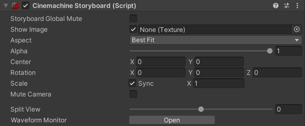

# Storyboard

Use the Cinemachine Storyboard [extension](CinemachineVirtualCameraExtensions.md) to let artists, producers, and directors contribute to your game development. Cinemachine Storyboard places a still image in screen space over the output of the Unity camera.

Storyboard simplifies animatics for your team. Start with still images to pre-visualize terrain, layout, movement, lighting, timing, and so on. Following the intentions of the Storyboard image, developers incrementally add the assets, GameObjects, and settings that implement the Scene.

Use the properties in the Storyboard component to hide and show the image to compare it to the actual rendering of the Unity camera.

Storyboards can be muted at a global level - completely disabling them. To toggle this, go to the Cinemachine Storyboard component and enable _Storyboard Global Mute_.

## Properties:

| **Property:** || **Function:** |
|:---|:---|:---|
| __Storyboard Global Mute__ || When enabled, all storyboards are globally muted. |
| __Show Image__ || Toggle the visibility of the storyboard image. |
| __Image__ || The image to display as an overlay over the output of the Virtual Camera. |
| __Aspect__ || How to handle differences between image aspect and screen aspect. |
| | _Best Fit_ | Resize the image as large as possible on the screen without cropping. Preserve the vertical and horizontal proportions. |
| | _Crop Image To Fit_ | Resize the image to fill the screen, cropping if necessary. Preserve the vertical and horizontal proportions. |
| | _Stretch To Fit_ | Resize the image to fill the screen, adjusting the vertical or horizontal width if necessary.  |
| __Alpha__ || The opacity of the image. Use 0 for transparent, 1 for opaque. |
| __Center__ || The screen-space position of the image. Use 0 for center. |
| __Rotation__ || The screen-space rotation of the image. |
| __Scale__ || The screen-space scaling of the image. |
| __Sync Scale__ || Check to synchronize the scale of the x and y axes. |
| __Mute Camera__ || Check to prevent the Virtual Camera from updating the position, rotation, or scale of the Unity camera. Use this feature to prevent Timeline from [blending](CinemachineBlending.md) the camera to an unintended position in the Scene. |
| __Split View__ || Wipe the image on and off horizontally. |
| __Waveform Monitor__ || Opens the Waveform monitor window.  This is very performance-intensive, use with care. |
