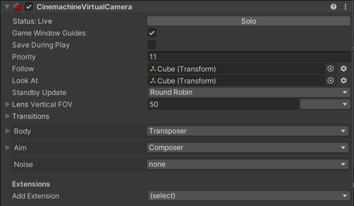

# Setting Virtual Camera properties

The Cinemacine Virtual Camera is a component that you add to an empty GameObject. It represents a Virtual Camera in the Unity Scene.

Use the __Aim__, __Body__, and __Noise__ properties to specify how the Virtual Camera animates position, rotation, and other properties. The Virtual Camera applies these settings to the Unity Camera when [Cinemachine Brain](CinemachineBrainProperties.md) or [Timeline](CinemachineTimeline.md) transfers control of the Unity camera to the Virtual Camera. You can also use handles to modify some common properties. For more information see, [Cinemachine Handle toolbar](handles.md). 

At any time, each Virtual Camera may be in one of these states:

* __Live__: The Virtual Camera actively controls a Unity camera that has a Cinemachine Brain. When a Cinemachine Brain blends from one Virtual Camera to the next, both Virtual Cameras are live. When the blend is complete, there is only one live Virtual Camera.

* __Standby__: The Virtual Camera doesn’t control the Unity camera. However, it still follows and aims at its targets, and updates at every frame. A Virtual Camera in this state is activated and has a priority that is the same as or lower than the live Virtual Camera.

* __Disabled__: The Virtual Camera doesn’t control the Unity camera and doesn’t actively follow or aim at its targets. A Virtual Camera in this state doesn’t consume processing power. To disable a Virtual Camera, deactivate its game object. The Virtual Camera is present but disabled in the Scene. However, even though the game object is deactivated, the virtual camera can still control the Unity camera if the virtual camera is participating in a blend, or if it is invoked by Timeline.

### Properties

| **Property:** || **Function:** |
|:---|:---|:---|
| __Solo__ || Toggles whether or not the Virtual Camera is temporarily live. Use this property to get immediate visual feedback in the [Game view](https://docs.unity3d.com/Manual/GameView.html) to adjust the Virtual Camera. |
| __Game Window Guides__ || Toggles the visibility of compositional guides in the Game view. These guides are available when Look At specifies a GameObject and the Aim section uses Composer or Group Composer, or when Follow specifies a target and the Body section uses Framing Composer. This property applies to all Virtual Cameras. |
| __Save During Play__ || Check to [apply the changes while in Play mode](CinemachineSavingDuringPlay.md).  Use this feature to fine-tune a Virtual Camera without having to remember which properties to copy and paste. This property applies to all Virtual Cameras. |
| __Priority__ || The importance of this Virtual Camera for choosing the next shot. A higher value indicates a higher priority. Cinemachine Brain chooses the next live Virtual Camera from all Virtual Cameras that are activated and have the same or higher priority as the current live Virtual Camera. This property has no effect when using a Virtual Camera with Timeline. |
| __Follow__ || The target GameObject that the Virtual Camera moves with. The [Body properties](CinemachineVirtualCameraBody.md) use this target to update the position of the Unity camera. Keep this property empty to make the Unity camera use the position of the Virtual Camera’ transform. For example, you might choose to animate the Virtual Camera in Timeline. |
| __Look At__ || The target GameObject to aim the Unity camera at. The [Aim properties](CinemachineVirtualCameraAim.md) use this target to update the rotation of the Unity camera. Keep this property empty to make the Unity camera use the orientation of the Virtual Camera. |
| __Standby Update__ || Controls how often the virtual camera is updated when the virtual camera is not live. |
| __Position Blending__ || Style for blending positions to and from this Virtual Camera. |
| | _Linear_ | Standard linear position blend. |
| | _Spherical_ | Spherical blend about the Look At position, if there is a Look At target. |
| | _Cylindrical_ | Cylindrical blend about the Look At position, if there is a Look At target. Vertical coordinate is linearly interpolated. |
| __Lens__ || These properties mirror their counterparts in the properties for the [Unity camera](https://docs.unity3d.com/Manual/class-Camera.html). |
| | _Field Of View_ | The camera view in vertical degrees. For example, to specify the equivalent of a 50mm lens on a Super 35 sensor, enter a Field of View of 19.6 degrees. This property is available when the Unity camera with the Cinemachine Brain component uses a Projection of Perspective.   |
| | _Presets_ | A drop-down menu of settings for commonly-used lenses. Choose **Edit Presets** to add or edit the asset that contains a default list of lenses. |
| | _Orthographic Size_ | When using an orthographic camera, defines the half-height of the camera view, in world coordinates. Available when the Unity camera with the Cinemachine Brain component uses a Projection of Orthographic. |
| | _Near Clip Plane_ | The closest point relative to the camera where drawing occurs. |
| | _Far Clip Plane_ | The furthest point relative to the camera where drawing occurs. |
| | _Dutch_ | Dutch angle. Tilts the Unity camera on the z-axis, in degrees. This property is unique to the Virtual Camera; there is no counterpart property in the Unity camera. |
|  __Mode Override__ || Allows you to select a different camera mode to apply to the [Unity camera](https://docs.unity3d.com/Manual/class-Camera.html) component when Cinemachine activates this Virtual Camera.  __Important:__ All the changes applied to the Camera component through this setting will remain after the Virtual Camera deactivation. If you set a mode override in any Virtual Camera, you should set one in all Virtual Cameras. |
| | _None_ | Leaves the __Projection__ and __Physical Camera__ properties unchanged in the Camera. |
| | _Orthographic_ | Sets the __Projection__ property to __Orthographic__. |
| | _Perspective_ | Sets the __Projection__ property to __Perspective__ and *disables* the __Physical Camera__ feature and properties. |
| | _Physical_ | Sets the __Projection__ property to __Perspective__ and *enables* the __Physical Camera__ feature and properties. |
| __Blend Hint__ || Provides hints for blending positions to and from the virtual camera. |
| __Inherit Position__ || When enabled, whenever this virtual camera goes live, forces the initial position to be the same as the current position of the Unity Camera, if possible. |
| __Extensions__ || Components that add extra behaviors to the Virtual Camera.  |
| | _Add Extension_ | Choose a new [extension](CinemachineVirtualCameraExtensions.md) to add to the Virtual Camera. |

