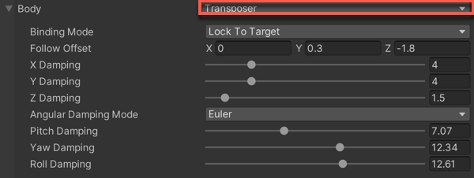

# Body properties

Use the Body properties to specify the algorithm that moves the Virtual Camera in the Scene. To rotate the camera, set the [Aim properties](CinemachineVirtualCameraAim.html).

Cinemachine includes these algorithms for moving a Virtual Camera:

* [__Transposer__](CinemachineBodyTransposer.html): moves in a fixed relationship to the __Follow__ target.
* [__Do Nothing__](CinemachineBodyDoNothing.html): does not move the Virtual Camera.
* [__Framing Transposer__](CinemachineBodyFramingTransposer.html): moves in a fixed screen-space relationship to the __Follow__ target.
* [__Orbital Transposer__](CinemachineBodyOrbitalTransposer.html): moves in a variable relationship to the __Follow__ target, optionally accepting player input.
* [__Tracked Dolly__](CinemachineBodyTrackedDolly.html): moves along a predefined path.
* [__Hard Lock to Target__](CinemachineBodyHardLockTarget.html): uses the same position at the __Follow__ target.
