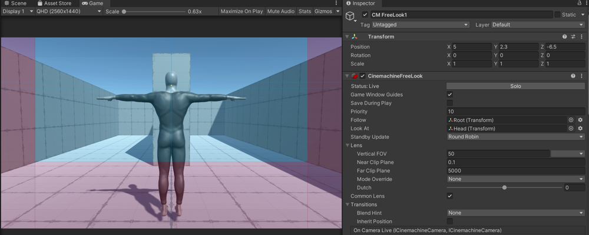

# Cinemachine

Cinemachine is a suite of modules for operating the Unity camera. Cinemachine solves the complex mathematics and logic of tracking targets, composing, blending, and cutting between shots. It is designed to significantly reduce the number of time-consuming manual manipulations and script revisions that take place during development.

The procedural nature of these modules makes Cinemachine bug-resistant. When you make adjustments—for example, change an animation, vehicle speed, terrain, or other GameObjects in your Scene—Cinemachine dynamically adjusts its behavior to make the best shot. There is no need, for example, to re-write camera scripts just because a character turns left instead of right.

Cinemachine works in real time across all genres including FPS, third person, 2D, side-scroller, top down, and RTS. It supports as many shots in your Scene as you need. Its modular system lets you compose sophisticated behaviors.

Cinemachine works well with other Unity tools, acting as a powerful complement to Timeline, animation, and post-processing assets.  Create your own [extensions](CinemachineVirtualCameraExtensions) or integrate it with your custom camera scripts.

## Requirements

Cinemachine has no external dependencies. Just install it and start using it. 

This Cinemachine version 2.8.0 is compatible with the following versions of the Unity Editor:

* 2018.4.17f1 and later
