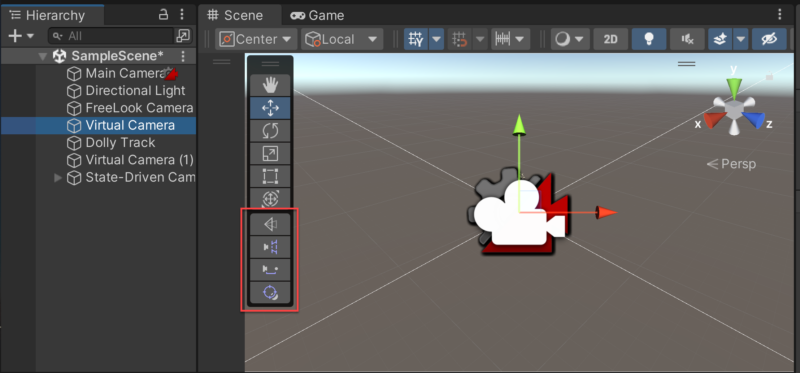
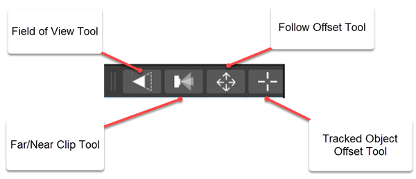
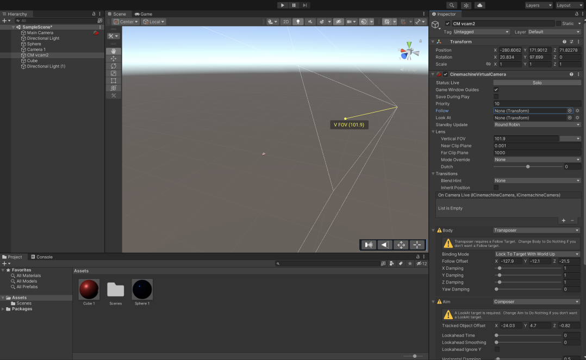
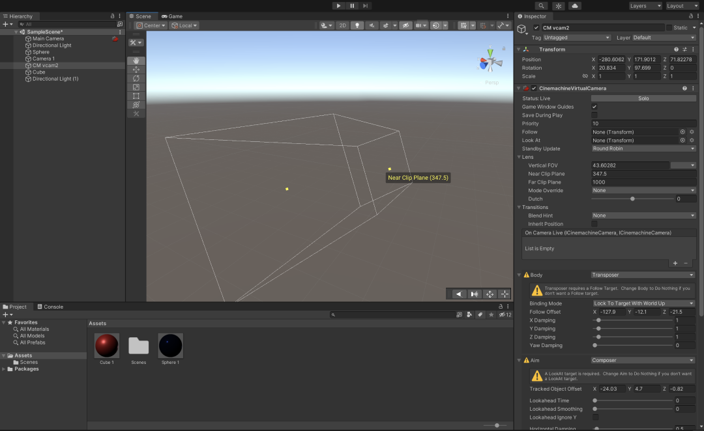
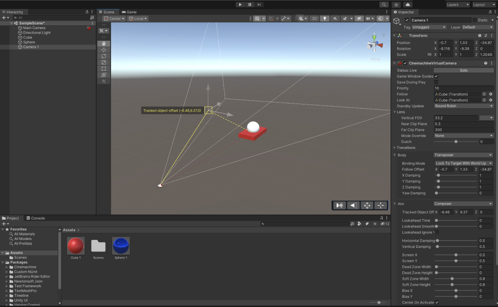
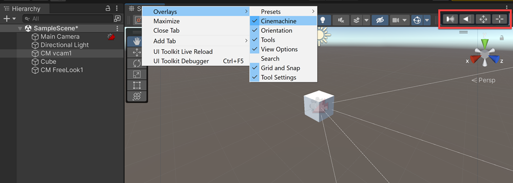

# Cinemachine Scene Handles

Cinemachine Scene Handles are a group of 3D controls that allow you to manipulate virtual camera parameters visually in the Scene view. You can use the handle tools to interactively adjust the selected object's parameters quickly and efficiently rather than controlling them via the inspector.

Cinemachine Scene Handles automatically appear in the Scene view **toolbar overlay** when you select a type of virtual camera with an associated handle.

## Types of Scene Handles

The following four Cinemachine Handle tools are available in the toolbar:

**1. Field of View (FOV)**

The FOV tool can adjust Vertical FOV, Horizontal FOV, Orthographic Size, or Focal Length depending on what's selected by the user. It can control:

* Vertical or Horizontal FOV (depending on the selection in the Main Camera) when the camera is in **Perspective** mode.
* Orthographic Size when the camera is in **Orthographic** mode.
* Focal length when the camera is in **Physical** mode.

For more information on the Field of View (FOV) property, see [Setting Virtual Camera properties](CinemachineVirtualCamera.md).

**2. Far/Near clip planes**

* You can drag the points to increase the far clip plane and near clip plane.

For more information on the Far and Near clip plane properties, see [Setting Virtual Camera properties](CinemachineVirtualCamera.md).

**3. Follow offset**

The Follow offset is an offset from the Follow Target. You can drag the points to increase or decrease the Follow offset position.

For more information on the Follow offset property, see [Orbital Transposer properties](CinemachineBodyOrbitalTransposer.md).

**4. Tracked object offset**

This starts from where the camera is placed. You can drag the points to increase or decrease the tracking target position when the desired area isn't the tracked object’s center.

For more information on the Tracked object offset property, see [Composer properties](CinemachineAimComposer.md).

## Cinemachine tool settings

Cinemachine tool settings are automatically displayed when a Free Look camera is selected. These settings allow you to adjust the position of the three separate camera rigs: **Top**, **Middle**, and **Bottom**.

For more information, see [Cinemachine Free Look Camera](CinemachineFreeLook.md).

To deactivate the Cinemachine tool settings for a Free Look camera:

1. Right-click on the **Scene** tab in the Scene view.
2. Select **Overlays** and then **Cinemachine tools** from the pop-up menu.
