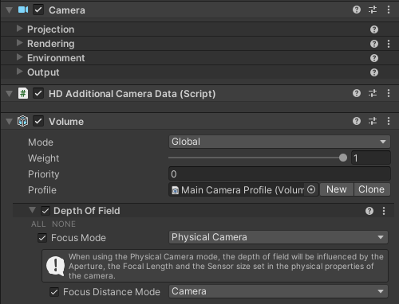

# CinemachineAutoFocus

This CmCamera extension drives the Camera's focusDistance property.  It can be used to hold focus onto a specific object, or (in HDRP) to auto-detect what is in front of the camera and focus on that.
	
FocusDiatance is only relevant for physical cameras, and appropriate processing must be installed for it to have any visible effect.

As of this writing, only HDRP provides out-of-the-box handling for this: create an active Volume containing a Depth Of Field override having Focus Mode activated and set to Physical Camera, and Focus Distance Mode activated and set to Camera.  With this, the actual focus distance can be driven by CinemachineAutoFocus.

## Properties:

| **Property:** || **Function:** |
|:---|:---|:---|
| __FocusTarget__ || The camera's focus distance will be set to the distance from camera to the selected target.  The Focus Offset field will then modify that distance.  |
| | _None_ | Focus tracking is disabled |
| | _LookAtTarget_ | Focus offset is relative to the LookAt target. |
| | _FollowTarget_ | Focus offset is relative to the Follow target. |
| | _CustomTarget_ | Focus offset is relative to the Custom target set in the _CustomTarget_ field. |
| | _Camera_ | Focus offset is relative to the camera.  Use this setting to directly set the focus distance using _FocusDepthOffset_. |
| | _ScreenCenter_ | HDRP only: Focus will be on whatever is located in the depth buffer at the center of the screen. |
| __Custom Target__ || The target to use if Focus Target is set to _CustomTarget_.  |
| __Focus Depth Offset__ || Offsets the sharpest point away in depth from the focus target location.  |
| __Damping__ || The value corresponds approximately to the time the focus will take to adjust to the new value.  |
| __Auto Detection Radius__ || HDRP-only: Radius of the AutoFocus sensor in the center of the screen, used when _Focus Target_ is set to _ScreenCenter_.  A value of 1 would fill the screen.  It's recommended to keep this quite small.  Default value is 0.02.  |

