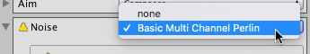

# Cinemachine Basic Multi Channel Perlin component

Use a Basic Multi Channel Perlin component in a Cinemachine Camera GameObject to simulate camera shake via Perlin noise movement. Perlin noise is a technique to compute pseudo-random movement with a natural behavior.

The Basic Multi Channel Perlin component applies a [Noise Profile Asset](CinemachineNoiseProfiles.md) which defines the noise behavior over time. Cinemachine includes a few noise profile assets. You can edit them and create your own ones.

<!--- Update the screenshot below, it should show the actual component --->

<!---

--->

## Properties

| **Property:** | **Function:** |
|:---|:---|
| **Noise Profile** | The noise profile asset to use.|
| **Amplitude Gain** | Gain to apply to the amplitudes defined in the noise profile. Use 1 to use the amplitudes defined in the noise profile. Setting this to 0 mutes the noise. Tip: Animate this property to ramp the noise effect up and down.|
| **Frequency Gain** | Factor to apply to the frequencies defined in the noise profile. Use 1 to use the frequencies defined in the noise profile. Use larger values to shake the camera more rapidly. Tip: Animate this property to ramp the noise effect up and down. |
| **Pivot Offset** | When rotating the camera, offset the camera's pivot by the indicated x, y, and z distance when applying rotational noise. This generates some positional variation that corresponds to the rotation noise. |
