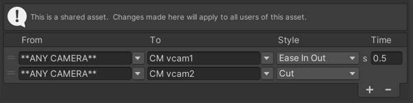

# Cinemachine Blender Settings asset 

Use a Cinemachine Blender Settings asset from the [Cinemachine Brain component](CinemachineBrain.md) to define **Custom Blends** (overriding the **Default Blend** setting) between specific pairs of Cinemachine Cameras.

For more information about blends, refer to [Camera control and transitions](concept-camera-control-transitions.md).

The __From__ and __To__ settings are name-based, not references. This means that Cinemachine finds cameras by matching their names to the settings. They are not linked to specific GameObjects.  The built-in dropdowns can be used to select a CinemachineCamera from the current scene, or the name can be typed directly into the text boxes.  If a name does not match any CinemachineCamera in the current scene, the field will be highlighted in yellow.

Use the reserved name **\*\*ANY CAMERA\*\*** to blend from or to any CinemachineCamera.

When Cinemachine begins a transition from one CinemachineCamera to another, it will look in this asset for an entry that matches the upcoming transition, and apply that blend definition.  

- If none is found, then the CinemachineBrain's DefaultBlend setting will apply.  
- If multiple entries in the Custom Blends asset match the upcoming transition, Cinemachine will choose the one with the strongest specificity. For example, if blending from vcam1 to vcam2, and the custom blends asset contains an entry for _vcam1-to-AnyCamera_, and another entry for _vcam1-to-vcam2_, then the _vcam1-to-vcam2_ entry will apply.
- If multiple entries in the Custom Blends asset match the upcoming transition with equally-strong specificity, then the first one found will apply.

## Properties:

| **Property:** || **Function:** |
|:---|:---|:---|
| __From__ || The name of the CinemachineCamera to blend from. Use the name \*\*ANY CAMERA\*\* to blend from any CinemachineCamera. This property is available only for custom blends. |
| __To__ || The name of the CinemachineCamera to blend to. Use the name \*\*ANY CAMERA\*\* to blend to any CinemachineCamera. This property is available only for custom blends. |
| __Style Default Blend__ || Shape of the blend curve. |
| | _Cut_ | Zero-length blend. |
| | _Ease In Out_ | S-shaped curve, giving a gentle and smooth transition. |
| | _Ease In_ | Linear out of the outgoing CinemachineCamera, and ease into the incoming CinemachineCamera. |
| | _Ease Out_ | Ease out of the outgoing CinemachineCamera, and blend linearly into the incoming CinemachineCamera. |
| | _Hard In_ | Ease out of the outgoing CinemachineCamera, and accelerate into the incoming CinemachineCamera. |
| | _Hard Out_ | Accelerate out of the outgoing CinemachineCamera, and ease into the incoming CinemachineCamera. |
| | _Linear_ | Linear blend. mechanical-looking. |
| | _Custom_ | Custom blend curve. Allows you to draw a custom blend curve. |
| __Time__ || Duration (in seconds) of the blend. |

