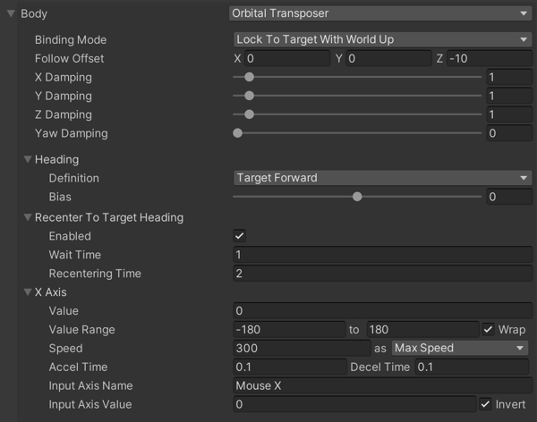

# Orbital Transposer

This Virtual Camera __Body__ algorithm moves the Unity camera in a variable relationship to the Virtual Camera’s __Follow__ target. It optionally accepts [player input](https://docs.unity3d.com/Manual/ConventionalGameInput.html), which allows the player to dynamically control the position of the camera relative to the target.

The __Orbital Transposer__ introduces the concept of __heading__, which is the direction in which the target is moving or facing. Orbital Transposer attempts to position the camera so that it points in the same direction as the heading direction. By default, this position is directly behind the target. Control this relationship by adjusting the __Heading Bias__ property.

If you attach an input controller to the __Orbital Transposer__, then the player can also control the camera. This allows the player to move the camera to any spot on an orbit around the target. Configure the __Orbital Transposer__ to take its input from any axis that you set up in the [Input Manager](https://docs.unity3d.com/Manual/class-InputManager.html). Or control the value directly using a custom input system.

__Orbital Transposer__ optionally re-centers the camera automatically. When __Recenter To Target Heading__ is checked, Orbital Transposer automatically moves the camera back to the target heading. You can specify the length of time to wait after it has detected no user input and the speed of the recentering.

## Properties:

| **Property:** || **Function:** |
|:---|:---|:---|
| __[Binding Mode](CinemachineBindingModes.md)__ || The coordinate space to use to interpret the offset from the target. |
| | _Lock To Target On Assign_ | Makes the orientation of the virtual camera match the local frame of the Follow target, at the moment when the virtual camera is activated or when the target is assigned. This offset remains constant in world space. The camera doesn't rotate along with the target. |
| | _Lock To Target With World Up_ | Makes the virtual camera use the local frame of the Follow target with tilt and roll set to 0. This binding mode ignores all target rotations except yaw. |
| | _Lock To Target No Roll_ | Makes the virtual camera use the local frame of the Follow target, with roll set to 0. |
| | _Lock To Target_ | Makes the virtual camera use the local frame of the Follow target. When the target rotates, the camera moves with it to maintain the offset and to maintain the same view of the target. |
| | _World Space_ | The offset is interpreted in world space relative to the origin of the Follow target. The camera will not change position when the target rotates. |
| | _Simple Follow With World Up_ | Simple follow with world up interprets the offset and damping values in camera-local space. This mode emulates the action a human camera operator would take when instructed to follow a target. The camera attempts to move as little as possible to maintain the same distance from the target; the direction of the camera with regard to the target does not matter. Regardless of the orientation of the target, the camera tries to preserve the same distance and height from it. |
| __Follow Offset__ || The position offset to attempt to maintain from the Follow target. You can also use [Scene Handles](handles.md) to modify this property.|
| __X Damping__ || How responsively the camera tries to maintain the offset in the x-axis. Small numbers make the camera more responsive. Larger numbers make the camera respond more slowly. Using different settings per axis can yield a wide range of camera behaviors. Not available when Binding Mode is Simple Follow With World Up. |
| __Y Damping__ || How responsively the camera tries to maintain the offset in the y-axis. Small numbers make the camera more responsive. Larger numbers make the camera respond more slowly.   |
| __Z Damping__ || How responsively the camera tries to maintain the offset in the z-axis. Small numbers make the camera more responsive. Larger numbers make the camera respond more slowly.   |
| __Yaw Damping__ || How responsively the camera tries to track the target rotation’s y angle. Small numbers make the camera more responsive. Larger numbers make the camera respond more slowly. Available when Binding Mode is Lock to Target With World Up, Lock to Target No Roll, or Lock to Target. |
| __Pitch Damping__ || How responsively the camera tries to track the target rotation’s x angle. Small numbers make the camera more responsive. Larger numbers make the camera respond more slowly. Available when Binding Mode is Lock to Target No Roll or Lock to Target. |
| __Roll Damping__ || How responsively the camera tries to track the target rotation’s z angle. Small numbers make the camera more responsive. Larger numbers make the camera respond more slowly. Available when Binding Mode is Lock to Target.  |
| __Heading__ || Specifies how to calculate the heading of the Follow target. |
| | _Definition_ | Choose Position Delta to calculate heading based on the difference in the position of the target from the last update and the current frame. Choose Velocity to use the velocity of the [Rigidbody](https://docs.unity3d.com/Manual/class-Rigidbody.html) of the target. If the target has no Rigidbody component, reverts to Position Delta. Choose Target Forward to use the target's local Forward axis as the heading. Choose World Forward to use a constant world-space Forward as heading. |
| | _Velocity Filter Strength_ | Controls the smoothing of the velocity when using Position Delta or Velocity in Definition. |
| | _Bias_ | Angular offset in the orbit to place the camera, relative to the heading. Measured in degrees. An axis value of 0 will put the camera here. |
| __Recenter To Target Heading__ || Controls automatic recentering when the player gives no input. |
| | _Enabled_ | Check to enable automatic recentering. |
| | _Wait Time_ | If no user input has been detected on the axis, the camera waits this long in seconds before recentering. |
| | _Recentering Time_ | Maximum angular speed of recentering. Accelerates into and decelerates out of this. |
| __X Axis__ || Heading Control. The settings here control the behaviour of the camera in response to the player’s input. |
| | _Value_ | The current value of the axis, in degrees. |
| | _Min Value_ | The minimum value for the axis. |
| | _Max Value_ | The maximum value for the axis. |
| | _Wrap_ | If checked, then the axis wraps around at the Min and Max values, forming a loop. |
| | _Max Speed_ | The maximum speed of this axis in degrees/second, or the multipler for the input value if Speed Mode is set to _InputValueGain_. |
| | _Speed Mode_ | How the axis responds to input.  _MaxSpeed_ (the default) clamps the maximum speed at which the axis can change, regardless of the input.  _Input Value Gain_ multiplies the input value by MaxSpeed. |
| | _Accel Time_ | The amount of time in seconds to accelerate to MaxSpeed with the supplied axis at its maximum value. |
| | _Decel Time_ | The amount of time in seconds o decelerate the axis to zero if the supplied axis is in a neutral position. |
| | _Input Axis Name_ | The name of this axis as specified in the Unity Input manager. Set to an empty string to disable the automatic updating of this axis. |
| | _Input Axis Value_ | The value of the input axis. A value of 0 means no input. Drive this directly from a custom input system, or set the Input Axis Name to drive the value by the Unity Input Manager. |
| | _Invert_ | Check to invert the raw value of the input axis before it is used. |

