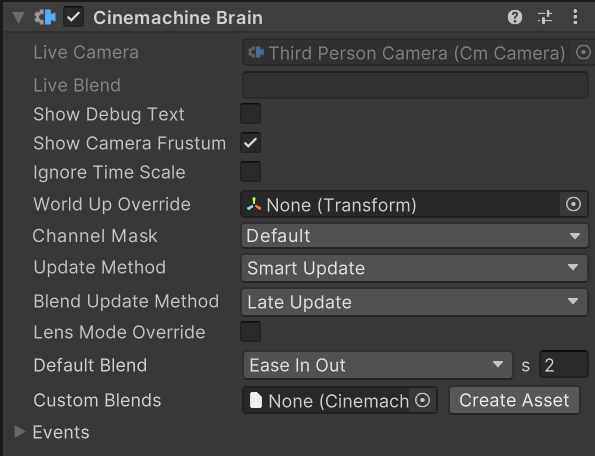

# Cinemachine Brain component

The Cinemachine Brain is a component in the Unity camera itself. Cinemachine Brain monitors all active [**CinemachineCameras**](CinemachineCamera.md) in the Scene. It chooses the next CinemachineCamera to control the Unity camera. It also controls the [transition (cut or blend)](concept-camera-control-transitions.md) from the current CinemachineCamera to the next.

Objects with a Cinemachine Brain are displayed in the hierarchy with a little CinemachineCamera icon next to them.  You can turn that off from the Cinemachine Preferences panel.

To add a Cinemachine Brain component to a Unity camera, do __one__ of the following:

* Use the GameObject > Cinemachine menu to add a CinemachineCamera to your Scene. Unity adds a Cinemachine Brain component to the Unity camera for you if there isn’t one already.

* [Add](https://docs.unity3d.com/Manual/UsingComponents.html) a Cinemachine Brain component to the Unity camera yourself.

You can also control CinemachineCameras from [Timeline](concept-timeline.md). Timeline overrides the decisions that Cinemachine Brain would otherwise make.

Cinemachine Brain holds the following key properties:

* __Blend Settings__: A list that defines how to blend from one CinemachineCamera to another.  For example, add an item to the list for a 4 second blend from vcam1 to vcam2 then add another item for a 1 second blend from vcam2 back to vcam1. If a blend between two cameras isn’t defined, Cinemachine Brain uses its default blend.

* __Channel Filter__:  Cinemachine Brain uses only those CinemachineCameras that output to Channels present in the Channel Mask.  You can set up [split-screen environments](CinemachineMultipleCameras.md) by using the Channel Mask to filter channels.

* __Event Dispatching__:  Cinemachine Brain fires events when it changes shot. It fires an event when a CinemachineCamera goes live. It also fires an event when it cuts from one CinemachineCamera to another. Use the latter event to reset temporal post effects.

## Properties:

| **Property:** || **Function:** |
|:---|:---|:---|
| __Show Debug Text__ || Check to display a textual summary of the live CinemachineCamera and blend in the view. |
| __Show Camera Frustum__ || Check to display the frustum of the camera in the Scene view. |
| __Ignore Time Scale__ || Check to make the CinemachineCameras respond in real time to user input and damping, even if the game is running in slow motion. |
| __World Up Override__ || The Y axis of the specified GameObject defines the worldspace up vector for CinemachineCameras. Use this property in top-down game environments. Set to None to use the worldspace Y axis. Setting this appropriately is important to avoid gimbal-lock in extreme up/down conditions. |
| __Channel Mask__ || The CinemachineBrain will find the highest-priority CinemachineCamera that outputs to any of the channels selected. CinemachineCameras that do not output to one of these channels will be ignored.  Normally, this value should be left at Default.  Change it in situations where multiple CinemachineBrains are needed (for example, when implementing Split-screen). |
| __Update Method__ || When to update the position and rotation of the CinemachineCameras.  |
| | _Fixed Update_ | Synchronize CinemachineCamera update with the Physics module, in FixedUpdate. |
| | _Late Update_ | In MonoBehaviour LateUpdate. |
| | _Smart Update_ | Update each CinemachineCamera according to how its target is updated. This is the recommended setting. |
| | _Manual Update_ | CinemachineCameras do not update automatically.  You must explicitly call `brain.ManualUpdate()` at an appropriate time in your game loop.  This should be after any camera LookAt or Follow targets have moved.  This is an advanced feature. |
| __Blend Update Method__ || When to resolve the blends and update the main camera.  |
| | _Late Update_ | In MonoBehaviour LateUpdate. This is the recommended setting. |
| | _Fixed Update_ | Use this setting only if your Update Method is FixedUpdate and you see judder when blending. |
| __Lens Mode Override__ || When enabled, CM camras are permitted to override the camera's lens mode (Perspective vs Orthographic vs Physical).  |
| __Default Mode__ || When Lens Mode Override is enabled and there is no CinemachineCamera actively overriding the lens mode, this lens mode will be pushed to the camera. |
| | _None_ | If Lens Override Mode is enabled and Default Mode is set to _None_, there will be no default mode pushed to the Camera when the CinemachineCamera is not overriding the lens mode.  This setting is not recommended, because it can produce unpredictable results.  It's always best to have a default mode. |
| | _Orthographic_ | Sets the __Projection__ property to __Orthographic__. |
| | _Perspective_ | Sets the __Projection__ property to __Perspective__ and *disables* the __Physical Camera__ feature and properties. |
| | _Physical_ | Sets the __Projection__ property to __Perspective__ and *enables* the __Physical Camera__ feature and properties. |
| __Default Blend__ || The blend to use when you haven’t explicitly defined a blend between two CinemachineCameras. |
| | _Cut_ | Zero-length blend. |
| | _Ease In Out_ | S-shaped curve, giving a gentle and smooth transition. |
| | _Ease In_ | Linear out of the outgoing shot, and easy into the incoming. |
| | _Ease Out_ | Easy out of the outgoing shot, and linear into the incoming. |
| | _Hard In_ | Easy out of the outgoing, and hard into the incoming. |
| | _Hard Out_ | Hard out of the outgoing, and easy into the incoming. |
| | _Linear_ | Linear blend. Mechanical-looking. |
| | _Custom_ | Custom blend curve. Draw the curve you want. |
| __Custom Blends__ || The asset that contains custom settings for blends between specific CinemachineCameras in your Scene. |
| __Create Asset__ || Create an asset containing a [list of custom blends](CinemachineBlending.md) between CinemachineCameras.  |
| __Camera Cut Event__ || This event fires when a CinemachineCamera goes live and there is no blend.  |
| __Camera Activated Event__ || This event fires when a CinemachineCamera goes live. If a blend is involved, then the event fires on the first frame of the blend. |

