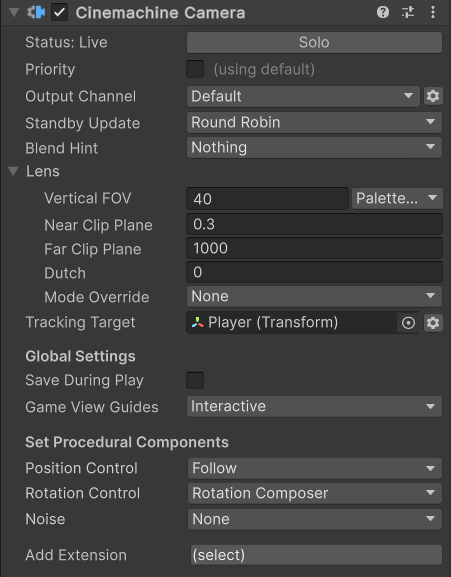

# Cinemachine Camera component

The CinemachineCamera is a component that you add to an empty GameObject. It represents a Cinemachine Camera in the Unity Scene.

## Properties

| **Property:** || **Function:** |
|:---|:---|:---|
| **Solo** || Toggles whether or not the CinemachineCamera is temporarily live. Use this property to get immediate visual feedback in the [Game view](https://docs.unity3d.com/Manual/GameView.html) to adjust the CinemachineCamera. |
| **Priority And Channel** || This setting controls how the output of this CinemachineCamera is used by the CinemachineBrain.  Enable this to use Priorities or custom CM output channels. |
|| _Channel_ | This is used to control which CinemachineBrain will be driven by this camera.  It is needed when there are multiple CinemachineBrains in the scene (for example, when implementing split-screen). |
|| _Priority_ | This is used to control which of several active CinemachineCameras should be live, when not controlled by Timeline. By default, priority is 0.  Use this to specify a custom priority value. A higher value indicates a higher priority. Negative values are also allowed. Cinemachine Brain chooses the next live CinemachineCamera from all CinemachineCameras that are activated and have the same or higher priority as the current live CinemachineCamera. This property has no effect when using a CinemachineCamera with Timeline. |
| **Standby Update** || Controls how often the Cinemachine Camera is updated when the Cinemachine Camera is not Live. Use this property to tune for performance. |
|  | _Never_ | Only update if the Cinemachine Camera is Live. Don't set this value if you're using the Cinemachine Camera in shot evaluation context. |
|  | _Always_ | Update the Cinemachine Camera every frame, even when it is not Live. |
|  | _Round Robin_ | Update the Cinemachine Camera occasionally, at a frequency that depends on how many other Cinemachine Cameras are in Standby. |
| **Blend Hint** || Provides hints for blending positions to and from the CinemachineCamera. Values can be combined together. |
| | _Spherical Position_ | During a blend, camera will take a spherical path around the Tracking target. |
| | _Cylindrical Position_ | During a blend, camera will take a cylindrical path around the Tracking target (vertical co-ordinate is linearly interpolated). |
| | _Screen Space Aim When Targets Differ_ | During a blend, Tracking target position will interpolate in screen space instead of world space. |
| | _Inherit Position_ | When this CinemachineCamera goes live, force the initial position to be the same as the current position of the Unity Camera, if possible. |
| | _Ignore Target_ | Don't consider the Tracking Target when blending rotations, just to a spherical interpolation. |
| | _Freeze When Blending Out_ | Normally the camera remain live when blending, because it creates the smoothest transitions.  If this hint is enabled, then the camera will not update while blending out; instead it will create a snapshot of its state and blending will be done from that. |

### Targets

| **Property:** || **Function:** |
|:---|:---|:---|
| **Tracking Target** || The target GameObject that the CinemachineCamera procedurally follows. The procedural algorithms use this target as input when updating the position and rotation of the Unity camera. |
| **Look At Target** || If enabled, this specifies a distinct target GameObject at which to aim the Unity camera. The [Rotation Control properties](#set-procedural-components-and-add-extension) use this target to update the rotation of the Unity camera. |

### Lens

> [!IMPORTANT]
> These properties mirror their counterparts in the properties for the [Unity camera](https://docs.unity3d.com/Manual/class-Camera.html).

| **Property:** || **Function:** |
|:---|:---|:---|
| **Field Of View** || The camera view in vertical degrees. For example, to specify the equivalent of a 50mm lens on a Super 35 sensor, enter a Field of View of 19.6 degrees. This property is available when the Unity camera with the Cinemachine Brain component uses a Projection of Perspective. You can also use [Scene Handles](handles.md) to modify this property. |
| **Presets** || A drop-down menu of settings for commonly-used lenses. Choose **Edit Presets** to add or edit the asset that contains a default list of lenses. |
| **Orthographic Size** || When using an orthographic camera, defines the half-height of the camera view, in world coordinates. Available when the Unity camera with the Cinemachine Brain component uses a Projection of Orthographic. |
| **Near Clip Plane** || The closest point relative to the camera where drawing occurs. You can also use [Scene Handles](handles.md) to modify this property.|
| **Far Clip Plane** || The furthest point relative to the camera where drawing occurs. You can also use [Scene Handles](handles.md) to modify this property.|
| **Dutch** || The Dutch angle. Tilts the Unity camera on the z-axis, in degrees. This property is unique to the CinemachineCamera; there is no counterpart property in the Unity camera. |
| **GateFit** || Physical cameras only: How the image is fitted to the sensor if the aspect ratios differ |
| **SensorSize** || Physical cameras only: This is the actual size of the image sensor (in mm) |
| **LensShift** || Physical cameras only: Position of the gate relative to the film back |
| **FocusDistance** || Physical cameras only: Distance from the camera lens at which focus is sharpest.  The Depth of Field Volume override uses this value if you set FocusDistanceMode to Camera.  Otherwise, this value is ignored. |
| **Iso** || Physical cameras only: The sensor sensitivity (ISO) |
| **ShutterSpeed** || Physical cameras only: The exposure time, in seconds |
| **Aperture** || Physical cameras only: The aperture number, in f-stop |
| **BladeCount** || Physical cameras only: The number of diaphragm blades |
| **Curvature** || Physical cameras only: Maps an aperture range to blade curvature |
| **BarrelClipping** || Physical cameras only: The strength of the \"cat-eye\" effect on bokeh (optical vignetting) |
| **Anamorphism** || Physical cameras only: Stretches the sensor to simulate an anamorphic look.  Positive values distort the camera vertically, negative values distort the camera horizontally |
|  **Mode Override** || Allows you to select a different camera mode to apply to the [Unity camera](https://docs.unity3d.com/Manual/class-Camera.html) component when Cinemachine activates this CinemachineCamera.  **Important:** For this override to take effect, you must enable the Lens Mode Override option in the CinemachineBrain inspector, and specify a default lens mode there. |
| | _None_ | Leaves the **Projection** and **Physical Camera** properties unchanged in the Camera. |
| | _Orthographic_ | Sets the **Projection** property to **Orthographic**. |
| | _Perspective_ | Sets the **Projection** property to **Perspective** and *disables* the **Physical Camera** feature and properties. |
| | _Physical_ | Sets the **Projection** property to **Perspective** and *enables* the **Physical Camera** feature and properties. |

### Global Settings

| **Property:** || **Function:** |
|:---|:---|:---|
| **Save During Play** || Check to [apply the changes while in Play mode](CinemachineSavingDuringPlay.md).  Use this feature to fine-tune a CinemachineCamera without having to remember which properties to copy and paste. This setting is shared by all CinemachineCameras. |
| **Game View Guides** || Toggles the visibility of compositional guides in the Game view. These guides are available when Tracking Target specifies a GameObject and the CinemachineCamera has a screen-composition behavior, such as Position Composer or Rotation Composer. This setting is shared by all CinemachineCameras. |
|| _Disabled_ | Game View Guides are not displayed. |
|| _Passive_ | Game View Guides are displayed while the relevant components are selected. |
|| _Interactive_ | Game View Guides are displayed while the relevant components are selected, and can be dragged in the Game View with the mouse to change the settings. |

### Set Procedural Components and Add Extension

| **Property:** || **Function:** |
|:---|:---|:---|
| **Position Control** || Select the procedural positioning behavior of the Cinemachine Camera via an extra component that you set in the same GameObject. |
|| [**Follow**](CinemachineFollow.md) | Moves in a fixed relationship to the **Tracking Target**.
|| [**Orbital Follow**](CinemachineOrbitalFollow.md) | moves in a variable relationship to the **Tracking Target**, optionally accepting player input.
|| [**Third Person follow**](CinemachineThirdPersonFollow.md) | Pivots the camera horizontally and vertically around the player, with the pivot point at the **Tracking Target**, following the rotation of the tracking target.
|| [**Position Composer**](CinemachinePositionComposer.md) | Moves in a fixed screen-space relationship to the **Tracking Target**.
|| [**Hard Lock to Target**](CinemachineHardLockToTarget.md) | Uses the same position as the **Tracking Target**.
|| [**Spline Dolly**](CinemachineSplineDolly.md) | Moves along a predefined path, specified by a Spline.
| **Rotation Control** || Select the procedural rotation behavior of the Cinemachine Camera via an extra component that you set in the same GameObject. |
|| [**Rotation Composer**](CinemachineRotationComposer.md) | Keep the **Look At** target in the camera frame, with composition controls and damping.
|| [**Hard Look At**](CinemachineHardLookAt.md) | Keep the **Look At** target in the center of the camera frame.
|| [**Pan Tilt**](CinemachinePanTilt.md) | Rotate the CinemachineCamera, optionally based on the user’s input.
|| [**Rotate With Follow Target**](CinemachineRotateWithFollowTarget.md) | Set the camera’s rotation to match the rotation of the **Tracking Target**.
| **Noise** || Shortcut for setting the procedural noise behavior of the CinemachineCamera. |
| **Add Extension** || Shortcut for adding procedural extension behaviors to the CinemachineCamera. |
