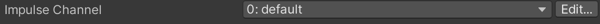
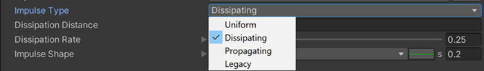
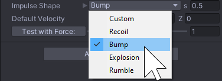
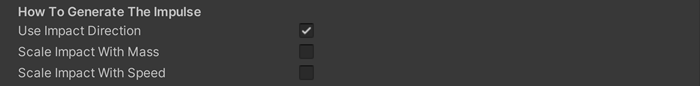

# Cinemachine Collision Impulse Source

For collision-based impulses, attach a **CinemachineCollisionImpulseSource** component to a GameObject that has a Collider or Collider2D component. **CinemachineCollisionImpulseSource** generates an impulse when something collides with the GameObject or enters a trigger zone. 

To add a Collision Impulse Source component:

1. Select the GameObject that you want to trigger impulses, navigate to its Inspector, and click the **Add Component** button.

2. Go to **Scripts > Cinemachine** and select **Cinemachine Collision Impulse Source**.

By default, an Impulse Source affects every [Impulse Listener](CinemachineImpulseListener.md) in range, but you can apply [channel filtering](CinemachineImpulseFiltering.md#ChannelFiltering) to make Impulse Sources affect some Impulse Listeners and not others. 

## Properties:

The properties in the Cinemachine Collision Impulse Source Inspector window are divided into the following sections.

- [Impulse Channel](#ImpulseChannel) 
- [Impulse Type](#ImpulseType)
- [Impulse Shape](#ImpulseShape) 
- [Trigger Object Filter](#TriggerObject)
- [How to Generate The Impulse](#GenerateImpulse)

### Impulse Channel

Impulse Listeners filter impulses based on channels to control which Impulse Sources they react to. Channels work like Camera Layers, but are distinct from them. These properties control the channels that the Collision Impulse Source broadcasts impulse signals on. For details, see documentation on [Filtering](CinemachineImpulseFiltering.md).

| **Property:**       | **Function:**                                                |
| ------------------- | ------------------------------------------------------------ |
| **Impulse Channel** | Choose one or more channels from the drop-down.  Click **Edit** to modify existing channels or add new ones. |

### Impulse Type

You can choose the level of complexity, depending on your needs. Changing the Impulse Type brings up range, dissipation, and propagation speed controls, as appropriate. 

| Property:| Function:|
|--|--|
|**Impulse Type**|You can choose from the following Impulse types:  **Uniform**: The impulse travels with infinite speed, and will be heard at the same time and in the same way by all listeners, no matter where they are in space.  **Dissipating**: The strength of the impulse decreases as the distance from the source increases. Listeners that are farther away will feel a weaker signal than listeners that are closer.  **Propagating**: In addition to being dissipating, the impulse signal travels with finite speed outward from the source. Listeners that are farther away will feel the impulse at a later time than listeners that are close.    **Legacy**: This mode exists to support projects made with earlier versions of Impulse, and has a more complex way of defining the impulse signal. We recommend using one of the other settings.|
|**Dissipation Distance**|This setting defines the distance over which the impulse dissipates. Beyond this distance, the impulse will not be felt.|
|**Propagation Speed**| This defines, in m/s, how quickly the impulse signal propagates outwards through space from its origin. The default value, 343, is the speed of sound.|
|**Dissipation Rate**|This defines how quickly the dissipation occurs over the dissipation distance. As shown in the image below, expanding the curve shows a graph illustrating the signal strength across the dissipation radius. The origin is in the center of the X axis. Moving the slider adjusts the blue picture.  |

### Impulse Shape

This defines the curve that specifies the shape of the signal, and the time over which the curve is emitted.

| Property:| Function:|
|--|--|
|**Predefined Impulse Shape**|You can choose from one of the following predefined Shapes: **Recoil**, **Bump**, **Explosion**, or **Rumble**.   **s (seconds)** field: Sets the duration of the impulse. Opening up the property shows you a picture of the impulse:  |
|**Custom Impulse Shape**|You can draw your own custom impulse shape (animation curve). Select **Custom** from the drop-down menu and click on the green icon to pop up an editor as shown below.  |
|**Default Velocity**|Specifies the direction in space that the impulse will have by default.|
|**Test with Force**| Allows you to **invoke** the default impulse from the inspector (when playing) with the specified force multiplier, to see what it looks like.|

### Trigger Object Filter

These properties filter the GameObjects that trigger an impulse when they collide or enter the trigger zone. GameObjects in layers specified by the **Layer Mask** trigger impulses unless you tag them with the **Ignore Tag** value. For details, see documentation on [Filtering](CinemachineImpulseFiltering.md).

| Property:      | Function:                                                    |
| -------------- | ------------------------------------------------------------ |
| **Layer Mask** | Rigidbody components in these layers that collide with an Impulse Source or enter the trigger zone cause the Source to broadcast its signal. |
| **Ignore Tag** | GameObjects with this tag do not generate an impulse, even if they are in a layer specified in **Layer Mask**. |

### How To Generate The Impulse

An impulse is triggered at a location by an impact mass moving at an impact velocity. Unity dynamically calculates the mass and velocity of the Rigidbody or Rigidbody 2D component that triggers the impulse. The **How To Generate The Impulse** properties control how the mass and velocity of the Rigidbody affect the strength and direction of the signal. 

| Property:                   | Function:                                                    |
| --------------------------- | ------------------------------------------------------------ |
| **Use Impact Direction**    | Enable this setting to rotate the impulse signal to correspond to the direction of the impact velocity. For example, if the raw signal vibrates vertically but the impact direction is horizontal, you could check this property to make the resulting impulse signal vibrate horizontally.    Disable to use the direction of the raw signal irrespective of the impact direction. |
| **Scale Impact With Mass**  | Enable this setting to increase or decrease the amplitude of the impulse signal based on the mass of the colliding GameObjects. The masses are specified in the Rigidbody or RigidBody2D component of the GameObject that contains the Cinemachine Impulse Source, and of the colliding GameObject.    Disable this setting to use a constant mass of 1. |
| **Scale Impact With Speed** | Enable this setting to scale the amplitude of the signal based on the speed of the impact. Faster moving GameObjects have a greater momentum, and therefore produce a stronger signal.   Disable this setting to ignore the speed of the colliding GameObject. |
