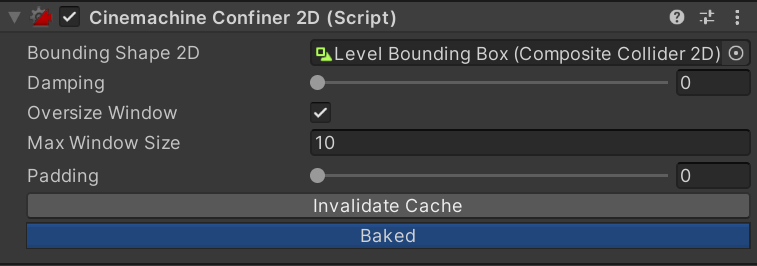

# Cinemachine Confiner 2D

Use the Cinemachine Confiner 2D [extension](https://docs.unity3d.com/Packages/com.unity.cinemachine@2.6/manual/CinemachineVirtualCameraExtensions.html) to confine the camera’s position so that the screen edges stay within a shape defined by a 2D polygon. This works for orthographic or perspective cameras, provided that the camera's forward vector remains parallel to the bounding shape’s normal (that is, that the camera is looking straight at the polygon, and not obliquely at it).

When confining the camera, the Cinemachine Confiner 2D considers the camera’s view size at the polygon plane, and its aspect ratio. Based on this information and the input polygon, it computes a second (smaller) polygon, and constrains the camera’s transform to it. Computation of this secondary polygon is resource-intensive, so you should only do this when absolutely necessary. 

Necessary use cases in which you need to recompute the cached secondary polygon include:

- when the input polygon’s points change,
- when the input polygon is non-uniformly scaled.

In these cases, for efficiency reasons, Cinemachine does not automatically regenerate the inner polygon. The client needs to call the InvalidateBoundingShapeCache() method to trigger the recalculation. You can do this from: 

- the script by calling InvalidateCache, or 
- the component inspector; to do so, press the **Invalidate Bounding Shape Cache** button.

If the input polygon scales uniformly or translates or rotates, the cache remains valid. 

When the Orthographic Size or Field of View of the Cinemachine Camera's lens changes, Cinemachine will not
automatically adjust the Confiner for efficiency reasons. To adjust the Confiner, call InvalidateLensCache() from script.

## Oversize Windows
If sections of the confining polygon are too small to fully contain the camera window, Cinemachine calculates a polygon skeleton for those regions, if the Oversize Window option is enabled. This is a shape with no area, that serves as a place to put the camera when it is confined to this region of the shape.

Skeleton computation is the most resource-heavy part of the cache calculation, so it is a good idea to tune this with some care:

- To optimize the skeleton calculation, set the **Max Window Size** property to the largest size you expect the camera window to have. Cinemachine does not spend time calculating the skeleton for window sizes larger than that.

## Efficiency
It is much more efficient to have more Cinemachine Cameras with different input bounding shapes and
blend between them instead of changing one Confiner2D's input bounding shape, because the initial cost of calculating the confiner shape is high.

## Remarks
There are several ways to set up a [Composite Collider 2D](https://docs.unity3d.com/Manual/class-CompositeCollider2D.html) for use with CinemachineConfiner2D. We recommend using the following structure:
1. Create a GameObject and add a Composite Collider 2D component to it.
2. In the Composite Collider 2D component, set `Is Trigger` to `true` and `Geometry Type` to `Polygons`.
3. When you added the Composite Collider 2D component, Unity automatically added a Rigidbody 2D component to your GameObject. Set the Rigidbody 2D's `Body Type` to `Static`.
4. Add one or more child GameObjects. These child GameObjects are going to hold the Collider2Ds for the Composite Collider 2D.
5. Add [Collider2Ds](https://docs.unity3d.com/Manual/Collider2D.html) to these GameObjects. Set the `Composite Operation` on the Collider2D components to **`Merge`**.

When assigning a GameObject that contains a Collider2D to Bounding Shape 2D, Unity is going to select the topmost Collider2D.

# Properties:

| **Property:**         |**Function:**|
|:----------------------|:---|
| __Bounding Shape 2D__ |Set the 2D shape you want to confine the camera viewport to.|
| __Damping__           |Damping Is applied around corners to avoid jumps. Higher numbers are more gradual.|
| __Slowing Distance__  | Size of the slow-down zone at the edge of the bounding shape.  When the camera is moving towards an edge and is within this distance of it, it will slow down gradually until the edge is reached. |
| __Max Window Size__   |To optimize computation and memory performance, set this to the largest view size that the camera is expected to have. The Confiner 2D does not compute a polygon cache for frustum sizes larger than this. This refers to the size in world units of the frustum at the confiner plane (for orthographic cameras, this is just the orthographic size). If set to 0, then Cinemachine ignores this parameter and calculates a polygon cache for all potential window sizes.|
| __Padding__   | For large window sizes, the confiner will potentially generate polygons with zero area.  The padding may be used to add a small amount of area to these polygons, to prevent them from being a series of disconnected dots.|
