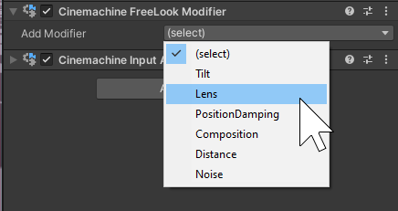
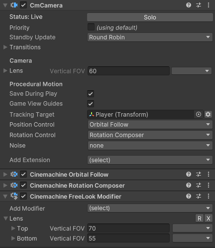

# Cinemachine FreeLook Modifier

This component is intended to be added to a CinemachineCamera set up as a [FreeLook](FreeLookCameras.md).  It is not necessary to have it (the FreeLook works just fine without it) but it can add some richness to the camera experience.

It allows you to vary some settings (for instance lens, noise, damping, composition, or camera distance) depending on whether the camera is at the top, middle, or bottom of its defined orbit. By default, the camera settings remain constant over the entire orbit. With the FreeLook  Modifier, you can change that.

The behavior holds a list of setting modifiers, and you can add any of the available ones. You can also create your own modifiers which will automatically get added to the list.

When you add a modifier, it will display entries for the Top and Bottom settings. The setting in the targeted behaviour determines the value for the middle of the orbit, and it is not repeated here.

As an example, if the CinemachineCamera has a lens FOV of 60, and you add a lens modifier, you could set the top to 70 for a wider view angle and the bottom to 55 for a slightly tighter shot. Then as the user moves the camera up and down in its orbit, the FOV will smoothly change from 55 at the bottom to 60 in the middle, to 70 at the top.

