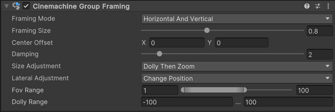

# Cinemachine Group Framing component

This component is a Cinemachine Camera extension that adds the ability to frame one or more targets when they are members of a Cinemachine Target Group. You can use it to dynamically adjust the zoom or to move the camera closer to or farther from the targets, to keep them in the frame at the desired size.

To enable the functionality of the Cinemachine Group Framing component, you must:
* Add it to an existing GameObject that contains a [Cinemachine Camera](CinemachineCamera.md) component.
* Create a separate GameObject with a [Cinemachine Target Group](CinemachineTargetGroup.md) component that targets the GameObjects you want to frame together in your Scene.
  * Make sure the Cinemachine Target Group has at least one member, and has a nonzero size.
* Set the Cinemachine Camera's Tracking Target property to target the created Cinemachine Target Group.

## Properties

> [!NOTE]
> The availability of some properties depend on the type of Unity Camera you're using: [perspective or orthographic](https://docs.unity3d.com/Manual/CamerasOverview.html).

| Property || Function |
| :--- | :--- | :--- |
| **Framing Mode** || Specifies the screen dimensions to consider when framing. |
|| _Horizontal_ | Consider only the horizontal dimension. Ignore vertical framing. |
|| _Vertical_ | Consider only the vertical dimension. Ignore horizontal framing. |
|| _Horizontal And Vertical_ | Use the larger of the horizontal and vertical dimensions to get the best fit. |
| **Framing Size** || The screen-space bounding box that the targets should occupy. Use 1 to fill the whole screen, 0.5 to fill half the screen, and so on. |
| **Center Offset** || Horizontally and vertically offsets the position of the group in the camera frame. |
| **Damping** || How gradually to make the framing adjustment. Larger numbers give a slower response, smaller numbers a snappier one. |
| **Size Adjustment** || How to adjust the camera in depth to get the desired framing. You can zoom, dolly in or out, or do both. Only available when using a perspective Unity Camera. |
|| _Zoom Only_ | Don’t move the camera, only adjust the Field of View. |
|| _Dolly Only_ | Move the camera, don’t change the Field of View. |
|| _Dolly Then Zoom_ | Move the camera as much as permitted by the ranges, then adjust the FOV if necessary to make the shot. |
| **Lateral Adjustment** || How to adjust the camera horizontally and vertically to get the desired framing. You can change position to reframe, or rotate the camera to reframe. Only available when using a perspective Unity Camera. |
|| _Change Position_ | Move the camera horizontally and vertically until the desired framing is achieved. |
|| _Change Rotation_ | Rotate the camera to achieve the desired framing. |
| **Fov Range** || Clamps the camera's Field of View to the specified range. Only available when including Zoom in **Size Adjustment**. |
| **Dolly Range** || Limits the camera movements to the specified range when achieving the desired framing. A negative distance is towards the target, and a positive distance is away from the target. Only available when including Dolly in **Size Adjustment**. |
| **Ortho Size Range** || Clamps the camera's Orthographic Size to the specified range. Only available when using an orthographic Unity Camera. |
