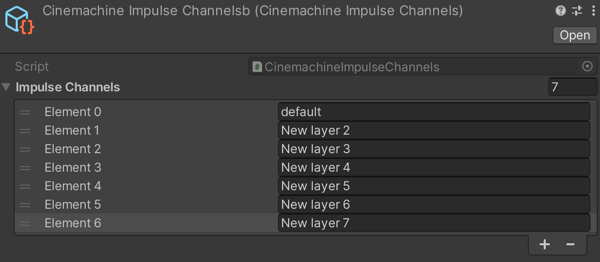
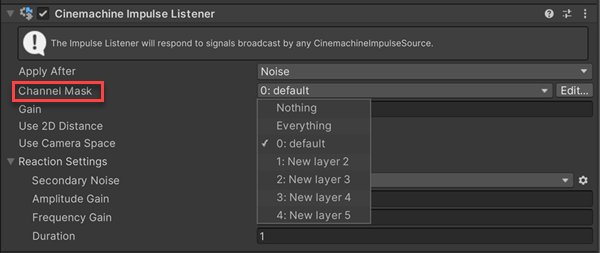

# Filtering impulses

Filtering lets you fine-tune how and when an Impulse Source generates impulses. Cinemachine Impulse allows two types of filtering:

- Use channel filtering to set things up so that an Impulse Listener reacts to certain Impulse Sources and ignores others. See [Filtering with channels](#ChannelFiltering) below for details.

- Use Trigger Object Filtering with Collision Impulse Sources to set things up so that only certain GameObjects trigger an impulse. See [Filtering with layers and tags](#TriggerObjectFiltering) for details.

## Filtering with channels

By default, every Impulse Listener reacts to every Impulse Source within range. Channels allow you to more precisely control which Impulse Sources an Impulse Listener reacts to. To set up channel filtering, you need to do three things:

- Set up your channels
- Set your Impulse Sources to broadcast on one or more channels
- Set your Impulse Listeners to listen to one or more channels

When an Impulse Listener is listening to specific channels, it only reacts to Impulse Sources that broadcast on those channels.

### Adding channels

The **CinemachineImpulseChannels** script creates channels in your Scene. It has one channel by default, and you can add as many new channels as you need, up to a maximum of 31.

To add new channels:

1. Inspect the **CinemachineImpulseChannels** (**Impulse Channel > Edit**) script by doing one of the following:

    - In the Cinemachine Impulse Listener inspector, navigate to the **Channel Mask** drop-down and click the **Edit** button next to it.

    - In the Cinemachine Impulse Source or Cinemachine Collision Impulse Source inspector, navigate to the **Impulse Channel** drop-down and click the **Edit** button next to it.

2. Expand the **Impulse Channels** property group and set the **Size** property to the number of channels you want. A new entry appears for each channel.

3. Rename your new channels.

    

    Channels are available from the channel drop-down in the Inspector as soon as you add them.

### Setting listen / broadcast channels

After setting up your channels, you need to define how your Impulse Listeners and Impulse Sources use them.

- Inspect each Impulse Listener, and choose the channels you want it to listen to from the **Channel Mask** drop-down.

    

- Inspect each Impulse Source or Collision Impulse Source, and choose the channels you want it to broadcast on from the **Impulse Channel** drop-down.

    

    You can select multiple filters from the drop down. You can also choose **Everything** to use all filters, or **Nothing** to use none of them.

## Filtering with layers and tags

You can use Unity’s [Layers](https://docs.unity3d.com/Manual/Layers.html) and [Tags](<https://docs.unity3d.com/Manual/Tags.html>) to specify which GameObjects trigger an impulse when they collide with a Collision Impulse Source, or enter a trigger zone. This is called **Trigger Object Filtering**.

The Cinemachine Collision Impulse Source component has two **Trigger Object Filter** properties:

- The **Layer Mask** drop-down lists all of the Scene’s layers. When you select one or more layers, GameObjects in those layers trigger impulses when they collide with the Impulse Source. The Impulse Source ignores collisions with GameObjects on other layers.

- The **Ignore Tag** drop-down lists all of the Scene’s tags. When you select a tag, GameObjects with that tag do not trigger impulses when they collide with the Impulse Source, even if they are in a layer specified in Layer Mask.

For example, in a Scene where a large animal is lumbering through a forest, you might want the camera to shake when it collides with large trees, but not small saplings.

One way to set that up would be to make the animal a Collision Impulse Source, put all of the large trees on their own layer, and select that as the Layer Mask.

If all of the trees, large ones and saplings alike, are already on the same layer, you could assign a special tag to the saplings, and use the **Ignore Tag** property to filter them out.