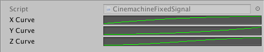
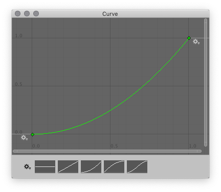

# Using Fixed Signals

The **CinemachineFixedSignal** Asset class is a simple 3D curve definition that lets you draw the curves yourself. Cinemachine Impulse either stretches or loops the curve to fit it in the attack-sustain-decay envelope, according to your specification in the Impulse Source.

## Connecting a fixed signal to an Impulse Source

To connect a fixed signal Asset to an Impulse Source, locate it in the Project view and drag it onto the **Raw Signal** field in the Impulse Source Inspector.

## Creating a new fixed signal

To create a new fixed signal Asset:

1. In the Impulse Source Inspector, click the gear icon next to the **Raw Signal** field and choose **New Fixed Signal**.

2. When prompted, give the new Asset a name and choose a location to save it to.

3. Locate the new Asset in the Project view and select it to open the Fixed Signal Inspector.

   

   The Inspector displays a preview of the curve for each axis. Click a preview pane to define your own curve for that axis. If you leave it blank, there is no movement along that axis.

4. Click a preview curve to open the Curve editor, where you can edit the curve for that axis.

   

5. Click one of the thumbnails at the bottom of the window to apply a curve preset. You can then edit the curve:

    - Drag the control points and Bezier handles to change the shape of the curve.
    - Click the gear icon next to the preset thumbnails to open the **Presets** window, where you can click **New** to add your current curve to the curve presets library.