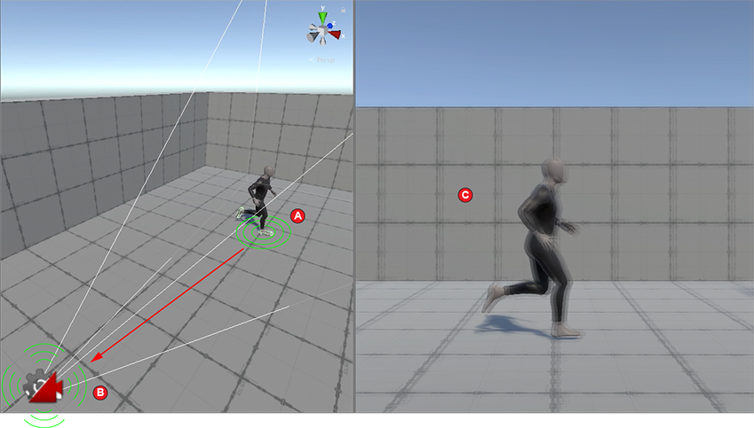

# Cinemachine Impulse Sources

An Impulse Source is a component that emits a vibration signal from a point in Scene space. Game events can cause an Impulse Source to emit a signal from the place where the event occurs. The event _triggers_ impulses, and the source _generates_ impulses. Virtual cameras with an Impulse Listener extension _react_ to impulses by shaking.

In the image below, the figure's feet are Impulse Sources. When they collide with the floor (A) they generate impulses. The camera is an Impulse Listener and reacts to the impulses by shaking (B), which shakes the resulting image in the game view (C). 

Cinemachine ships with two types of Impulse Source components.

- **[Cinemachine Collision Impulse Source](CinemachineCollisionImpulseSource.md)** generates impulses in reaction to collisions and trigger zones.

- **[Cinemachine Impulse Source](CinemachineImpulseSource.md)** generates impulses in reaction to events other than collisions.  

Your Scene can have as many Impulse Sources as you want. Here are a few examples of where you might use Impulse Source components in a Scene:

- On each of a giant’s feet, so that the ground shakes when the giant walks.

- On a projectile that explodes when it hits a target.

- On the surface of a gelatin planet that wobbles when something touches it.

By default, an Impulse Source affects every [Impulse Listener](CinemachineImpulseListener.md) in range, but you can apply [channel filtering](CinemachineImpulseFiltering.md#ChannelFiltering) to make Sources affect some Listeners and not others. 

## Key Impulse Source properties

While the vibration signal defines the basic “shape” of the camera shake, the Impulse Source controls several other important properties that define the impulses it generates.

For descriptions of all Impulse Source properties, as well as instructions for adding Impulse Sources to your scene, see documentation on the [Impulse Source](CinemachineImpulseSource.md) and [Collision Impulse Source](CinemachineCollisionImpulseSource.md) components.
