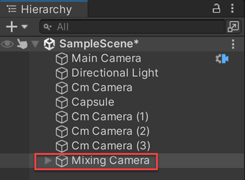
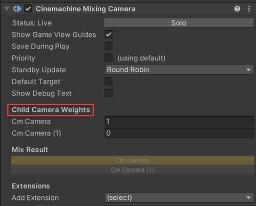

# Cinemachine Mixing Camera

The __Cinemachine Mixing Camera__ component uses the weighted average of its child CinemachineCameras to compute the position and other properties of the Unity camera.

Mixing Camera manages up to eight child CinemachineCameras. In the Mixing Camera component, these CinemachineCameras are fixed slots, not a dynamic array. Mixing Camera uses this implementation to support weight animation in Timeline. Timeline cannot animate array elements.

To create a Mixing Camera:

1. In the Unity menu, choose __GameObject > Cinemachine > Mixing Camera__.
A new Mixing Camera appears in the [Hierarchy](https://docs.unity3d.com/Manual/Hierarchy.html) window. By default, Unity also adds two CinemachineCameras as children of the Mixing Camera.
2. Adjust the children CinemachineCameras.
3. Add up to six more child cameras.
4. Select the Mixing Camera in the Hierarchy window then adjust the Child Camera Weights in the [Inspector](https://docs.unity3d.com/Manual/UsingTheInspector.html) window.

## Properties:

| **Property:** || **Function:** |
|:---|:---|:---|
| __Solo__ || Toggles whether or not the CinemachineCamera is temporarily live. Use this property to get immediate visual feedback in the [Game view](https://docs.unity3d.com/Manual/GameView.html) to adjust the CinemachineCamera. |
| __Game View Guides__ || Toggles the visibility of compositional guides in the Game view. These guides are available when Tracking Target specifies a GameObject and the CinemachineCamera has a screen-composition behaviour, such as Position Composer or Rotation Composer. This setting is shared by all CinemachineCameras. |
| __Save During Play__ || Check to [apply the changes while in Play mode](CinemachineSavingDuringPlay.md).  Use this feature to fine-tune a CinemachineCamera without having to remember which properties to copy and paste. This setting is shared by all CinemachineCameras. |
| __Custom Output__ || This setting controls how the output of this CinemachineCamera is used by the CinemachineBrain.  Enable this to use Priorities or custom CM output channels. |
|| _Channel_ | This controls which CinemachineBrain will be driven by this camera.  It is needed when there are multiple CinemachineBrains in the scene (for example, when implementing split-screen). |
|| _Priority_ | This is used to control which of several active CinemachineCameras should be live, when not controlled by Timeline. By default, priority is 0.  Use this to specify a custom priority value. A higher value indicates a higher priority. Negative values are also allowed. Cinemachine Brain chooses the next live CinemachineCamera from all CinemachineCameras that are activated and have the same or higher priority as the current live CinemachineCamera. This property has no effect when using a CinemachineCamera with Timeline. |
| __Standby Update__ || Controls how often the Cinemachine Camera is updated when the Cinemachine Camera is not Live. Use this property to tune for performance. |
|  | _Never_ | Only update if the Cinemachine Camera is Live. Don't set this value if you're using the Cinemachine Camera in shot evaluation context. |
|  | _Always_ | Update the Cinemachine Camera every frame, even when it is not Live. |
|  | _Round Robin_ | Update the Cinemachine Camera occasionally, at a frequency that depends on how many other Cinemachine Cameras are in Standby. |
| __Default Target__ || If enabled, this target will be used as fallback if child CinemachineCameras don't specify a Tracking Target of their own |
| __Show Debug Text__ || If enabled, current state information will be displayed in the Game View |
| __Child Camera Weights__ || The weight of the CinemachineCamera. Each child CinemachineCamera has a corresponding Weight property. Note that setting one camera's weight to 1 does not put the other weights to zero.  The contribution of any individual camera is its weight divided by the sum of all the child weights. |
| __Mix Result__ || A graphical representation of the weights of the child CinemachineCameras. The light part of the bar of each child camera represents the proportion of its contribution to the final position of the Mixing Camera. When the bar is completely dark, the camera makes no contribution to the position of the Mixing Camera. |

