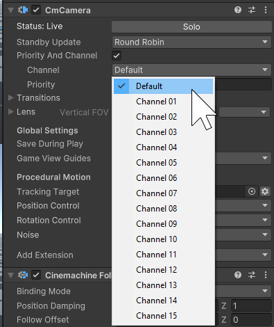
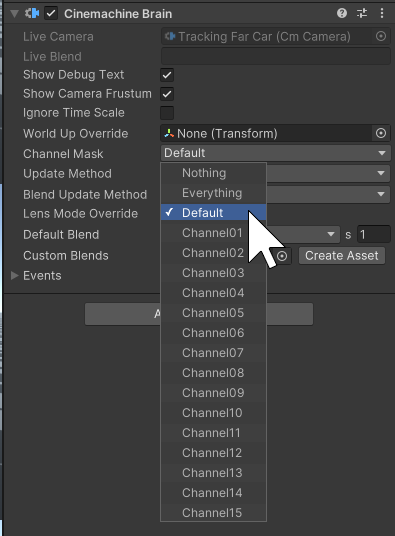

# Split screen and multiple Unity Cameras

By design, [CinemachineCameras](CinemachineCamera.md) are not directly linked to [CinemachineBrains](CinemachineBrain.md).  Instead, active CinemachineCameras in the scene are dynamically found by the Brain, allowing them to be brought into existence via prefab instantiation or scene loading.  By default, if multiple CinemachineBrains exist in the scene, they will all find the same CinemachineCameras and consequently display the same thing.  To assign a specific CinemachineCamera to a specific Brain, **Cinemachine Channels** are used.  This works the same way as Unity Layers.

First, set your CinemachineCamera to output to the desired channel:

Next, add that channel to the CinemachineBrain's Channel mask.  Multiple channels may be present simultaneously in the mask.  The CinemachineBrain will use only those CinemachineCameras that output to channels that are present in the mask.  All other CinemachineCameras will be ignored.

