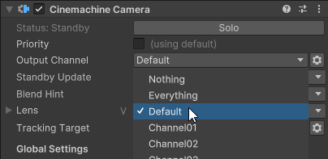

# Split-Screen and Multiple Unity Cameras

By design, CinemachineCameras are not directly linked to CinemachineBrains.  Instead, active CinemachineCameras in the scene are dynamically found by the Brain, allowing them to be brought into existence via prefab instantiation or scene loading.  By default, if multiple CinemachineBrains exist in the scene, they will all find the same CinemachineCameras and consequently display the same thing.  To assign a specific CinemachineCamera to a specific Brain, Cinemachine Channels are used.  This works the same way as Unity Layers.  

First, set your CinemachineCamera to output to the desired channel:



Next, add that channel to the CinemachineBrain's Channel mask.  Multiple channels may be present simultaneously in the mask.  The CinemachineBrain will use only those CinemachineCameras that output to channels that are present in the mask.  All other CinemachineCameras will be ignored.


## Assigning Cinemachine Channels at Runtime

If you need to assign channels and channel masks dynamically as new CinemachineBrains are added to the scene, you can do this based on the BrainCount.  When a new CinemachineBrain and CinemachineCamera combo is added to the scene, you can run this bit of code to choose a channel for the camera, and a channel mask for the brain:

```cs
using UnityEngine;
using Unity.Cinemachine;

public class ChannelChooser : MonoBehaviour
{
    [SerializeField] CinemachineBrain m_CinemachineBrain;
    [SerializeField] CinemachineCamera m_CinemachineCamera;

    void Start()
    {        
        // Choose a channel based on the current brain count
        var channel = 1 << CinemachineBrain.BrainCount;

        m_CinemachineBrain.ChannelMask = (OutputChannel.Channels) channel;
        m_CinemachineCamera.OutputChannel.Value = (OutputChannel.Channels) channel;
    }
}
```
