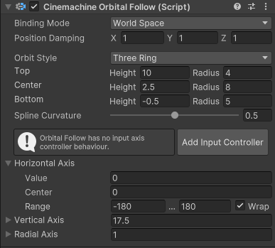

# Orbital Follow

This CinemachineCamera __Position Control__ behavior moves the Unity camera in a variable relationship to the CinemachineCamera’s __Tracking Target__. If you add a [Cinemachine Input Axis Controller](CinemachineInputAxisController.md) behavior, the camera position can be driven by [player input](https://docs.unity3d.com/Manual/ConventionalGameInput.html), which allows the player to dynamically control the position of the camera relative to the target.

__Orbital Follow__ operates in 2 modes:
- Sphere: In this mode, the camera is positioned at any point on a sphere surrounding the target.
- ThreeRig: In this mode, the camera is positioned anywhere on a surface created by extruding a spline - defined by 3 circular orbits - around the target.

The exact position of the camera on the surface is determined by 3 axis values in the __Orbital Follow__ component: horizontal, vertical, and radius. Radius controls the scale, allowing the camera to move towards or away from the target. You can control these values from a custom script, or with an Animator, or by other means that you may devise.

If you attach an input controller to the CinemachineCamera, then the player can control the position of the camera on the defined surface using Unity's input controls. This allows the player to move the camera to any spot on the orbit surface around the target. 

## Properties

| **Property** || **Function** |
|:---|:---|:---|
| __Target Offset__ || Offset from the target object's center in target-local space. Use this to fine-tune the orbit position when the desired focus of the orbit is not the tracked object's center. |
| __[Binding Mode](#binding-modes)__ || The coordinate space to use to interpret the offset from the target. |
| | _Lock To Target On Assign_ | Makes the orientation of the CinemachineCamera match the local frame of the Tracking target, at the moment when the CinemachineCamera is activated or when the target is assigned. This offset remains constant in world space. The camera doesn't rotate along with the target. |
| | _Lock To Target With World Up_ | Makes the CinemachineCamera use the local frame of the Tracking target with tilt and roll set to 0. This binding mode ignores all target rotations except yaw. |
| | _Lock To Target No Roll_ | Makes the CinemachineCamera use the local frame of the Tracking target, with roll set to 0. |
| | _Lock To Target_ | Makes the CinemachineCamera use the local frame of the Tracking target. When the target rotates, the camera moves with it to maintain the offset and to maintain the same view of the target. |
| | _World Space_ | The offset is interpreted in world space relative to the origin of the Tracking target. The camera will not change position when the target rotates. |
| | _Lazy Follow_ | Lazy Follow interprets the offset and damping values in camera-local space. This mode emulates the action a human camera operator would take when instructed to track a target. The camera attempts to move as little as possible to maintain the same distance from the target; the direction of the camera with respect to the target does not matter. Regardless of the orientation of the target, the camera tries to preserve the same distance and height from it. |
| __Position Damping__ || How responsively the camera tries to maintain the offset in the x, y, and z axes. Small numbers make the camera more responsive. Larger numbers make the camera respond more slowly.  |
| __Angular Damping Mode__ || Can be Euler or Quaternion.  In Euler mode, individual values can be set for Pitch, Roll, and Yaw damping, but gimbal lock may become an issue.  In Quaternion mode, only a single value is used, but it is impervious to gimbal lock.  |
| __Rotation Damping__ || How responsively the camera tracks the target's pitch, yaw, and roll, when in Euler angular damping mode. Small numbers make the camera more responsive. Larger numbers make the camera respond more slowly.|
| __Quaternion Damping__ || How responsively the camera tracks the target's rotation, when in Quaternion Angular Damping Mode.|
| __Orbit Style__ || Controls what kind of orbit surface is used |
|| _Sphere_| The camera is positioned at any point on a sphere surrounding the target |
|| _ThreeRing_| The camera is positioned anywhere on a surface created by extruding a spline - defined by 3 circular orbits - around the target |
| __Radius__ || In Sphere mode, this defines the radius of the surface sphere |
| __Top__, __Center__, __Bottom__ || In ThreeRing mode, these define the height and radius of the 3 orbit rings that are used to create the orbit surface. These values are relative to the target's origin. |
| __Spline Curvature__ || In ThreeRing mode, this defines the tautness of the line that connects the 3 orbits. This line determines the final shape of the surface. |
| __Recentering Target__ || Defines the reference frame for horizontal recentering.  The axis center will be dynamically updated to be behind the selected object. |
||_Axis Center_|Static reference frame.  Axis center value is not dynamically updated.|
||_Parent Object_|Axis center is dynamically adjusted to be behind the parent object's forward.|
||_Tracking Target_|Axis center is dynamically adjusted to be behind the Tracking Target's forward.|
||_LookAt Target_|Axis center is dynamically adjusted to be behind the LookAt Target's forward.|
| __Horizontal Axis__ || Horizontal positioning (rotation about the Y axis) of the camera on the surface. Value is in degrees, and Range defines the allowable value limits. If Wrap is checked, the value wraps around when it crosses the edge of its range. You can define a Center position here, which can be used if recentering logic is enabled in the axis driver. |
| __Vertical Axis__ || Vertical positioning (rotation about the X axis) of the camera on the surface.  Value is in degrees in Sphere mode, but is in arbitrary units in ThreeRing mode. Range defines the allowable value limits. If Wrap is checked, the value wraps around when it crosses the edge of its range. You can define a Center position here, which can be used if recentering logic is enabled in the axis driver. |
| __Radial Axis__ || Controls the camera distance from the target by scaling the orbits. Value is a scalar multiplier of the orbit heights and radii. Range defines the allowable value limits. If Wrap is checked, the value wraps around when it crosses the edge of its range. You can define a Center position here, which can be used if recentering logic is enabled in the axis driver. |
| __Recentering__ | | If enabled for an axis, Recentering will gradually return the axis value to its Center. |
|  | _Wait_ | If recentering is enabled for an axis, it will wait this many seconds after the last user input before beginning the recentering process. |
|  | _Time_ | The time it takes for the recentering to complete, once it has started. |

## Binding Modes

[!include]
