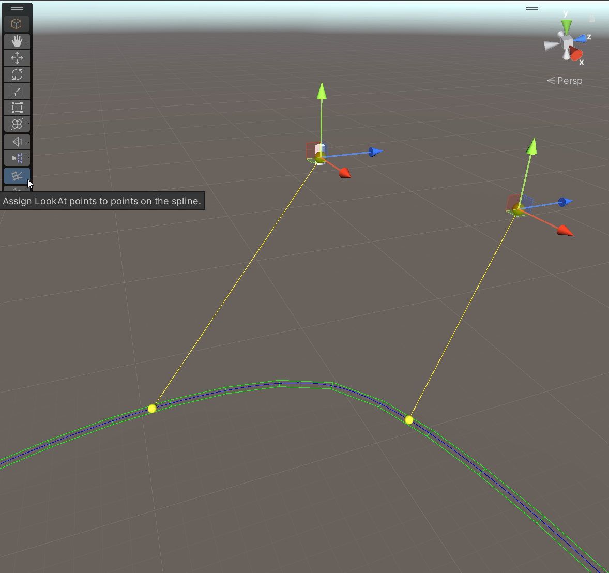

# Cinemachine Spline Dolly LookAt Targets

This CinemachineCamera __Rotation Control__ behaviour lets you assign LookAt targets to points on a spline, so that as the camera arrives at the position on the spline, it looks at the specified place.  

It's useful for creating curated dolly shots with specified aim targets along the way.  This behaviour eliminates the need to provide rotation animations for the camera that are synchronized with the spline position animation.  LookAt points are anchored to specific spline positions, and because they specify a LookAt target point, the appropriate rotation angles get computed dynamically.  As a result, the rotation animation is more robust and less likely to break if the spline is modified.

To use this behaviour, select it in the Rotation Control section of the CinemachineCamera inspector, or just add it manually to a CinemachineCamera.  Note that a CinemachineSplineDolly behaviour is required in the Position Control section of the CinemachineCamera.  Then, add Data Points to the array.

### Scene View Tool

When the LookAtDataOnSpline is selected in the inspector, a Scene View tool is provided to position the LookAt targets along the spline.  The tool lets you add, remove, and reposition LookAt targets.

### Properties

| Property | Field | Description |
| --- | --- | --- |
| __Index Unit__ |  | Defines how to interpret the _Index_ field for each data point.  _Knot_ is the recommended value because it remains robust if the spline points change. |
| __Data Points__ |  | The list of LookAt target on the spline.  As the camera approaches these positions on the spline, the camera will look at the corresponding targets. |
| | _Index_ | The position on the Spline where the camera should look at the supplied point.  The value is interpreted according to the _Index Unit_ setting. |
| | _Look At_ | The target object to look at.  It may be None, in which case the Offset will specify a point in world space. |
| | _Offset_ | The offset (in local coords) from the LookAt target's origin.  If LookAt target is None, this will specify a world-space point. |
| | _Easing_ | Controls how to ease in and out of this target.  A value of 0 will linearly interpolate between LookAt points, while a value of 1 will slow down and briefly pause the rotation to look at the target. |

