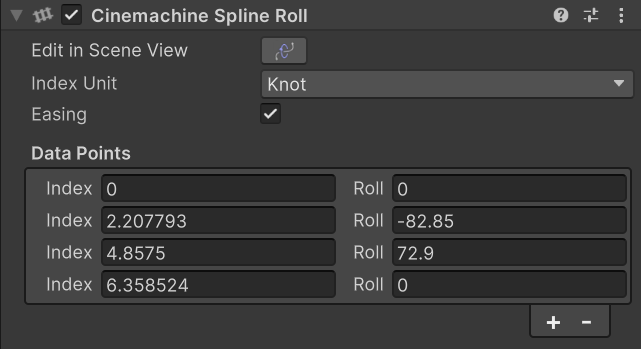

# Cinemachine Spline Roll

This behavior adds Roll to a Spline. Roll is the rotation about the spline's tangent. Add data points to set the roll at specific points along the spline. Roll will be interpolated between those points. This behavior will also draw a railroad-track Gizmo in the Scene view, to help visualize the roll.

If you add this behavior to the Spline itself, then any [Cinemachine Camera](CinemachineCamera.md) or [Cinemachine Spline Cart](CinemachineSplineCart.md) that follows the path will respect the roll. If instead you add this behavior to the CinemachineCamera itself, then the roll will be visible only to that CinemachineCamera.

### Properties

| Property | Field | Description |
| --- | --- | --- |
| __Index Unit__ |  | Defines how to interpret the _Index_ field for each data point.  _Knot_ is the recommended value because it remains robust if the spline points change. |
| __Easing__ |  | When enabled, roll value will ease in and out of the data point values.  Otherwise, interpolation is linear. |
| __Data Points__ |  | The list of Roll points on the spline.  At these postions on the spline, it will take on the specified roll value. |
| | _Index_ | The position on the Spline where it should assume the specified roll.  The value is interpreted according to the _Index Unit_ setting. |
| | _Roll_ | The roll value for the spline.  This is specified in degrees, and the axis of rotation is the spline tangent at that point. |
