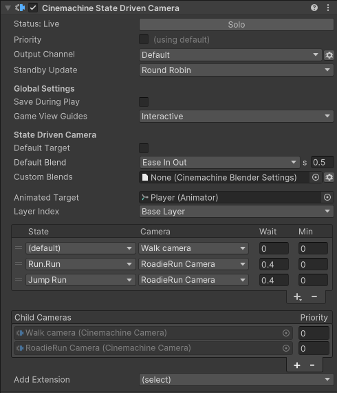

# Cinemachine State-Driven Camera

The __Cinemachine State-Driven Camera__ component activates a child CmCamera when an animation target changes states. For example, consider your avatar’s local-motion system and orbit camera. Your game feels more alive to the player when the camera shakes more as your avatar runs. When the avatar walks, blend for example to a CmCamera with more damping.

The animation target for a State-Driven Camera is a GameObject with an [Animator](https://docs.unity3d.com/Manual/class-Animator.html) component controlled by an [Animator Controller](https://docs.unity3d.com/Manual/class-AnimatorController.html).

Assign normal __Trcking Targets__ each child CmCamera. If a child CmCamera has no __Tracking Target__, State-Driven camera can provide its own as a fallback.

State-Driven Camera has a list that assigns child CmCameras to animation states. You can define default and custom blends between the State-Driven children.

In the Inspector, the State-Driven camera lists its CmCamera children. Use this list to add and delete child CmCameras, and assign priorities.

To create a State-Driven camera:

1. Set up the animation target GameObject to [control it with an Animator Controller](https://docs.unity3d.com/Manual/AnimatorControllers.html).

2. In the Unity menu, choose __GameObject > Cinemachine > State-Driven Camera__. A new State-Driven camera appears in the hierarchy with a new child CmCamera.

3. In the [Inspector](https://docs.unity3d.com/Manual/UsingTheInspector.html), assign the animation target you created in step 1 to the Animated Target property.

4. If needed, add more child CmCameras either by clicking + in CmCamera Children or dragging and dropping existing CmCameras in the [Hierarchy](https://docs.unity3d.com/Manual/Hierarchy.html) window.

5. Use the __State__ to assign child CmCameras to the animation states.

## Properties:

| **Property:** | **Function:** |
|:---|:---|
| __Solo__ | Toggles whether or not the CmCamera is temporarily live. Use this property to get immediate visual feedback in the [Game view](https://docs.unity3d.com/Manual/GameView.html) to adjust the CmCamera. |
| __Game View Guides__ | Toggles the visibility of compositional guides in the Game view. These guides are available when Tracking Target specifies a GameObject and the CmCamera has a screen-composition behaviour, such as Position Composer or Rotation Composer. This setting is shared by all CmCameras. |
| __Save During Play__ | Check to [apply the changes while in Play mode](CinemachineSavingDuringPlay.md).  Use this feature to fine-tune a CmCamera without having to remember which properties to copy and paste. This setting is shared by all CmCameras. |
| __Priority__ | This is used to control which of several active CmCameras should be live, when not controlled by Timeline.  By default, priority is 0.  Enable this to specify a custom priority value.  A higher value indicates a higher priority.  Negative values are also allowed. Cinemachine Brain chooses the next live CmCamera from all CmCameras that are activated and have the same or higher priority as the current live CmCamera. This property has no effect when using a CmCamera with Timeline. |
| __Standby Update__ | Controls how often the CmCamera is updated when the CmCamera is not live. |
| __Default Target__ | If enabled, this target will be used as fallback if child CmCameras don't specify a Tracking Target of their own |
| __Show Debug Text__ | If enabled, current state information will be displayed in the Game View |
| __Animated Target__ | The GameObject that contains the Animator Controller. The State-Drive camera reacts to the animation state changes from this GameObject. |
| __Layer__ | The animation layer to observe in the Animated Target. |
| __Default Blend__ | The blend which is used if you don’t explicitly define a blend between two CmCameras. |
| __Custom Blends__ | The asset which contains custom settings for specific child blends. |
| __State__ | The state to which the CmCamera will be mapped. |
| __Camera__ | The CmCamera to activate for this state. |
| __Wait__ | The delay to activate the CmCamera (in seconds) once this state is entered. For example, the animation target moves from an active Walk state, to a Jog state, to a Run state. If the Jog Wait time is set to four seconds, the Walk CmCamera remains active for those four seconds even though the Jog state is now active. If the Jog state duration is less than the Wait time before the animation target passes into another state, the Jog CmCamera will not activate and is bypassed. |
| __Min__ | The minimum length of time (in seconds) the CmCamera must remain active once it is activated. For example, the animation target enters the Run state from the Jog state. It has spent five seconds in the Jog state before moving to the Run state. The Jog Min is set to 12 seconds. This means that the Jog CmCamera remains the active camera for an additional seven seconds even though the animation target is in the Run state. |
| __CmCamera Children__ | The list of CmCameras that are children of the State-Driven camera. |

