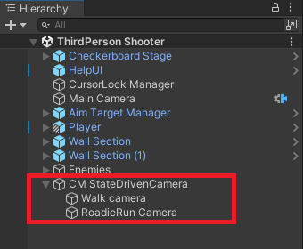

# Cinemachine State-Driven Camera

The __Cinemachine State-Driven Camera__ component allows you to associate CinemachineCameras with animation states.  When the state becomes active, the associated CinemachineCamera will also activate.  This allows you to define specific camera settings and behaviours for specific anmation states.  For example, you could have one camera for the Walk state, another for the Run state.  The state-Driven camera will blend between those cameras when the animation target changes states.

The animation target for a State-Driven Camera is a GameObject with an [Animator](https://docs.unity3d.com/Manual/class-Animator.html) component controlled by an [Animator Controller](https://docs.unity3d.com/Manual/class-AnimatorController.html).

Assign normal __Tracking Targets__ to each child CinemachineCamera. If a child CinemachineCamera has no __Tracking Target__, the State-Driven camera can provide its own as a fallback.

State-Driven Camera has a list that assigns child CinemachineCameras to animation states. You can define default and custom blends between the State-Driven children.  You don't need to define cameras for all the states.  If you define a camera for the default state, it will be used for any state that doesn't have a specific camera defined.

If multiple cameras are defined for any given state, the State-Driven camera will choose the one with the highest priority.  If multiple cameras for the same state have the same priority, the State-Driven camera will choose the one that appears earliest in the list.

In the Inspector, the State-Driven camera lists its CinemachineCamera children. Use this list to add and delete child CinemachineCameras, and assign priorities.

To create a State-Driven camera:

1. Set up the animation target GameObject to [control it with an Animator Controller](https://docs.unity3d.com/Manual/AnimatorControllers.html).

2. In the Unity menu, choose __GameObject > Cinemachine > State-Driven Camera__. A new State-Driven camera appears in the hierarchy with a new child CinemachineCamera.

3. In the [Inspector](https://docs.unity3d.com/Manual/UsingTheInspector.html), assign the animation target you created in step 1 to the Animated Target property.

4. If needed, add more child CinemachineCameras either by clicking + in CinemachineCamera Children or dragging and dropping existing CinemachineCameras in the [Hierarchy](https://docs.unity3d.com/Manual/Hierarchy.html) window.

5. Use the __State__ to assign child CinemachineCameras to the animation states.

## Properties:

| **Property:** || **Function:** |
|:---|:---|:---|
| __Solo__ || Toggles whether or not the CinemachineCamera is temporarily live. Use this property to get immediate visual feedback in the [Game view](https://docs.unity3d.com/Manual/GameView.html) to adjust the CinemachineCamera. |
| __Game View Guides__ || Toggles the visibility of compositional guides in the Game view. These guides are available when Tracking Target specifies a GameObject and the CinemachineCamera has a screen-composition behavior, such as Position Composer or Rotation Composer. This setting is shared by all CinemachineCameras. |
| __Save During Play__ || Check to [apply the changes while in Play mode](CinemachineSavingDuringPlay.md).  Use this feature to fine-tune a CinemachineCamera without having to remember which properties to copy and paste. This setting is shared by all CinemachineCameras. |
| __Custom Output__ || This setting controls how the output of this CinemachineCamera is used by the CinemachineBrain.  Enable this to use Priorities or custom CM output channels. |
|| _Channel_ | This controls which CinemachineBrain will be driven by this camera.  It is needed when there are multiple CinemachineBrains in the scene (for example, when implementing split-screen). |
|| _Priority_ | This is used to control which of several active CinemachineCameras should be live, when not controlled by Timeline. By default, priority is 0.  Use this to specify a custom priority value. A higher value indicates a higher priority. Negative values are also allowed. Cinemachine Brain chooses the next live CinemachineCamera from all CinemachineCameras that are activated and have the same or higher priority as the current live CinemachineCamera. This property has no effect when using a CinemachineCamera with Timeline. |
| __Standby Update__ || Controls how often the Cinemachine Camera is updated when the Cinemachine Camera is not Live. Use this property to tune for performance. |
|  | _Never_ | Only update if the Cinemachine Camera is Live. Don't set this value if you're using the Cinemachine Camera in shot evaluation context. |
|  | _Always_ | Update the Cinemachine Camera every frame, even when it is not Live. |
|  | _Round Robin_ | Update the Cinemachine Camera occasionally, at a frequency that depends on how many other Cinemachine Cameras are in Standby. |
| __Default Target__ || If enabled, this target will be used as fallback if child CinemachineCameras don't specify a Tracking Target of their own |
| __Show Debug Text__ || If enabled, the current state information will be displayed in the Game View. |
| __Animated Target__ || The GameObject that contains the Animator Controller. The State-Drive camera reacts to the animation state changes from this GameObject. |
| __Layer__ || The animation layer to observe in the Animated Target. |
| __Default Blend__ || The blend which is used if you don’t explicitly define a blend between two CinemachineCameras. |
| __Custom Blends__ || The asset which contains custom settings for specific child blends. |
| __State__ || The state to which the CinemachineCamera will be mapped. |
| __Camera__ || The CinemachineCamera to activate for this state. |
| __Wait__ || The delay to activate the CinemachineCamera (in seconds) once this state is entered. For example, the animation target moves from an active Walk state, to a Jog state, to a Run state. If the Jog Wait time is set to four seconds, the Walk CinemachineCamera remains active for those four seconds even though the Jog state is now active. If the Jog state duration is less than the Wait time before the animation target passes into another state, the Jog CinemachineCamera will not activate and is bypassed. |
| __Min__ || The minimum length of time (in seconds) the CinemachineCamera must remain active once it is activated. For example, the animation target enters the Run state from the Jog state. It has spent five seconds in the Jog state before moving to the Run state. The Jog Min is set to 12 seconds. This means that the Jog CinemachineCamera remains the active camera for an additional seven seconds even though the animation target is in the Run state. |
| __CinemachineCamera Children__ || The list of CinemachineCameras that are children of the State-Driven camera. |
