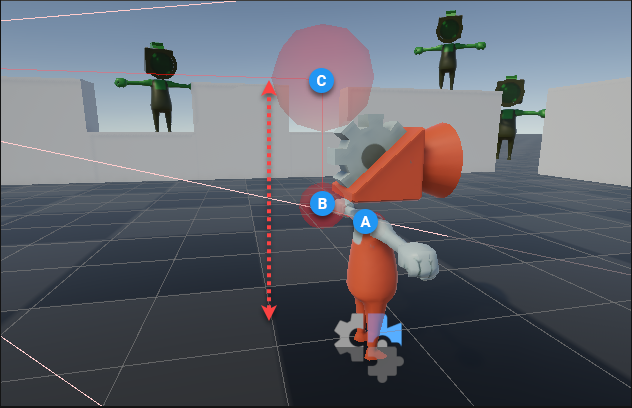

# Third Person Follow

Use Cinemachine CinemachineCamera’s **Third Person Follow** to keep the camera at a constant position and distance relative to a Tracking Target (subject to damping controls), tracking the target’s movement and rotation.

The Third Person Follow’s mini-rig setup defines the camera position and distance relative to the target. With a suitable shoulder offset, this mini-rig can produce a third-person camera, where the character is offset in the frame and the camera looks over the character’s shoulder. With different settings, it can produce a first-person camera.

For example, a rig set up with these values:

| **Property:**           | **Value:**                    |
| :---------------------- | :---------------------------- |
| Shoulder Offset         | X = 0.7 ; Y = 0.3 ; Z = -0.5  |
| Vertical Arm Length     | 0.5                           |
| Camera Side             | 1                             |
| Camera Distance         | 2                             |

Produces this virtual rig in the Scene view:

Which results in this Game view:

The rig and the camera position are defined by three pivot points (the origin, the shoulder, and the hand) as well as by a camera that is positioned behind the hand.

- The **origin (A)**: The origin is the tracking target's position. When the target pivots horizontally, the rig rotates with it around this point.
- The **shoulder (B)**: By default, it is offset to one side, to create an over-the-shoulder follow position. Vertical rotations of the tracking target are transferred here, so the rig rotates horizontally about the origin, and vertically about the shoulder.
- The **hand (C)**: Vertically offset in relation to the shoulder. The arm length affects the tracking target's screen position when the camera rotates vertically. By default, it is offset from the shoulder, so that vertical rotations will keep the character nicely positioned on the screen. For 1st-person cameras, this can be set to 0.
- The **camera (D)**: The camera's rotation will always be parallel to the tracking target's rotation, but positioned at Camera Distance behind the hand. The camera always looks directly at the hand.

Note the rotations on the rig; 

- **B rotates horizontally around A**. Using A as the origin, B's position is calculated from the Shoulder Offset's X, Y, and Z values. 
   

- **C rotates vertically around B**. C's position is calculated from the Vertical Arm Length from B. Positive values result with C above B, and negative values result with C below B. 
   

## Controlling the Camera

There is no direct input control for the camera. You must have a controller script that moves and rotates the tracking target; the camera will position and orient itself relative to that. When the tracking target is the character itself, the camera’s rotation always matches the character’s rotation. When the tracking target is an invisible GameObject that can rotate independently of the character, the camera will then be able to rotate around the character.

## Built-in Collision Resolution

The Third-person Follow component has a built-in collision resolution system, so when the target moves close to an obstacle, the camera position is adjusted so that it will never be inside an obstacle; the built-in collision resolution means the camera always keeps the target in sight, despite intervening obstacles. When the target moves too close to an obstacle, the rig bends and stretches to keep the camera outside the obstacle but always with the target in view.

## Shaky Movement, Steady Aim

When combined with the [CinemachineThirdPersonAim](CinemachineThirdPersonAim.md) extension, the result is a powerful rig that can maintain steady aim for a shooter-type game, even when the camera movement is shaky or noisy. CinemachineThirdPersonAim re-adjusts the camera orientation to maintain a fixed point at the center of the screen, correcting for variations due to camera noise.

## Sample Scene

To experiment with a Third Person Follow set up that includes camera control, shaky movement, and aim mode, open and run the `ThirdPersonWithAimMode` sample Scene from the [3D samples available with the Cinemachine package](samples-tutorials.md).

## Properties:

|**Property:**|**Function:**|
|:---|:---|
| Damping                 | The responsiveness of the camera in tracking the target. Each axis can have its own setting. The value is the approximate time it takes the camera to catch up to the target's new position. Small numbers make the camera more responsive. Larger numbers make the camera respond more slowly. |
| Shoulder Offset         | Position of the shoulder pivot relative to the tracking target origin. This offset is in target-local space. |
| Vertical Arm Length     | Vertical offset of the hand in relation to the shoulder. Arm length affects the tracking target's screen position when the camera rotates vertically. |
| Camera Side             | Specifies which shoulder the camera is on (left, right, or somewhere in-between). |
| Camera Distance         | Specifies the distance from the hand to the camera.                |
| Camera Collision Filter | Specifies which layers will be included or excluded from collision resolution. |
| Ignore Tag              | Obstacles with this tag will be ignored by collision resolution. It is recommended to set this field to the target's tag. |
| Camera Radius           | Specifies how close the camera can get to collidable obstacles without adjusting its position. |
| Damping Into Collision  | Specifies how gradually the camera moves to correct for an occlusion. Higher numbers move the camera more gradually.|
| Damping From Collision  | Specifies how gradually the camera returns to its normal position after having been corrected by the built-in collision resolution system. Higher numbers move the camera more gradually back to normal.|
