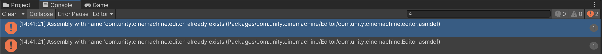
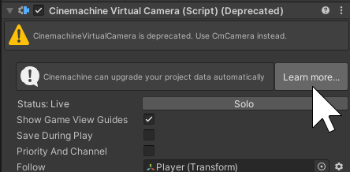
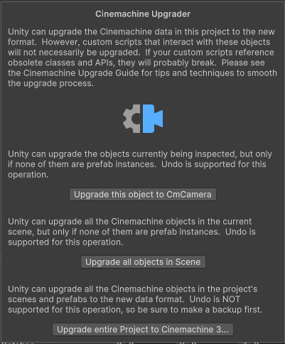

# Upgrade a Project from Cinemachine 2.x

Follow these instructions if your project currently uses Cinemachine 2.x and you need to upgrade it to Cinemachine 3.x.

> [!CAUTION]
> Cinemachine 3.x is a major version change from Cinemachine 2.x, and the [API and data format have changed significantly](whats-new.md#major-api-changes). Scripts written for the Cinemachine 2.x API are unlikely to run with Cinemachine 3.x without manual intervention. Also, the Virtual Camera instances in your project will themselves need upgrading.
>
> In many cases, especially if your project includes custom Cinemachine scripts, **it might be better to stick with Cinemachine 2.x**, which will continue to be supported for a while in parallel with Cinemachine 3.x. If you do choose to consider upgrading your project, this guide will give you some pointers to make the process smoother.

## Pre-requisite

> [!IMPORTANT]
> Back up your project. Don't skip this step.

## Upgrade the package and fix the errors

Once you backed up your project, you can upgrade the Cinemachine package to version 3.x. You should expect to see a number of errors in the console depending on the complexity and customization level of your project.

1. Use the Package Manager to upgrade your project to Cinemachine 3.x.  
   If you have custom scripts that use the Cinemachine API, they will likely break. You have to get them compiling again.

1. Update the `using Cinemachine` declarations.  
   The [namespaces have been changed](whats-new.md#new-namespaces) to `Unity.Cinemachine`.

1. Update any references to the [renamed components](whats-new.md#renamed-components).

1. Update the broken [Cinemachine field names](whats-new.md#renamed-fields).  
   For the most part, this just means removing the `m_` prefix. In other cases, there might be a bit more to do, but the appropriate action to take should be clear by looking at the code in each case.

At this point your project should more or less run as before, using the obsolete classes. Do not leave it this way! Continue on to the next steps.

> [!NOTE]
> The Cinemachine 3.x upgrade unhides "cm" GameObjects in your project's Hierarchy. This is not a license to mess with these objects, they were hidden for a reason. We recommend that you get rid of them by upgrading the parent objects to their Cinemachine 3.x equivalents. If any of them are still there after the components have been upgraded, it is safe to simply delete them.

## Upgrade the project data and fix the warnings

Once the scripts use the new API, you can upgrade the project data to convert legacy Cinemachine 2.x objects to their Cinemachine 3.x counterparts. At this point, you should still see a number of warnings in the console about these legacy objects.

> [!NOTE]
> Cinemachine 3.x maintains support – in deprecated form – of obsolete Cinemachine 2.x classes that have been superceded by newer ones. This is to help ease the transition to the new API.
>
> However, it is strongly recommended that you upgrade your project to use the new API as soon as possible. The deprecated classes might be removed in a future release. To reduce code bloat in your deliverables, you can remove the deprecated class support immediately by defining `CINEMACHINE_NO_CM2_SUPPORT` in your project's Scripting Define Symbols.

Cinemachine comes with a data upgrade tool to facilitate the conversion of legacy objects. It's not a trivial operation, because in addition to the Virtual Camera objects in your scene, it's also necessary to upgrade prefabs and animation assets that might be referencing them.

1. Where possible, replace your `CinemachineVirtualCamera` and `CinemachineFreeLook` references by the `CinemachineVirtualCameraBase` class rather than the derived `CinemachineCamera` type.  
   If you do this, the Cinemachine upgrader tool will be able to preserve existing object references, since the old and new classes all inherit from this same base class.

1. To upgrade the project data, run the [Cinemachine Upgrader](#how-to-use-the-cinemachine-upgrader).  
   Follow the instructions according your data upgrade needs: upgrade of a single object, a single scene, or the whole project.

1. Because Cinemachine component types have changed, you have to manually go through your scripts and update any specific references to be to [the new types](whats-new.md#new-components-with-clearer-names).  
   The console log is your friend: "obsolete" warnings point you to the places that need attention.

1. After the data upgrade, object references might be broken.  
   You need to check and repair them if necessary.

1. If you are using layers to filter cameras into separate split-screen brains, that filtering doesn't work any more.  
   To fix this, make sure to upgrade to Cinemachine Cameras and switch the filtering over to Channels.

> [!NOTE]
> if at any stage you get errors of the following nature, just restart the Unity Editor.
> 

### How to use the Cinemachine Upgrader

You can launch the Cinemachine Upgrader from any Cinemachine Virtual Camera or FreeLook inspector.

> [!NOTE]
> If all the relevant inspectors are inside prefabs, then you can make a temporary Cinemachine Virtual Camera object and upgrade from its inspector.

#### Upgrade a single object

If you want to upgrade only the Cinemachine object currently being inspected, you can do this provided that it's not a prefab instance. In this case, it will upgrade only the inspected objects, replacing them with Cinemachine 3.x equivalents.

> [!WARNING]
> Any script references to this object will be lost (because the class will change), as will any animation tracks that are writing to fields inside this camera (because classes and field names have changed). Timelines referencing this object will lose their bindings.

> [!NOTE]
> Undo is supported, so you can try it out and then change your mind if you want.  

If you have script references or animation tracks or if this camera is part of a prefab or prefab instance, then you need to use the [**Upgrade Entire Project** option](#upgrade-the-whole-project), which will scan the project for references and make the appropriate updates.

#### Upgrade a single scene

You can also choose to update all the Cinemachine objects in the current scene. Again, this will not update any assets outside of the scene, so it is not appropriate for any but the simplest of scenes.

> [!NOTE]
> Undo is also supported for this operation.

#### Upgrade the whole project

The **Upgrade Entire Project** option will upgrade all the objects in all the scenes and all the prefabs. There is logic to handle animation tracks, script references, and prefab instances. It's a major operation and every scene and prefab in the project will be opened and saved multiple times.

> [!WARNING]
> Undo is not supported for this action, be sure to make a complete backup first.

Select this option if you have prefabs to upgrade, or in any case other than the simplest of scenes.

