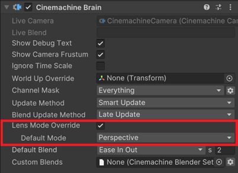

# Upgrading a Project from Cinemachine 2.X

Cinemachine 3.0 is a major version change from CM 2.X, and the API and components have changed significantly. Scripts written for the CM 2.X API are unlikely to run with 3.X without manual intervention. Also, the CM components in your scenes and prefabs will themselves need upgrading.

While it is possible to upgrade an existing project from CM 2.X, you should think carefully about whether you are willing to put in the work. __It might be better in many cases just to stick with CM 2.X__, which will continue to be supported for a while in parallel with CM 3.X.  If you do choose to consider upgrading your project, this guide will give you some pointers to make the process smoother.

## Upgrading your Project Step by Step
Here are the steps to take when upgrading an existing project from CM 2.X:
1. Back up your project. Don't skip this step.
1. Use the Package Manager to upgrade your project to CM3.  If you have custom scripts that use the Cinemachine API, they will likely break.  Get them compiling again by doing the following:
   1. Update the `using Cinemachine` declarations.  The namespaces have been changed to `Unity.Cinemachine`.
   1. Update any references to the renamed components.
   1. Update the broken CM field names. For the most part, this just means removing the m_ prefix. In other cases, there might be a bit more to do, but the appropriate action to take should be clear by looking at the code in each case.
   1. At this point your project should more-or-less run as before, using the deprecated components.  Do not leave it this way!  You need to convert the deprecated components to their CM3 equivalents.  Continue on to the next steps.
1. The new `CinemachineCamera` class that replaces `CinemachineVirtualCamera` and `CinemachineFreeLook` inherits from `CinemachineVirtualCameraBase`.  Where possible, replace your script references to use this base class rather than the derived type. If you do this, the CM upgrader tool will be able to preserve existing component references, since the old and new classes inherit from this same base class.
1. Convert the deprecated components in the project by running the Cinemachine Upgrader. You can launch the Cinemachine Upgrader tool from any CM VirtualCamera or FreeLook inspector, provided they are not inside a prefab.  If all the relevant inspectors are inside prefabs, then you can make a temporary CinemachineVirtualCamera object and upgrade from its inspector.
1. Because many CM component types have changed, you will have to manually go through your scripts and update any specific references to be to the new type. The console log is your friend: "obsolete" warnings will point you to the places that need attention.
1. After the component upgrade, object references might be broken. You will need to check and repair them if necessary.
1. If you are using layers to filter cameras into separate split-screen brains, that filtering will stop working until after you have converted to CinemachineCameras and switched the filtering over to Channels.

Note: if at any stage you get errors of this nature, just restart Unity:

## What has Changed in the API

Some components were replaced by new components, others were renamed. Field names have changed. Namespaces have changed.  For most of these issues, you will see errors or deprecation warnings in the console, which will point you to the areas in your code that need attention. 

One thing to note: the new `CinemachineCamera` class that replaces `CinemachineVirtualCamera` and `CinemachineFreeLook` inherits from `CinemachineVirtualCameraBase`.  If you can replace your script references to use this base class wherever possible, then the upgrader will be able to preserve existing component references across the conversion, since the old and new classes inherit from this same base class.

### New Namespaces
Namespaces have changed to be more consistent with Unity standards.
- `Cinemachine` is now `Unity.Cinemachine`
- `Cinemachine.Editor` is now `Unity.Cinemachine.Editor`
- `Cinemachine.Utility` has been folded into `Unity.Cinemachine`.

### New Components with Clearer Names

Old components have been replaced by new components. These are not renames, they are new component types. The old components still exist but are deprecated. If your scripts refer to any of them, they will need to be updated once the project's components have been converted.
- CinemachineVirtualCamera is replaced by [CinemachineCamera](CinemachineCamera.md).
- CinemachineFreeLook is replaced by [CinemachineCamera](CinemachineCamera.md).
- CinemachinePath and CinemachineSmoothPath are replaced by Spline Container, provided by Unity's native spline implementation.
- CinemachineDollyCart is replaced by [CinemachineSplineCart](CinemachineSplineCart.md).
- CinemachineTransposer is replaced by [CinemachineFollow](CinemachineFollow.md).
- CinemachineOrbitalTransposer is replaced by [CinemachineOrbitalFollow](CinemachineOrbitalFollow.md)
- CinemachineFramingTransposer is replaced by [CinemachinePositionComposer](CinemachinePositionComposer.md).
- CinemachineComposer is replaced by [CinemachineRotationComposer](CinemachineRotationComposer.md).
- CinemachinePOV is replaced by [CinemachinePanTilt](CinemachinePanTilt.md).
- CinemachineTrackedDolly is replaced by [CinemachineSplineDolly](CinemachineSplineDolly.md).
- CinemachineGroupComposer is replaced by the [CinemachineGroupFraming](CinemachineGroupFraming.md) extension used in conjunction with [CinemachineRotationComposer](CinemachineRotationComposer.md).
- CinemachineCollider is replaced by [CinemachineDeoccluder](CinemachineDeoccluder.md)
- CinemachineConfiner is replaced by [CinemachineConfiner2D](CinemachineConfiner2D.md) and [CinemachineConfiner3D](CinemachineConfiner3D.md)
- Cinemachine3rdPersonFollow is replaced by [CinemachineThirdPersonFollow](CinemachineThirdPersonFollow.md).
- CinemachineSameAsFollowTarget is replaced by [CinemachineRotateWithFollowTarget](CinemachineRotateWithFollowTarget.md).

### Renamed Components

- Cinemachine3rdPersonAim has been renamed to [CinemachineThirdPersonAim](CinemachineThirdPersonAim.md).
- CinemachineBlendListCamera has been renamed to [CinemachineSequencerCamera](CinemachineSequencerCamera.md).

### Renamed Fields 

The old convention of using "m_FieldName" has been changed to follow Unity's latest naming conventions. Consequently, all of the "m_" prefixes have been removed from field names, everywhere. If your scripts don't compile because of this, the first remedy is to remove the "m_" from the field name that your script is referencing. Most of the time, that will be enough. Occasionally, some field names were changed more significantly. It should be fairly easy to find the appropriate replacements.

The _SimpleFollowWithWorldUp_ binding mode has been renamed to _LazyFollow_.

### CinemachineCore.Instance is removed

Most methods and properties that used to be accessed via the `CinemachineCore.Instance` singleton are now direct static methods and properties on `CinemachineCore`.
There are some exceptions, notably `ActiveBrainCount` and `GetActiveBrain()` which are now static methods in `CinemachineBrain`.

### Cleaner Object Structure, No Hidden GameObjects

Cinemachine 2.x implemented the CM pipeline on a hidden GameObject child of the vcam, named "cm". This has been removed in CM 3.0, and CM pipeline components (such as OrbitalFollow or RotationComposer) are now implemented directly as components on the CinemachineCamera GameObject. You can access them as you would any other components: `GetCinemcachineComponent()` is no longer necessary, just use `GetComponent()`.

You will now see the `cm` child objects of your legacy CM vcams in the hierarchy, because CM3 unhides them. This is not a license to mess with these objects - they were hidden for a reason. We recommend that you get rid of them by converting their parent objects to their CM3 equivalents, using the Cinemachine Upgrader.  If any of them are still there after the components have been converted, it is safe to simply delete them.

### New Input Handling
User input has been decoupled from the Cinemachine Components: they no longer directly read user input, but expect to be driven by an external component.  [CinemachineInputAxisController](CinemachineInputAxisController.md) is provided to do this job, but you could also choose to implement your own input controller by inheriting InputAxisControllerBase.

### New Events Architecture
While CM2.X has events in CinemachineVirtualCamera and CinemachineBrain, CM3 only fires global events via CinemachineCore.  Scripts can add listeners to those events and take action based on them. Listeners will receive events for all cameras and all Brains.  

Camera-specific and Brain-specific events are now supported via two new behaviours: [Cinemachine Brain Events](CinemachineBrainEvents.md) and [Cinemachine Camera Events](CinemachineCameraEvents.md).  These monitor the global events and fire more specialized ones relating to the objects to which they are attached.

### New Spline Implementation
Cinemachine's paths are now implemented using Unity's native Splines, which provide equivalent functionality. The Cinemachine Upgrader will automatically convert your CM paths to Splines. The CM path implementations still exist, but are now deprecated.

### Decoupled from Unity Layers
In CM2, CinemachineBrain would only process CinemachineCameras that were assigned to layers included in the associated Camera's culling mask.  This mechanism was useful in situations such as split-screen, to cause specific CinemachineCameras to be assigned to specific Brains.  In CM3, this has been replaced by **Cinemachine Channels**.  These are dedicated layers that only Cinemachine uses, so that Unity layers don't get needlessly squandered.  CinemachineCameras are assigned to a Cinemachine Channel, and the CinemachineBrain has a channel mask.  Normally, the "Default" channel is used, and only needs to be changed in specific situations where channel separation is a requirement.

### Lens Mode Override

If your project is using virtual cameras with a Lens Mode Override (e.g. changing between physical and perspective and ortho cameras), then this will stop working until you enable mode override and assign a default lens mode in the CinemachineBrain.

## Converting the Project's Deprecated Components

Once the scripts are using the new API, you can upgrade the project's scenes and prefabs to convert deprecated CM components to their CM3 equivalents. Cinemachine comes with a project upgrade tool to facilitate this. It's not a trivial operation, because in addition to the vcam objects in your scene, it's also necessary to upgrade prefabs and animation assets that might be referencing them.

You can launch the Cinemachine Upgrader tool from any CM VirtualCamera or FreeLook inspector:

### Option 1: Converting a Single Object
If you want to upgrade only the Cinemachine object currently being inspected, you can do this provided that it isn't a prefab instance. In this case, only the inspected objects will be converted to CM3 equivalents. Undo is supported, so you can try it out and then change your mind if you want.  

Note that any script references to this object will be lost (because the class will change), as will any animation tracks that are writing to fields inside this camera (because classes and field names have changed).  Timelines referencing this object will lose their bindings.  If you have script references or animation tracks or if this camera is part of a prefab or prefab instance, then you need to use the "Upgrade Entire Project" option, which will scan the project for references and make the appropriate updates.

### Option 2: Converting a Single Scene
You can also choose to convert all the CM objects in the current scene. Again, this will not update any assets outside of the scene, so it is not appropriate for any but the simplest of scenes. Undo is also supported for this operation.

### Option 3: Converting the Whole Project
This option will upgrade all the objects in all the scenes and all the prefabs. There is logic to handle animation tracks, script references, and prefab instances. It's a major operation and every scene and prefab in the project will be opened and saved multiple times. Undo is not supported, so be sure to make a complete backup first.

Select this option if you have prefabs to upgrade, or animation tracks that reference Cinemachine cameras or paths or dolly carts, or in any case other than the simplest of scenes.

