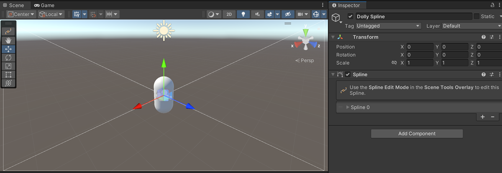

# Constrain a camera to a path

Use a [Spline](https://docs.unity3d.com/Packages/com.unity.splines@latest) to constrain the movement of a camera along a predefined and customizable path.

A Spline path is a path formed by a Spline in a scene. Use a Spline to specify a fixed course to position or animate a CinemachineCamera. Use the [Spline Dolly](CinemachineSplineDolly.md) behaviour to make your CinemachineCamera follow a Spline path.

To create a Cinemachine Camera with a dolly path:

1. In the Unity menu, choose __GameObject > Cinemachine > Dolly Camera with Spline__.
A new Cinemachine Camera and spline appear in the [Hierarchy]([https://docs.unity3d.com/Manual/Hierarchy.html](https://docs.unity3d.com/Manual/Hierarchy.html)).

2. In the [Hierarchy]([https://docs.unity3d.com/Manual/Hierarchy.html](https://docs.unity3d.com/Manual/Hierarchy.html)) window, select the new dolly spline GameObject.

3. In the [Inspector]([https://docs.unity3d.com/Manual/UsingTheInspector.html](https://docs.unity3d.com/Manual/UsingTheInspector.html)) or in the Scene View, add and adjust waypoints.

Any Unity spline can be used as a path in Cinemachine.  Just drag it into the [Spline Dolly](CinemachineSplineDolly.md) Spline property field, and immediately the CinemachineCamera will be confined to the spline. 

By default, Unity Splines contain no rotation data. Camera rotation will be inferred from the spline tangent at any point, combined with the world Up vector. To add rotation about the tangent, you can use the [Cinemachine Spline Roll](CinemachineSplineRoll.md) behaviour. This allows you to specify Roll values for any point along the spline. Roll values are used to rotate the camera about the spline tangent at that point, giving you more control over the camera's final rotation.

If a Cinemachine Spline Roll behaviour is added to the spline, all cameras and dolly carts that use the spline will see it. Alternatively, you can add the Cinemachine Spline Roll behaviour to the Cinemachine Camera itself, in which case the roll will only apply to it.
