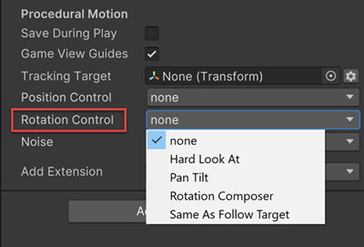

# Rotation Control

Use the Rotation Control behaviors to specify how to rotate the CinemachineCamera. To change the camera’s position, use a [Position Control](CinemachineVirtualCameraBody.md) behaviour.

Cinemachine includes these behaviors for rotating a CinemachineCamera:

- [__None__](CinemachineAimDoNothing.md): Do not procedurally rotate the CinemachineCamera. The rotation can be controlled by object parenting, a custom script, or by animation.
- [__Rotation Composer__](CinemachineRotationComposer.md): Keep the __Look At__ target in the camera frame, with composition controls and damping.
- [__Hard Look At__](CinemachineHardLookAt.md): Keep the __Look At__ target in the center of the camera frame.
- [__Pan Tilt__](CinemachinePanTilt.md): Rotate the CinemachineCamera, optionally based on the user’s input.
- [__Rotate With Follow Target__](CinemachineRotateWithFollowTarget.md): Set the camera’s rotation to match the rotation of the __Tracking Target__.