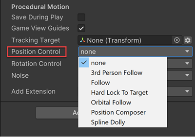

# Body properties

Use the Body properties to specify the algorithm that moves the Virtual Camera in the Scene. To rotate the camera, set the [Aim properties](CinemachineVirtualCameraAim.md).

Cinemachine includes these algorithms for moving a Virtual Camera:

- [__Do Nothing__](CinemachineBodyDoNothing.md): does not move the Virtual Camera.
- [__3rd Person follow__](Cinemachine3rdPersonFollow.md): Pivots the camera horizontally and vertically around the player, to the __Follow__ target.
- [__Framing Transposer__](CinemachineBodyFramingTransposer.md): moves in a fixed screen-space relationship to the __Follow__ target.
- [__Hard Lock to Target__](CinemachineBodyHardLockTarget.md): uses the same position at the __Follow__ target.
- [__Orbital Transposer__](CinemachineBodyOrbitalTransposer.md): moves in a variable relationship to the __Follow__ target, optionally accepting player input.
- [__Tracked Dolly__](CinemachineBodyTrackedDolly.md): moves along a predefined path.
- [__Transposer__](CinemachineBodyTransposer.md): moves in a fixed relationship to the __Follow__ target.

