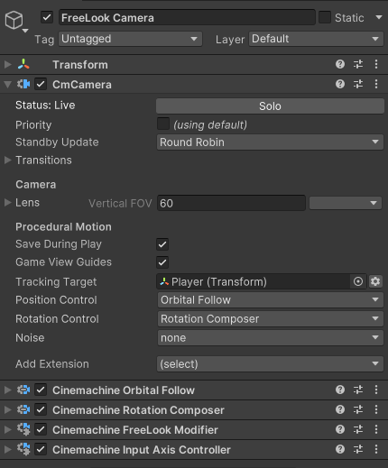

# Create a FreeLook Camera

With Cinemachine 3.0, the FreeLook camera is no longer a separate class as it was in prior versions of Cinemachine. Instead, it is implemented by setting up a [CinemachineCamera](CinemachineCamera.md) with the appropriate behaviors.

A FreeLook is a CinemachineCamera that tracks a GameObject target and allows the user to control the camera's viewing angle. Essentially, it is a camera that can orbit the target in response to user input. There are several possible ways to implement such a camera, each with its own style of behavior and idiosyncrasies. The one you choose will depend on the way your target moves, and on the specific camera behavior that you want. It's a good exercise to think carefully about how you want the camera to behave. There is no one-size-fits-all.

When you choose **Cinemachine > FreeLook Camera** from the GameObject menu, it will by default create a CinemachineCamera with the following components:

The [Orbital Follow](CinemachineOrbitalFollow.md) provides the orbiting position functionality, and the [Rotation Composer](CinemachineRotationComposer.md) ensures that the camera always looks at the target, from whatever position it is.  User input is provided by the [Input Axis Controller](CinemachineInputAxisController.md) component. The settings there will allow you to map the camera angle to whatever input controls you like, and to tune their responsiveness.

The [Cinemachine Free Look Modifier](CinemachineFreeLookModifier.md) behavior's job is to allow you to tweak some settings as a function of the vertical veiwing angle of the camera. For example, you can have different lens settings depending on whether you look from the top or from the bottom. A number of different possibilities are provided with that component, and of course it is always possible to craft your own and add them.  Cinemachine Free Look Modifier is an optional component, and you can remove it if you don't need what it provides.

An alternative version of a FreeLook can be made by changing the Position Control behavior to [Position Composer](CinemachinePositionComposer.md) and the Rotation Control behavior to [Pan Tilt](CinemachinePanTilt.md), as follows:

In this case, [Pan Tilt](CinemachinePanTilt.md) sets the viewing angle, and [Position Composer](CinemachinePositionComposer.md) positions the camera such that the target is properly placed on the screen.