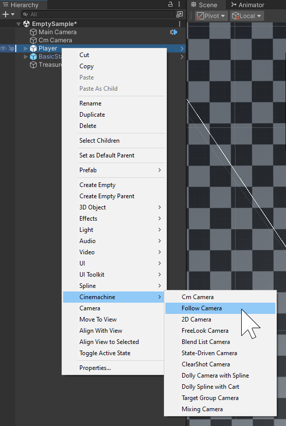

## Installation and upgrade

Cinemachine is a free package, available for any project. You install Cinemachine like [any other package](https://docs.unity3d.com/Manual/upm-ui.html).

After you install Cinemachine, a new __GameObject > Cinemachine__ menu is available. You can also access this menu when you right-click inside the Hierarchy view.

## Requirements

Cinemachine has few external dependencies. Just install it and start using it. If you are also using the Post Processing via HDRP or URP volumes, then adapter modules are provided - protected by `ifdef` directives which auto-define if the presence of the dependencies is detected.  

There are similar `ifdef`-protected behaviours for other packages, such as Timeline and UGUI.

This version of Cinemachine is supported by the following versions of the Unity Editor:

* 2022.2.16f1 and later

## Upgrading from previous versions of Cinemachine

Cinemachine 3.0 is a major version change from CM 2.X, and the API and data format have changed significantly. Scripts written for the CM 2.X API are unlikely to run with 3.X without manual intervention. Also, the CM Camera instances in your project will themselves need upgrading.

While it is possible to upgrade an existing project from CM 2.X, you should think carefully about whether you are willing to put in the work. It might be better in many cases just to stick with CM 2.X, which will continue to be supported for a while in parallel with CM 3.X.  If you do choose to upgrade your project, please see the [**upgrade guide**](CinemachineUpgradeFrom2.md).

Cinemachine 3.0 maintains support - in deprecated form - of obsolete CM2 classes that have been superceded by newer ones.  This is to help ease the transition to the new API.  However, it is strongly recommended that you upgrade your project to use the new API as soon as possible.  The deprecated classes will be removed in a future release.  To reduce code bloat in your deliverables, the deprecated class support can be removed immediately by defining **CINEMACHINE_NO_CM2_SUPPORT** in your project's Scripting Define Symbols.

## Upgrading from the old Asset Store version of Cinemachine

If you already installed a very old version of Cinemachine from the Unity Asset Store, you should upgrade to the Cinemachine Package. It is recommended in this case to upgrade to Cinemachine 2.X, which in most cases is completely automatic.

To upgrade to the Cinemachine Package:

1. In Unity Editor, 2019.4+ or later, open your project.
2. Save the current Scene you are working on.
3. Create a new, empty Scene.
4. In the [Project window](https://docs.unity3d.com/Manual/ProjectView.html), delete the Cinemachine Asset and any CinemachinePostProcessing adaptor assets you may have installed.
5. Install the Cinemachine 2.X package.
