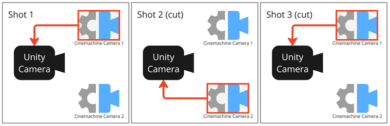

# Cinemachine Camera activations and transitions

<!--- Find a quick and nice way to introduce, all should be about having a Cinemachine Camera control the Unity camera, what makes such a Cinemachine Camera, how to select the next Cinemachine Camera, and what happens when the next Cinemachine Camera takes control of the Unity camera over the current Cinemachine Camera. --->

## Cinemachine Camera states

At any time, each Cinemachine Camera may be in one of three different states.

| State | Description |
| :--- | :--- |
| Live | The Cinemachine Camera actively controls a Unity Camera that has a Cinemachine Brain. When a [blend](#blends) occurs from one Cinemachine Camera to the next, both Cinemachine Cameras are live. When the blend is complete, there is only one live Cinemachine Camera. |
| Standby | The Cinemachine Camera doesn’t control the Unity camera. However, it still follows and aims at its targets, and updates. A Cinemachine Camera in this state has its GameObject activated and a priority that is the same as or lower than the live Cinemachine Camera. |
| Disabled | The Cinemachine Camera doesn’t control the Unity camera and doesn’t actively follow or aim at its targets. A Cinemachine Camera in this state doesn’t consume processing power. To disable a Cinemachine Camera, deactivate its GameObject. The Cinemachine Camera is present but disabled in the Scene. However, even though the GameObject is deactivated, the Cinemachine Camera can still control the Unity camera if the Cinemachine Camera is participating in a blend, or if Timeline invokes it. |

## Live Cinemachine Camera selection

The conditions that make a Cinemachine Camera the live one are different depending on the context you're using Cinemachine in.

### Realtime dynamic events

By default, the Cinemachine Brain is responsible to handle the live Cinemachine Camera selection.

To be or become live, a Cinemachine Camera must meet the following rules:
* Its GameObject must be the most recently [activated GameObject](https://docs.unity3d.com/Manual/DeactivatingGameObjects.html) that includes a Cinemachine Camera component.
* Its Priority, a property you can optionally set in the [Cinemachine Camera component](CinemachineCamera.md), must be the highest among activated Cinemachine Cameras.

You can respond to dynamic game events in real time by manipulating Cinemachine Camera priorities or by activating and deactivating their GameObjects. This is particularly useful for live gameplay, where action isn’t always predictable.

### Timeline

Use [Cinemachine with Timeline](concept-cinemachine-timeline.md) to choreograph Cinemachine Cameras and manage shots in predictable situations, like cutscenes.

When you use Timeline with Cinemachine Cameras, Timeline overrides the Cinemachine Brain priority system. The live Cinemachine Camera selection is based on the activation of specific Cinemachine Camera clips that give you precise, to-the-frame camera control.

## Cinemachine Camera transitions

You can manage transitions between Cinemachine Cameras each time a new one becomes live.

The ways to set up Cinemachine Camera transitions are different depending on the context you're using Cinemachine in:
* By default, you handle transition rules in the [Cinemachine Brain component](CinemachineBrain.md).
* When you're using Timeline for shot sequencing, you handle transitions directly in the Timeline Cinemachine track.

### Blends

Blends allow you to create sophisticated camera motion by combining relatively simple shots and blending between them in response to real-time game events or in a choreographed way via a timeline.

A Cinemachine blend is not a fade, wipe, or dissolve. Rather, Cinemachine performs a smooth animation of the position, rotation, and other settings of the Unity Camera from one Cinemachine Camera to the next, taking care to preserve the view of the target object, and to respect the Up direction.

  
_**Blend:** The two Cinemachine Cameras simultaneously control the Unity Camera during the blend, smoothly exchanging full control over a predetermined time._

### Cuts

By definition, a cut is an abrupt transition from a shot to another. In Cinemachine, a cut between two Cinemachine Cameras corresponds to a blend that occurs instantly, without smooth transition between Cinemachine Camera properties.

  
_**Cut example:** two Cinemachine Cameras taking turns controlling the Unity Camera instantly._

## Additional resources

* [Set up multiple Cinemachine Cameras and transitions](setup-multiple-cameras.md)