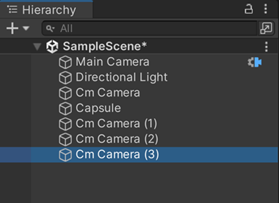

# Cinemachine essential elements

Learn about the essential elements that make a functional Cinemachine environment.

## Overview

A functional Cinemachine setup involves three main types of elements:

* A single [**Unity Camera**](#unity-camera) which captures the images across the Scene,
* A [**Cinemachine Brain**](#cinemachine-brain) which enables the Cinemachine functionality in the Unity Camera, and
* One or multiple [**Cinemachine Cameras**](#cinemachine-cameras) which take turns controlling the Unity Camera according to their status.

## Unity Camera

The Unity Camera is a GameObject that includes a [Camera](https://docs.unity3d.com/Manual/class-Camera.html) component, as opposed to Cinemachine Cameras, which includes other types of components to control the Unity Camera.

A Cinemachine setup must include **only one Unity Camera**, which is then the only GameObject that captures the images from your Scene while the Cinemachine Cameras control it.

## Cinemachine Brain

To work with Cinemachine, the Unity Camera GameObject must include a [**Cinemachine Brain component**](CinemachineBrain.md). This component is mainly responsible to:
* Monitor all active Cinemachine Cameras in the Scene.
* Determine which Cinemachine Camera controls the Unity Camera.
* Handle the transition when another Cinemachine Camera takes control of the Unity Camera.

> [!NOTE]
> When you use Timeline to get a choreographed sequence of Cinemachine Camera shots, Timeline overrides the Cinemachine Brain for Cinemachine Camera priority and transition management.

## Cinemachine Cameras

The Cinemachine Cameras (formerly named _Virtual Cameras_) are GameObjects that act as camera placeholders ready to [take control](concept-camera-control-transitions.md) of the Unity Camera according to their status.

When a Cinemachine Cameras takes control of the Unity Camera, it dynamically overrides its properties and behavior, which affects:
* Where the Unity Camera is positioned in the Scene.
* What the Unity Camera aims at.
* The Unity Camera's lens settings (field of view, clipping planes, etc).
* The Unity Camera's post-processing profiles (if used).
* How the Unity Camera behaves through time.

### Cinemachine Camera GameObjects

Cinemachine Camera GameObjects are separate from the Unity Camera GameObject.
* They behave independently, and must not be nested within each other.
* They don't include a Camera component, as opposed to the Unity Camera GameObject.
* They must include a [Cinemachine Camera component](CinemachineCamera.md).
* They can include additional Cinemachine components to manage [procedural motion](concept-procedural-motion.md) and add extended functionality.

### Single or multiple Cinemachine Cameras

You can create as many Cinemachine Cameras as required for your project, but you can also get a fully functional setup with a single Cinemachine Camera, depending on your needs. For example:

* If you want the Unity Camera to follow a single character, you can use a single Cinemachine Camera and set it up with a follow behavior that corresponds to your needs. In the end, this Cinemachine Camera will be the only one to control the Unity Camera.

* If your project requires multiple shots over multiple places, you should create one Cinemachine Camera per shot, with or without specific procedural behavior. In that case, you have to understand how Unity handles Cinemachine Camera activations and transitions.

### Processing power consumption

Cinemachine encourages you to create many Cinemachine Cameras. The Cinemachine Camera is designed to consume little processing power. If your Scene is performance-sensitive, deactivate all but the essential Cinemachine Cameras at any given moment for best performance.

## Additional resources

* [Set up a basic Cinemachine environment](setup-cinemachine-environment.md)
