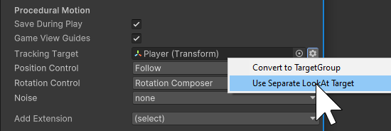
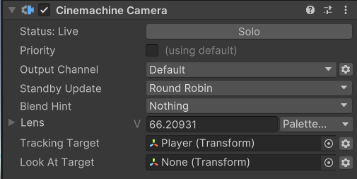

# Procedural Motion

On its own, a Cinemachine Camera is a passive GameObject that you can, for example:
* Place in a fixed location with a static aim.
* Parent to another GameObject to make it move along with it.
* Control the Transform via a custom script.

However, for more dynamic and realistic results, you can set up Cinemachine Cameras with procedural motion, for example:
* Use target tracking in translation and rotation to automatically follow or aim at another GameObject.
* Add noise to simulate hand-held effects or vehicle shakes.
* Use impulse signal listening to shake the camera in reaction to a signal emitted by an external source.

## Positioning and Aiming

Cinemachine separates the control of the camera's position and the camera's riotation.  You can think of it as being analogous to someone instructing a camera operator: "Stand _here_ and look _there_."

Choose from among Cinemachine's Position Control behaviours to control how to move the camera. Choose from among the Rotation Control behaviours to control how to aim it.

If no procedural components are present, then the camera's position and rotation are controlled by its transform, which can in turn be controlled in the usual manner (e.g. with parenting, animation, or custom scripts).

## Tracking and LookAt Targets

The tracking and LookAt targets are key defining procedural motion.  Offsets and screen compositions are specified in relation to these targets, so as the targets move around in the world, the cameras adjust themselves to keep the shot.  

By default, a CinemachineCamera has a single Tracking Target, which is used for two purposes:

* It specifies a Transform for the CinemachineCamera to move with (position control).
* It specifies the LookAt target, i.e. the Transform to aim at (rotation control).

If you want to use two different Transforms for these purposes, that is done by enabling the Separate LookAt Target option in the CinemachineCamera's inspector: 

The target is also relevant when Cinemachine performs blends between shots.  Cinemachine attempts to maintain the shot's desired screen position for the target, and if the target changes between shots an interpolation between the targets' positions is performed.  

If no target is specified for a camera blend, then Cinemachine can only interpolate the position and rotation independantly, which often results in the object of interest moving around on the screen in undesirable ways.  If Cinemachine is given knowledge of what is the object of interest, it can correct that problem.

## Position Control

Use the Position Control behaviors to specify how the CinemachineCamera moves. You can select the desired behaviour from the dropdown in the CinemachineCamera inspector.  This is just a shortcut for convenience - it is equally valid to simply use Unity's AddComponent function.  

Cinemachine includes a variety of procedural behaviours to control positioning and aiming. Each behaviour solves a specific problem, and exposes properties to customize the behaviour for your specific needs. You can write a custom script inheriting the `CinemachineComponentBase` class to implement your own custom moving behavior.  Your custom behaviours will be automatically added to the dropdown.

- [__Follow__](CinemachineFollow.md): Moves in a fixed relationship to the __Tracking Target__.
- [__Orbital Follow__](CinemachineOrbitalFollow.md): moves in a variable relationship to the __Tracking Target__, optionally accepting player input.
- [__Third Person follow__](CinemachineThirdPersonFollow.md): Pivots the camera horizontally and vertically around the player, with the pivot point at the __Tracking Target__, following the rotation of the tracking target.
- [__Position Composer__](CinemachinePositionComposer.md): Moves in a fixed screen-space relationship to the __Tracking Target__.
- [__Hard Lock to Target__](CinemachineHardLockToTarget.md): Uses the same position as the __Tracking Target__.
- [__Spline Dolly__](CinemachineSplineDolly.md): Moves along a predefined path, specified by a Spline.

## Rotation Control

Use the Rotation Control behaviors to specify how to rotate the CinemachineCamera. You can select the desired behaviour from the dropdown in the CinemachineCamera inspector.  This is just a shortcut for convenience - it is equally valid to simply use Unity's AddComponent function.  

Cinemachine includes these behaviors for rotating a CinemachineCamera:

- [__Rotation Composer__](CinemachineRotationComposer.md): Keep the __Look At__ target in the camera frame, with composition controls and damping.
- [__Hard Look At__](CinemachineHardLookAt.md): Keep the __Look At__ target in the center of the camera frame.
- [__Pan Tilt__](CinemachinePanTilt.md): Rotate the CinemachineCamera, optionally based on the user’s input.
- [__Same As Follow Target__](CinemachineSameAsFollowTarget.md): Set the camera’s rotation to match the rotation of the __Tracking Target__.

## Noise Control

Real-world physical cameras are often heavy and cumbersome. They are hand-held by the camera operator or mounted on unstable objects like moving vehicles. Use [Noise Behaviours](CinemachineBasicMultiChannelPerlin.md) to simulate these real-world qualities for cinematic effect. For example, you could add a camera shake when following a running character to immerse the player in the action.

At each frame update, Cinemachine adds noise separately from the movement of the camera to follow a target. Noise does not influence the camera’s position in future frames. This separation ensures that properties like __damping__ behave as expected.

## Extensions

Extensions are components that augment the behavior of a CinemachineCamera. For example, the [Deoccluder](CinemachineDeoccluder.md) extension moves a camera out of the way of GameObjects that obstruct the camera’s view of its target.

Cinemachine includes a variety of extensions. Create your own custom extensions by inheriting the `CinemachineExtension` class.  For convenience, all available extensions are are included in the CinemachineCamera inspector's Add Extension button.  This is just a shortcut making it easier to find extension behaviours.  It is equally valid to add extensions by using Unity's AddComponent function.

To add an extension to a CinemachineCamera:

1. Select your CinemachineCamera in the [Scene](https://docs.unity3d.com/Manual/UsingTheSceneView.html) view or [Hierarchy](https://docs.unity3d.com/Manual/Hierarchy.html) window.
2. In the [Inspector](https://docs.unity3d.com/Manual/UsingTheInspector.html), use the __Add Extension__ drop-down menu to choose the extension.  The chosen behaviour will be added to the CinemachineCamera GameObject.
3. Alternativly, use the **Add Component** button in the inspector, or call `AddComponent()` from a script.
